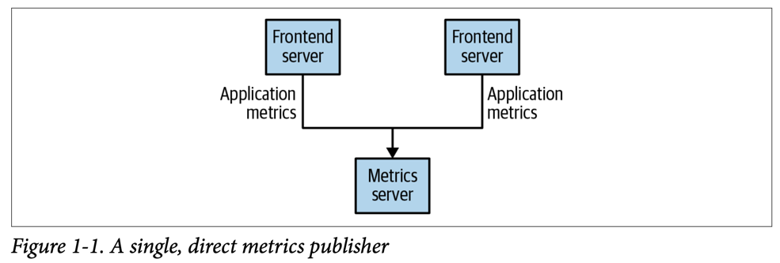
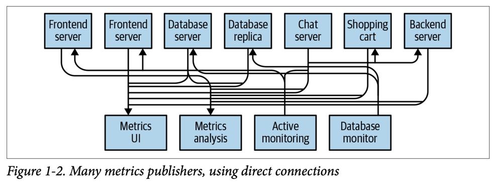
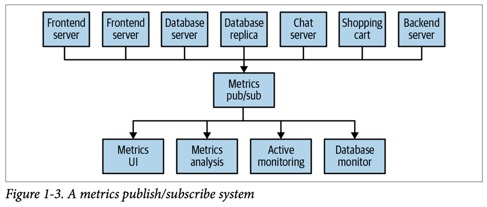
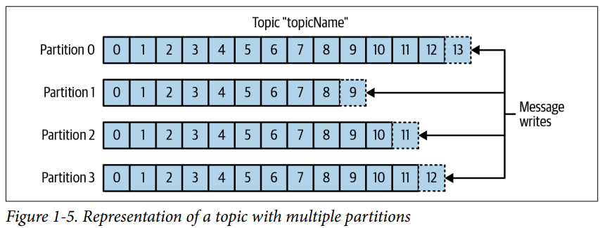
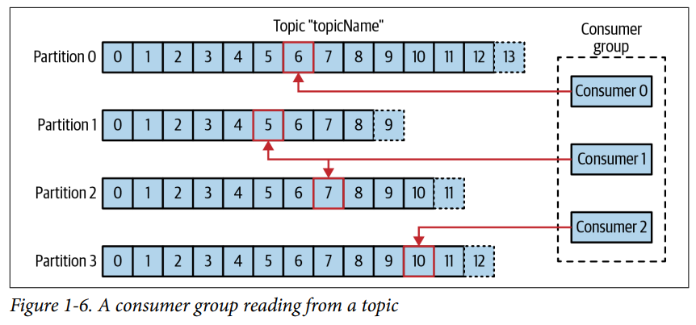
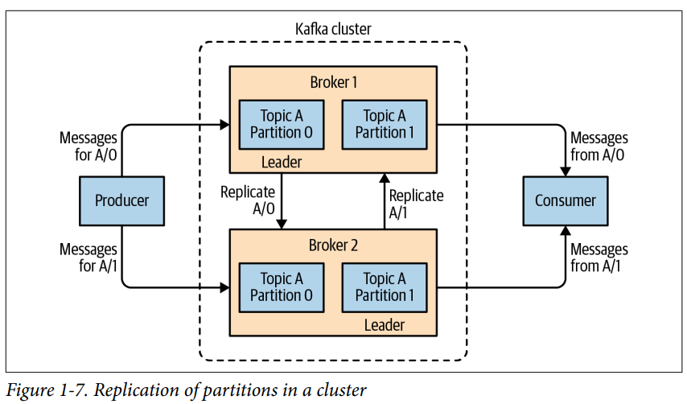
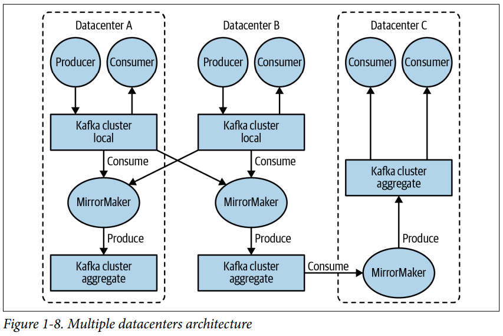
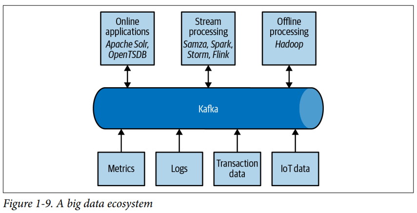

# 1. Meet kafka

- Publish/Subscribe Messaging
- Enter Kafka
- Why Kafka?
- The Data Ecosystem
- Kafka's Origins
- Getting Started with Kafka

---

- 모든 application은 데이터를 만듦
    - 데이터 : log message, user activity, metrics, ...
- 데이터 이동이 쉬울수록 핵심 비즈니스에 집중 가능
- pipeline : data-driven enterprise의 핵심 컴포넌트

## Publish/Subscribe Messaging

#### _Publish/subscribe (pub/sub) messaging_

- sender (publisher) : data (message)를 receiver에게 다이렉트로 전송 안함
    - 메시지를 분류
- receiver (subscriber) : 특정 메시지 종류를 받음
- broker : 메시지가 발행되는 중앙 지점

### How It Starts (e.g. 모니터링 정보를 전송하는 application)

- 간단한 message queue 혹은 프로세스간의 소통 채널

- 모니터링하는 시스템을 추가하기 시작
- 모니터링 데이터를 요구하는 application이 많아짐
- application간의 **점대점 연결**이 많아짐 (복잡)

- 모니터링 데이터를 받는 single application을 만들어서 모든 데이터를 받음
- 데이터를 요구하는 application에게 데이터 제공

### Individual Queue Systems

- pub/sub system 분리
- 점대점 연결 해소
- 중복이 증가 -> 하나의 중앙 시스템이 필요해짐

## Enter Kafka

- "distributed commit log", "distributed streaming platform"이라고도 불림
- Kafka 내의 데이터
    - 연속적, 순서대로 저장, 읽기 가능
    - 분산 저장 성능 향상, 장애 보호

### Messages and Batches

#### _message_ : Kafka 내의 데이터 unit

- Database의 _row_, _record_ 와 비슷
- bytes array로 구성
- _key_ : message를 파티션해서 다룰 때 사용
    - key를 해시해서 파티션에 접근

#### _batch_ : message의 컬렉션

- topic, partition에 저장한 메시지 컬렉션
- batch 단위로 메시지를 읽을 수 있음

### Schemas

- message 자체에 구조, 스키마를 정의해서 메시지 가독성을 높일 수 있음
- 사용자 application 요구사항에 따라 _schema_ 정의 옵션이 있음
    - e.g. JSON, XML, ...

### Topics and Partitions

#### _topic_ : message category

- DB의 테이블, 파일 시스템의 폴더

#### _partition_ : topic을 분리 (구성)

- 여러개의 partition으로 구성됨
- 각 partition의 마지막에 메시지 삽입
- 각 partition을 서로 다른 서버에 호스팅 가능
- 한 partitno을 다른 서버에 복제 가능

#### _stream_

- Kafka와 같은 시스템 안의 데이터
- partition 수에 관계없이 하나으 _topic_ 을 뜻함
- 실시간 메시지 처리에 사용 e.g. Kafka Streams, Apache Samza, Storm

### Producers and Consumers

- kafka client의 2가지 타입 : producer, consumerl
    - 그 외 : Kafka Connect (data integration), Kafka Streams (stream processing)

#### _producer_ : message 생성

- 다른 pub/sub 시스템에서는 _publisher_ , _writer_ 라고 불림
- message는 특정 topic에 생성됨
    - 기본적으로 해당 topic의 partition에 고르게 분배
    - 특정 partition에 다이렉트로 생성 가능
        - hash key를 이용해서 특정 partition에 생성

#### _consumer_ : message 읽음

- 다른 pub/sub 시스템에서는 _subscriber_ , _reader_ 라고 불림
- 1개 이상의 topic을 subscribe
- 각 partition에 들어온 순서대로 read (FIFO)
- _offset_ : 시퀀스 값, metadata
    - message 별로 가지고 있는 채번값
    - message가 생산되면 offset이 증가
    - 각 메시지는 partition안에서 unique한 offset을 가짐
    - 다음 메시지가 더 큰 offset을 가짐
    - Kafka가 스스로 다음 offset을 관리
    - **consumer가 offset을 통해 읽을 위치를 결정**

#### _consumer group_ : 1개 이상의 consumer로 구성

- group 내에서 동일한 topic을 읽음
- _ownership_ : consumer를 parition에 매핑하는 것 (소유권)
    - partition은 오직 1개의 consumer만 읽을 수 있음 (소유)
- consumer 한명이 메시지 읽기를 실패하면,
    - group 내에서 대기중인 다른 consumer가 해당 partition을 읽음

### Brokers and Clusters

#### _broker_ : single Kafka server

- producer의 message를 받음
- message에 offset을 부여
- consumer의 partition 요청에 message와 함께 응답
- 하드웨어 퍼포먼스에 따라
    - 하나의 broker가 1초에 수천개의 partition, 수만개의 message를 다룰 수 있음

#### _cluster_ : broker의 집합

- 하나의 broker가 cluster _controller_ 기능
    - cluster 중 하나를 자동으로 선정
- controller는 operation 관리자
    - partition을 broker에 할당
    - broker 장애 모니터링
- _leader_ of partition : partition을 소유한 한개의 broker
- _followers_ : partition 복제본의 주인 broker
    - leader가 장애가 나면 follower 중 하나가 leader가 됨
- 모든 producer는 leader와 통신
    - leader에게 message를 전송
- consumer는 leader 혹은 follower와 통신

#### _retention_ : message 보존 기간

- broker가 topic의 보유기간 default 값을 가짐 e.g. 7일
    - partition 사이즈로 정할 수 있음 e.g. 1GB
- 보유 기간이 다되면, message가 만료되고 삭제됨
- topic 별로 지정 가능
- _log compacted_ : 특정 key의 가장 마지막 생산 message만 저장
    - changelog 유형의 데이터에 유용 e.g. 마지막 업데이트

### Multiple Clusters

> #### 두개 이상 Cluster의 장점
>
> - 데이터 타입 별로 분리
> - 보안 요구에 따른 고립
> - 장애 복구 - Data Center가 분산되어 있을 때

- Kafka 복제 매커니즘은 cluster 내에서만 구현되어있음
- _MirrorMaker_ : 다른 cluster로 데이터를 복제하는 Kafka tool
    - Kafka consumer, producer 구조로 서로 queue로 연결되어있음
    - 한 cluster의 message가 다른 cluster로 복제됨

## Why Kafka?

- pub/sub system 중 Kafka 차별점

### Multiple Producers

- Kafka는 끊임없이 많은 producer를 다룰 수 있음
    - 클라이언트가 동일 topic을 다루던, 다른 topic을 다루던
- 많은 frontend 시스템으로부터 지속적으로 생산되는 데이터를 일관성있게 처리
- 예를들어, 하나의 웹사이트, 여러개의 마이크로서비스가 있는경우
    - 다양한 마이크로서비스로부터 생산되는 페이지 조회정보를 Kafka로 전송
    - 하나의 Kafka Data Stream으로 처리

### Multiple Consumers

- 하나의 message stream에 대해 여러 consumer를 지원
    - 다른 시스템은 메시지가 소비되면 다른 client는 해당 메시지를 읽을 수 없음
- Kafka의 Consumer는 group에 속해, stream을 공유할 수 있음

### Disk-Based Retention

- consumer가 항상 실시간으로 message를 읽지 않아도 됨
- 설정한 보존 규칙에 맞춰 disk에 저장
- consumer가 실패해도 data 유실없음
    - 실패한 지점부터 다시 시작 가능

### Scalable

- 유연한 확장성
- 1개의 broker -> 몇개의 borker와 작은 cluster -> 수천개의 broker와 큰 cluster
- cluster가 online 상태에서 확장 가능

### High Performance

- 매우 큰 message stream을 다루기 위해 쉽게 scale-out 가능
- 1초 이내의 latency가 발생하면서 scale-out 가능

### Platform Features

- Kafka Connect : 데이터를 Kafka로 가져오고 내보내는 표준 API
- Kafka Streams : Kafka에서 stream processing을 위한 client library

## The Data Ecosystem

- 여러 infrastructure 간의 message를 이동
- 클라이언트에게 일관된 인터페이스를 제공
- producer와 consumer의 약결합
- producer는 데이터를 어떤 consuemr가 사용하는지 몰라도 됨

### Use Cases

#### Activity Tracking

- LinkedIn에서 사용자 활동을 추적하기위해 개발됨
- 유저가 frontend application과 상호작용할 때마다 message를 생성
    - e.g. 페이지 조회, 클릭, 프로필 수정 등
- message는 backend가 소비
- 리포트 생성, ML 시스템, 사용자 경험을 위한 계산 등

#### Messaging

- application이 message를 공지하고 싶을 때 (e.g. 이메일)
- message 의 포맷, 전송 방법을 고민하지 않고 생성
- single applcation 이 모든 meesage를 읽고 전송
    - message 포맷팅, _decorating_
    - message 통합
    - message 전송 (사용자의 선호에 맞게)

#### Metrics and logging

- application(시스템) 메트릭, 로그 수집
- 여러 application이 같은 타입의 message를 생성할 때 유용
- applicaton이 메트릭을 Kafka topic 기반으로 생성
    - 모니터링 시스템이 message를 소비
- Hadoop같은 오프라인 시스템이서 사용 (longer-term analysis)
- Log message를 생성하고 분산된 log search system (e.g. Elasticsearch)으로 전송
- Destination system이 변경될 때, producer를 변경할 필요 없음

#### Commit log

- changelog stream
    - changelog에 대한 buffer로 사용
- 데이터베이스 업데이트를 Kafka로 publish
    - application이 데이터베이스 업데이트 사항을 consume
- 데이터베이스 복제, 동기화
- 2개 이상의 application으로부터 하나의 데이터베이스를 업데이트할 때
- log-compacted topic을 사용해서 더 긴 보존기간 확보 가능
    - key마다 하나의 변동 사항만 저장

#### Stream processing

- Hadoop 의 map/reduce와 유사한 처리
    - Hadoop은 몇시간~며칠 간의 데이터를 집계 후 처리
- Kafka를 활용한 stream processing은 실시간으로 처리 가능

## Kafka's Origins

## Getting Started with Kafka