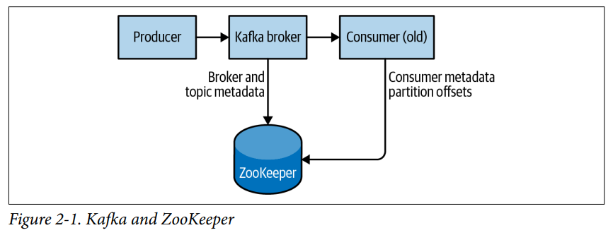
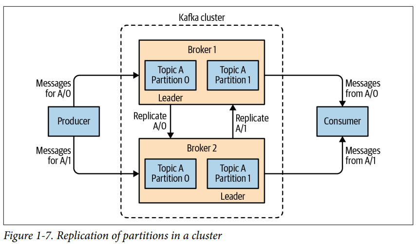
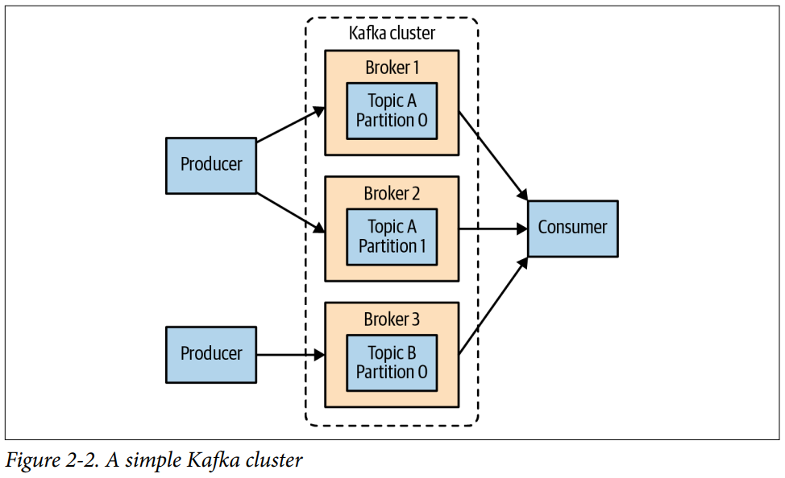

# 2. Installing Kafka

- Environment Setup
- Installing a kafka Broker
- Configuring the Broker
- Selecting hardware
- Kafka in the Cloud
- Configuring Kafka Clusters
- Production Concerns
- Summary

---

- Apache Kafka broekr를 설치하는 방법
- Apache Zookeeper 셋업
    - Apache Zookeeper : Kafka가 broker의 메타데이터를 저장할때 사용
- 기본 설정 옵션
- broker를 실행할 하드웨어 선택
- 운영 환경에서 사용할 때 알아야하는 것들

## Environment Setup

### Choosing an Operating System

- Apache kafka 는 Java application
- 다양한 OS에서 구동 가능
    - Windows, Linux, macOS
- Linux를 가장 추천

### Installing Java

- Kafka, ZooKeeper는 OpenJDK Java에서 작동
- Oracle 사이트에서 다운로드

### Installing ZooKeeper



- ZooKeeper : 중앙화된 서비스
    - 설정 정보, 이름, 동기화, 그룹 서비스 등 제공

#### Standalone server

1. `wget`으로 ZooKeeper 다운로드
2. `tar`로 압축 해제
3. `mv`로 압축 해제된 디렉토리를 `/usr/local/zookeeper`로 이동
4. `/var/lib/zookeeper` 디렉토리 생성
5. `zoo.cfg` 파일 작성
6. `JAVA_HOME` 환경변수 설정
7. `zkServer.sh` 실행

```Shell
# wget https://archive.apache.org/dist/zookeeper/zookeeper-3.5.9/apache-zookeeper-3.5.9-bin.tar.gz
# tar -zxf apache-zookeeper-3.5.9-bin.tar.gz
# mv apache-zookeeper-3.5.9-bin /usr/local/zookeeper
# mkdir -p /var/lib/zookeeper
# cp > /usr/local/zookeeper/conf/zoo.cfg << EOF
> tickTime=2000
> dataDir=/var/lib/zookeeper
> clientPort=2181
> EOF
# export JAVA_HOME=/usr/java/jdk-11.0.10
# /usr/local/zookeeper/bin/zkServer.sh start
JMX enabled by default
Using config: /usr/local/zookeeper/bin/../conf/zoo.cfg
Starting zookeeper ... STARTED
#
```

#### ZooKeeper ensemble

- _ensemble_ : ZooKeeper 클러스터 (고가용성)
- 홀수 개수의 서버로 구성하기를 권장 (부하 분산 알고리즘 때문)
- 7개 이상 권장하지 않음
- 공통으로 설정하고, 각 서버마다 _myid_ 파일을 생성
    - _myid_ 파일 : 각 서버의 고유 ID를 저장하는 파일
    - e.g. zoo1.example.com, zoo2.example.com, zoo3.example.com

```Shell
tickTime=2000
dataDir=/var/lib/zookeeper
clientPort=2181
initLimit=20
syncLimit=5
server.1=zoo1.example.com:2888:3888
server.2=zoo2.example.com:2888:3888
server.3=zoo3.example.com:2888:3888
```

- `initLimit` : follower가 leader와 연결되기 위해 기다리는 시간
    - `tickTime`의 배수
    - 20 = 2000ms * 20 = 40 sec
- `syncLimit` : leader와 sync 되지 않은 follower들이 있을 수 있는 시간
    - `tickTime`의 배수
    - 5 = 2000ms * 5 = 10 sec

```Text
## ensemble 인스턴스 설정
server.X=hostname:peerPort:leaderPort 
````

- `X` : 서버 ID (숫자)
- `hostname` : 서버의 호스트 이름
- `peerPort` : ensemble 내에서 서버 간 통신에 사용되는 포트
- `leaderPort` : ensemble 내에서 leader 선출시 사용되는 포트
- client는 오로지 `clientPort`만 사용해서 ensemble에 접근
- single machine에서 테스트 (**운영환경에선 권장하지 않음**)
    - host 명은 localhost
    - 서버마다 포트만 다르게 부여 (`peerPort`, `leaderPort`)
    - 인스턴스마다 `zoo.cfg` 파일을 생성

## Installing a kafka Broker

- ZooKeeper가 설치되어 있어야 함

1. 설치
2. topic "test" 생성
3. topic "test"에 메시지 전송
4. topic "test"에서 메시지 읽기


1. 설치

```Shell
# wget https://archive.apache.org/dist/kafka/2.7.0/kafka_2.13-2.7.0.tgz
# tar -zxf kafka_2.13-2.7.0.tgz
# mv kafka_2.13-2.7.0 /usr/local/kafka
# mkdir /tmp/kafka-logs
# export JAVA_HOME=/usr/java/jdk-11.0.10
# /usr/local/kafka/bin/kafka-server-start.sh /usr/local/kafka/config/server.properties

```

2. topic "test" 생성

```Shell
# /usr/local/kafka/bin/kafka-topics.sh --create --bootstrap-server localhost:9092 --replication-factor 1 --partitions 3 --topic test
Created topic "test".
# /usr/local/kafka/bin/kafka-topics.sh --bootstrap-server localhost:9092 --describe --topic test
Topic: test     PartitionCount: 3       ReplicationFactor: 1    Configs: segment.bytes=1073741824
        Topic: test     Partition: 0    Leader: 0       Replicas: 0     Isr: 0
        Topic: test     Partition: 1    Leader: 0       Replicas: 0     Isr: 0
        Topic: test     Partition: 2    Leader: 0       Replicas: 0     Isr: 0

```

3. topic "test"에 메시지 전송

```Shell
# /usr/local/kafka/bin/kafka-console-producer.sh --bootstrap-server localhost:9092 --topic test
>Karina is Best   
>Karina is Aespa
>^C
```

4. topic "test"에서 메시지 읽기

```Shell
# /usr/local/kafka/bin/kafka-console-consumer.sh --bootstrap-server localhost:9092 --topic test --from-beginning
Karina is Best
Karina is Aespa
Processed a total of 2 messages
^C
````

## Configuring the Broker



### General Broker Parameters

- 단일 서버에 standalone broker 구축환경이 아니라면 적절히 설정 필요

#### broker.id

- 모든 borker는 고유한 ID (숫자)를 가져야함
    - 동일한 kafka cluster 내에서 unique
- default : `0`
- 추천 방법
    - host name이 `host1.example.com`이라면 `1`로 설정
    - host name이 `host2.example.com`이라면 `2`로 설정

#### listeners

- example 설정 파일에 TCP port `9092`로 설정되어있음
- `<protocol>://<hostname>:<port>` 형식으로 설정, 콤마로 구분
    - e.g. `PLAINTEXT://localhost:9092,SSL://:9091`
- port 번호가 1024 미만이라면 root 권한 필요
- Kafka를 root로 실행하는건 비추

#### zookeeper.connect

- ZooKeeper 포트
- `hostnanme` : ZooKeeper가 실행되는 호스트 이름
- `port` : ZooKeeper 클라이언트 포트
- `/path` : chroot 환경일 경우 설정

> #### Kafka Cluster는 Chroot 환경 권장
>
> - Kafka Cluster가 chroot 환경에서 실행되는 것을 권장
> - ZooKeeper ensemble이 다른 application과 충돌 없이 공유
> - 동일한 ensemble의 여러 ZooKeeper 서버 지정 : 서버 장애시 다른 ZooKeeper 서버로 연결 가능

#### log.dirs

- Kafka 는 모든 메시지를 disk에 씀
- `log.dirs` : Kafka가 log segment를 저장할 디렉터리
- 쉼표로 구분
- 여러 경로가 지정되면, 가장 적게 사용된 디렉터리에 저장
- 하나의 파티션의 log segment는 동일한 디렉터리에 저장

#### num.recovery.threads.per.data.dir

- log segment를 다루는 thread pool
- thread pool 사용
    - 시작 시 각 파티션의 log segment 열기
    - failure 후 시작 시 각 파티션의 log segment check and truncate
    - shut down시 log segment 닫기
- default로 각 log 디렉터리에 1개의 thread 사용
    - 시작/종료 시에만 사용됨
- 병렬 실행을 위해 thread 수를 늘릴 수 있음
    - `log.dirs` 가 3개, `num.recovery.threads.per.data.dir`가 4라면
        - 12개의 thread가 생성됨

#### auto.create.topics.enable

- default 로 자동으로 topic을 생성
    - 프로듀서가 토픽에 메시지를 작성할 때
    - 컨슈머가 토픽에서 메시지를 읽을 때
    - 클라이언트가 토픽의 메타데이터를 요청할 때
- `false`로 설정하면, 토픽을 명시적으로 생성하게 강제

#### auto.leader.rebalance.enable

- 하나의 borker에 모든 leader가 할당되는 것을 방지
- background thread가 `leader.imbalance.check.interval.seconds` 마다 실행

#### delete.topic.enable

- `false` : 토픽 삭제 불가
- topic을 임의로 삭제하는 것을 방지

### Topic Defaults

- 토픽마다 설정을 지정할 수 있음
    - parition 수, message retention 등
- 부가적인 관리 툴로 설정해야함

#### num.partitions

- 토픽 생성시 생성할 파티션 수
- default : `1`
- **토픽의 파티션수는 증가만 가능 (감소 불가)**
- 특정 topic이 `num.partition` 보다 작은 파티션이 필요한 경우 수동으로 topic 생성해야함
- 일반적으로 topic 의 partition 수 = cluster 내 broker 수 (e.g. 3개의 broker = 3개의 partition)
    - 혹은 borker 수의 배수 (e.g. 3개의 broker = 6개의 partition)
- partition 수 설정 예시
    - topic에서 1GBPS의 I/O처리를 원하고, consumer가 50MBps 성능일 경우 20개의 partition 필요
    - 50MBps * 20 = 1GBps
- 추천 방법 : partition 크기를 6GB 미만으로 제한해서 점차 확장

> #### How to Choose the Number of Partitions
>
> - topic에게 필요한 성능? write 100KB/sec, 1GB/sec?
> - 단일 partition에서 consumer의 최대 처리량
> - 단일 partition에 대한 producer 최대 처리량 (producer는 대게의 경우 consumer보다 빠르므로 skip해도 됨)
> - key 기반의 메시지 작성인 경우, 나중에 partition 추가는 매우 어려움
> - broker 별 공간 예측 (disk, network 대역폭)
> - 과소평가해야함 - broker가 메모리, 기타 리소스 사용 and 메타 데이터 업데이트, leadership 이전 시간 등이 추가됨
> - 미러링 데이터 환경에서 많은 partition은 bottleneck이 될 수 있음
> - VM, cloud 환경에서 IOPS 제한이 있을 경우 고려해야함

#### default.replication.factor

- `auto.create.topics.enable` 설정이 `true`일 경우, 토픽의 복제본 수
- 권장사항
    - `min.insync.replicas` 보다 1 이상 (하드웨어 설정이 매우 좋을 경우 2 이상)
- 일반적인 cluster
    - 최소 3개 이상의 partition 복제품이 있음
    - 각각 disk failure, broker failure, data center failure, rolling 배포 등을 대비

#### log.retention.ms

- message를 저장할 시간
- `log.retention.hours` 값이 default
    - `168` (7일)일
- `log.retention.minutes`, `log.retention.ms`로 설정 가능
- 추천 파라미터 `log.retention.ms`
- 중복으로 선언되어있으면 가장 작은 사이즈의 파라미터가 적용됨

> #### Retention by Time and Last Modified Times
>
> - disk의 각 log segment file이 마지막으로 수정된 시간 기반으로 삭제됨
> - e.g. log segment가 닫힌 시간 = file의 마지막 message timestamp

#### log.retention.bytes

- message 의 총 byte 수로 제한하는 방법
- partition마다 적용됨
- topic이 8개 partition을 가지고, `log.retention.bytes`가 1GB라면
    - topic에 최대 8GB의 데이터가 저장됨
- `-1` : 제한 없음

> #### Configuring Retention by Size and Time
>  `log.retention.bytes`, `log.retention.ms` 둘다 설정되어있는 경우
> 둘 중 하나가 충족되면 삭제됨
> e.g. `log.retention.bytes=1GB`, `log.retention.ms=1day`이면, 둘 중 하나가 충족되면 삭제됨

#### log.segment.bytes

- log retention 설정은 log segment에 적용됨 (message 단위 X)
- message가 publish되면 partition의 가장 최근 log segment에 저장
- default : `1GB`
- log segment 사이즈가 `log.segment.bytes` 에 도달하면, log segment가 닫히고, 새로운 log segment 오픈
- log segment가 너무 작으면 잦은 logsegment 열림/닫힘으로 전체적인 성능 저하
- topic의 produce 률이 낮을 경우 (예를 들어 하루에 100MB 생산)
    - default `log.segment.bytes=1GB`이기 때문에, 1개의 segment를 10일간 유지
    - `log.retention.ms=1week`인 경우, 최대 17일간 message가 보존됨

    1. log.segment.bytes=1GB`를 채우기 위해 10일간 유지되고 log segment가 닫힘
    2. `log.retention.ms=1week` 로 인해 닫히고 7일간 유지

> #### Retrieving Offsets by Timestamp
>
> - 특정 timestamp에서 partition offset 요청 시,
> - 해당 timesttamp에서 쓰기 중이던 log segment file을 찾음
> - 지정된 timestamp 이전에 생성된 file 중 가장 최근에 수정된 file을 찾음
> - 해당 file의 시작부분에 있는 offset 반환

#### log.roll.ms

- log segment 가 닫혀야하는 시간 간격
- `log.segment.bytes` 설정과 병행 가능
- 아무거나 한 조건이 만족하면 log segment가 닫힘

> #### Disk Performance When Using Time-Based Segments
>
> - 시간 기반으로 segment를 제한할 경우
> - 2개 이상의 log segment가 동시에 닫힐때의 Disk 성능을 고려해야함
> - 비슷한 시각에 시간이 시작되어 비슷한 시각에 닫히는 segment가 많을 경우

#### min.insync.replicas

- `min.insync.replicas=2` : 최소 2개의 replica가 producer와 "in sync"(동기화)
- producer의 ack "all" 요청과 함께 사용
- 최소 2개의 replica에 쓰기 성공을 보장
- leader에 쓰기작업이 실패된 뒤 follower를 leader로 승격한 경우
    - 실패했던 쓰기작업의 데이터가 없을 수 있음
    - 이 떄 `min.insync.replicas` 설정이 없다면, 데이터 손실이 발생할 수 있음
- 오버헤드를 고려해서 메시지 손실이 허용되는 경우 `1` 추천

#### message.max.bytes

- message의 최대 사이즈
- default : `1MB`
- producer가 message를 publish할 때, message의 사이즈가 `message.max.bytes`를 초과하면 에러 발생
- 메시지 사이즈는 성능에 큰 영향을 줌
    - borker thread의 request별 network connection이 길어짐
    - disk 크기를 많이 차지
    - 해결책 : blob store, 계층형 저장소 등으로 해소

> #### Coordinating Message Size Configurations
>
> - 클라이언트의 `fetch.message.max.bytes` 설정을 고려해야함
> - `fetch.message.max.bytes`이 더 작으면 producer가 publish한 message를 읽을 수 없음
> - `replica.fetch.max.bytes` 설정도 동일한 이유로 고려해야함

## Selecting hardware

- 전체 성능에 bottleneck이 될만한 부분
- Disk throughput, capacity(용량), memory, networking, CPU
- Kafka를 매우 크게 확장할 때, metadata 업데이트 양이 많아짐

### Disk Throughput (처리량)

- broker disk : producer 성능이 가장 영향을 많이 받는 요소
- message가 발행되면 local storage에 커밋됨
    - 대부분의 producer 클라이언트가 최소 1개의 broker가 message 정상 발행여부를 확인해줄 떄까지 block
    - 쓰기 속도가 빠를수록 produce latency가 낮아짐
- HDD? SSD?
- SSD : 탐색속도가 빨라 성능을 높임
- HDD : SSD에 비해 경제적이고, 용량이 큼
    - HDD 성능 향상 방법 : 데이터 디렉터리 여러개 사용, RAID 구성
- HDD : 용량이 크지만, 자주 사용되지 않는 데이터를 저장하기에 적합
- SSD : 매우 많은 client connection을 처리할 때 적합

### Disk Capacity (용량)

- 얼마나 많은 message가 retain되어야 하는가?
- broker가 하루마다 1TB 트래픽을 받고, retention이 7일이라면
    - log segment에 최소 7TB의 disk가 필요, 10% 오버헤드 추가 고려
- Kafka scaling 시 주요한 고려요소
    - topic의 여러 partition
    - broker 증설
    - 복제 전략

### Memory

- Kafka consumer는 partition 마지막부터 message를 읽음
- system의 page chace 용량
    - consumer가 읽고있는 message는 시스템 page cache에 저장됨
- JVM 의 많은 heap memory를 필요로하지 않음
    - broker가 150,000 message를 1초마다 다루고, 200mb/s 데이터전송 시 5GB heap memory 필요
- **Kafka를 다른 application과 동일한 시스템에서 구축하기를 권장하지 않음**
    - 메모리 영역을 page cache, Kafka log segment cache 등에 사용해야함
    - 안그러면 consumer client의 성능 감소

### Networking

- Kafka가 다룰수 있는 트래픽의 최대량 결정
- disk storage, cluster size와 함께 고려
- inbound / outbound 불균형 문제
    - proucer는 초마다 1MB를 topic에 씀 (inbound)
    - 다수의 consumber가 topic에서 1MB를 읽음 (outbound)
- 최소 10GB NIC 사용 권장

### CPU

- borker의 전체 성능에 미미하게 영향을 줄 수 있음
- client가 network, disk 최적화를 위해 메시지 압축, 압축 해제
- Kafka가 CPU 성능이 필요할 때
    - broker가 모든 메시지를 압축 해제 -> `checksum`으로 메시지 검증 -> 다시 압축 -> disk에 쓰기
- cluster가 매우 커지면 (수백개 cluster, 한 cluster에 수만개의 partition) 고려

## Kafka in the Cloud

- Confluent vender사, AWS, Azure, Google Cloud Platform 등에서 Kafka를 제공
- 각 CSP에서 제공하는 적절한 compute instance 선택

### Microsoft Azure

- VM으로부터 별도로 disk 운용 가능
- low latency가 문제된다면, I/O 최적화 인스턴스 사용 (SSD)
- 아니면, Azure Blob Storage, Azure Managed Disks 사용
- 실제로 Standard D16s v3 인스턴스 타입 적합
    - 작은 clsuter
- 더 높은 성능 D64s v3 인스턴스 타입 적합
    - 큰 cluster
- Azure Managed Disks 권장
- HDD Managed Disks는 저렴하나 SLA 없음
- premium SSD, ultra SSD는 SLA 있음
- latency에 민감하지 않다면 Microsoft Blob Storage 사용

### Amazon Web Services

- latency에 민감하다면 I/O 최적화 인스턴스 사용 (local SSD Storage)
- 아니면, Amazon Elastic Block Store (EBS) 사용
- 일반적으로 m4, r3 인스턴스 타입 사용
    - m4 ; retention 기간 보장하나, disk throughput이 낮음 (EBS 사용)
    - r3 : disk throughput이 높음 (local SSD 사용), retention 기간이 짧음
- i2, d2 인스턴스 타입은 비싸지만 retention 기간이 길고, disk throughput이 높음

## Configuring Kafka Clusters



- Single Broker는 로컬 개발, 검증용까지만 적합
- Kafka cluster는 3개 이상의 broker로 구성
- Broker server간에 부하 분산 가능
- Replication : 데이터 손실 방지

### How Many Brokers?

- Disk 용량
- borker마다 replication 용량
- CPU 성능
- Network 성능

#### Disk 용량

- retaining 메시지 수, single broker의 storage 용량
- cluster가 10TB를 저장해야하고, 각 Broker가 2TB가 가능하면, 총 5개의 broker 필요
    - 추가로 replication이 늘어남에 따라 최소 100%의 용량이 필요

#### Cluster의 request 수용량

- 한 cluster에 10개의 broker, 100만개 이상의 replica, 50만개의 partition (replication factor 2)
    - 각 broker는 대략 10만개의 partition을 다룸
    - 병목 현상 초래
- 권장 사항 (과거)
    - 각 broker마다 4천개 이하의 partition replica를 다루도록함
    - cluster에 총 20만개의 parition replica
- 권장사항 (최근)
    - broker에 1만 4천개 이하의 parittion replica
    - cluster에 1백만개 이하의 replica

#### CPU

- 대부분 use case에서 bottlneck 원인이 아님
- 극단적으로 client connecttion, rquest가 늘어나는 경우 문제
- 모니터링 요소 : unique한 client, consumer group 수

### Network 성능

- 네트워크 인터페이스 용량
- data retention 기간 동안 트래픽이 일정하지 않은 경우 (e.g. 피크 시간 트래픽 폭증)에 대비
- single borker가 피크시간에 80% 가 사용되고, 동일한 데이터의 consumer가 둘일 때 2개의 broker가 필요

### Broker Configuration

- broker내에서 cluster 설정 파라미터 2개
- `zookeeper.connect` : ZooKeeper ensemble의 호스트 이름과 포트
    - cluster가 메타데이터를 저장하는 zookkeeper ensemble에 연결
- `broker.id` : broker의 고유 ID
    - cluster 내에서 고유해야함

### OS Tuning

- Kafka 성능을 향상시킬 수 있는 kernel 매개변수
- Virtual Memory, Network 하위 시스템, log segment를 저장할 disk mount 지점
- 세부적인건 Linux 배포판 참조

#### Virtual memory

- swap space 처리 방식, dirty memory page 조정
- swap을 피하는 것이 좋음
    - memory page를 Disk로 swap하는 비용이 큼
    - Kafka는 system page cache를 주로 사용
- Swap 최소화하기 `vm.swappiness`
    - VM 서브시스템이 page cache를 삭제하는 대신 swap할 확률
    - `1` : swap을 최소화
    - `0`으로 설정하면 swap을 사용하지 않음 (out-of-memory error가 발생 가능)
    - swap의 이점 : 메모리 부족시 시스템이 죽지 않음

> #### `vm.swappiness=0` 안하는 이유 : out-of-memory error
>
> - 예전에는 `0`을 추천했음
> - Linux kernel version 3.5-rcl 이후에는 `0`을 추천하지 않음
> - 3.5-rcl 이전 : out-of-memory error가 발생하지 않는 한 swap을 사용하지 않음
> - 3.5-rcl 이후 : `0`으로 설정하면 out-of-memory error가 나도 swap 없음

- dirty page 조정
- Kafka의 producer의 응답시간은 Disk I/O 성능에 의존
    - 따라서 log segment는 SSD, RAID와 같이 빠른 disk에 저장함
- `vm.dirty_background_ratio` 를 10보다 낮게 설정
    - system memory 총량의 백분율
    - `5`로 설정하는 것이 적합
    - `0`은 안됨. kernel이 page를 계속 flush하려고 함
- `/proc/vmstat` 에서 현재 운용중인 dirty page 수 확인 가능

```Bash
# cat /proc/vmstat | egrep "dirty|writeback"
nr_dirty 21845
nr_writeback 0
nr_writeback_temp 0
nr_dirty_threshold 32715981
nr_dirty_background_threshold 2726331
#
```

#### Disk

- 파일 시스템 선택하기 Ext4, XFS
- XFS는 추가 조정 필요, 성능이 Ext4보다 좋음
- `noatime` 을 설정해 디스크 쓰기 줄이기
- `largeio` 을 설정해 대용량 쓰기 효율성 증가
- 추천 : XFS를 고려하고, `noatime` 옵션을 설정할 것

#### Networking

- Kafka 튜닝은 다른 웹서버와 비슷
- Socket의 송수신 Buffer 기본, 최대 량 조정
    - 대규모 전송 시 성능 향상
    - `net.core.wmen_default` : 기본 송수신 buffer 크기 (128KiB 추천)
    - `net.core.wmen_max` : 최대 송수신 buffer 크기 (2 MiB 추천)
- TCP Socket 송수신 버퍼 크기 설정
    - `net.ipv4.tcp.wmem` , `net.ipv4.tcp.rmem`
    - 최소, 기본, 최대 크기 설정 (공백으로 구분)
    - e.g. `4096 65536 2048000` (최소 4KiB, 기본 64KiB, 최대 2MiB)
- `net.ipv4.tcp_window_scaling=1` : TCP window scaling 활성화
- `net,ipv4.tcp_max_syn_backlog`를 기본값 (1024)보다 크게 허용
    - 동시 접속 수 더 많이 수락
- `net.core.netdev_max_backlog` 를 기본값(1000)보다 크게 허용
    - multigigabit network connection에서 성능 향상

## Production Concerns

## Summary