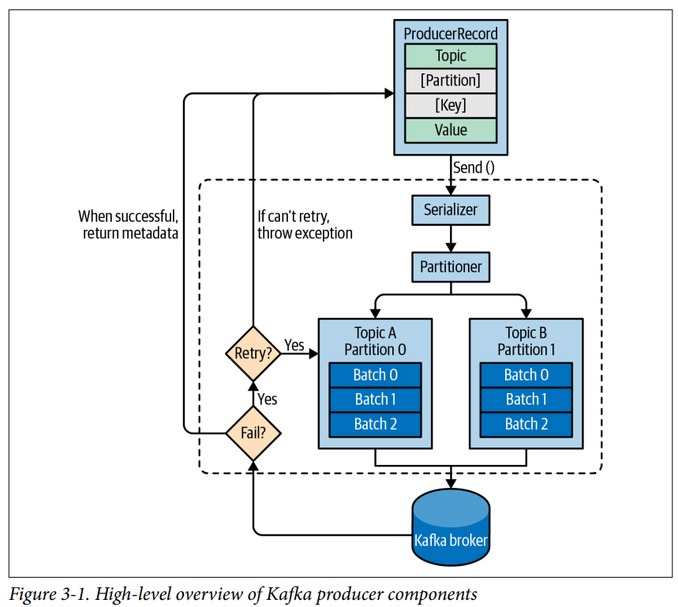
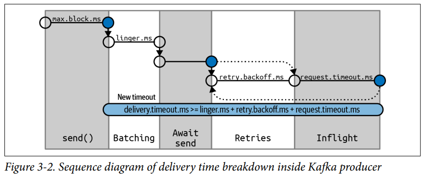
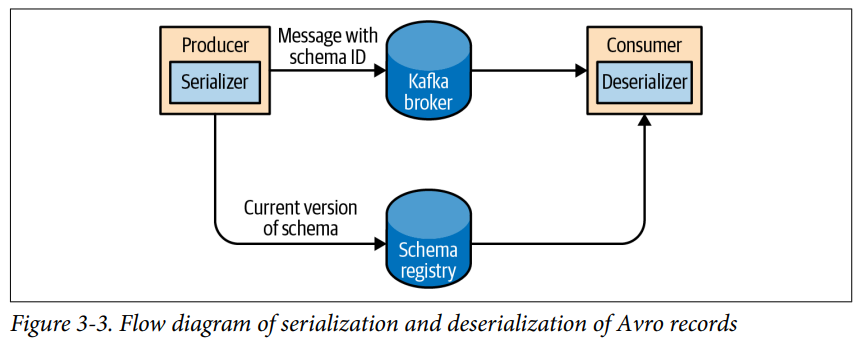

# 3. Kafka Producers: Writing Messages to Kafka

- Producer Overview
- Constructing a Kafka Producer
- Sending a Message to Kafka
- Configuring Producers
- Serializers
- Partitions
- Headers
- Interceptors
- Quotas and Throttling
- Summary

---

- Kafka Producer를 사용하는 방법
- `KafkaProdcer`, `ProducerRecord` Object 생성방법
- record를 Kafka에 보내는 방법
- Kafka가 보내는 error 처리 방법
- Producer의 configuration
- Parition, 직려화 방법

> #### Third-Party Clients
>
> - Kafka는 binary protocol을 사용
> - Kafka network port로 올바른 byte sequence를 보내면 Kafka는 이를 처리 (읽고, 쓰기 가능)
> - 각 programming 언어에 Kafka wire protocol이 구현되어있음
> - Java, C++, Python, Go, ...

## Producer Overview



1. `ProducerRecord`을 생성하는 거스로 message produce
    - 필수 : topic, value
    - 선택 : key, partition, timestamp, headers
2. producer가 message를 직렬화 (network에 보낼 준비)
3. partition을 명시 안했으면 partitioner가 partition을 선택
    - `ProducerRecord` key 기반으로 선택
    - partition이 선택되면 producer는 목적지 partition을 알게 됨
4. 목적지 (topic, partition)이 같은 message 묶음에 추가
5. 별도 thread에서 message 묶음을 알맞은 kafka broker에게 전송
6. Broker가 message를 받고 response
    - 성공적으로 쓰기가 완료되었으면 `RecordMetadata`를 반환
        - `RecordMetadata` : topic, partition, offset, timestamp
    - 실패했으면 return error
7. producer는 error를 처리하고, message를 재전송하거나, 다른 작업 수행

## Constructing a Kafka Producer

- Kafka 에게 message 보내는 방법 : Kafka producer 객체 생성하기

#### `bootstrap.servers` (필수값)

- `host:port` 쌍의 list
- producer가 Kafka cluster와 connection을 맺는데 사용
- 모든 broker를 포함할 필요 없음
    - 최소 2개 이상의 broker를 포함하는 것이 좋음 (fault tolerance)

#### `key.serializer` (필수값)

- `ProducerRecord`의 key를 byte array로 직렬화하는데 사용
- Kafka broker는 key와 message value를 byte array로 받음
- `org.apache.kafka.common.serialization.Serializer` 구현체를 사용
    - producer가 구현체를 사용해 직렬화
    - 직접 구현하지 않아도 `ByteArraySerializer`, `StringSerializer`, `IntegerSerializer` 등이 있음
    - `VoidSerializer` : key가 없는 경우 사용

#### `value.serializer` (필수값)

- `ProducerRecord`의 value를 byte array로 직렬화하는데 사용

#### 예시 : 필수 파라미터 기입

````
Properties propsKafka = new Properties();
propsKafka.put("bootstrap.servers", "broker1:9092,broker2:9092"); // broker list
propsKafka.put("key.serializer", "org.apache.kafka.common.serialization.StringSerializer"); // key serializer
propsKafka.put("value.serializer", "org.apache.kafka.common.serialization.StringSerializer"); // value serializer
````

#### 메시지 전송 방법 1. _Fire-and-Forget_

- 메시지를 server에 보내고 정상 도착 여부를 확인하지 않음
- error나 timout이 발생하면 알 수 없음

#### 메시지 전송 방법 2. _Synchronous Send_

- Kafka는 기술적으로 항상 async
- `send()`호출 시 return `Future`
- `Future`의 `get()`을 호출하면 blocking

#### 메시지 전송 방법 3. _Asynchronous Send_

- `send()` 호출 시 callback을 지정
- callback : Kafka broker로부터 응답이 오면 호출

## Sending a Message to Kafka

````
ProducerRecord<String, String> record =
    // 1.
    new ProducerRecord<>("CustomerCountry", "Precision Products","France");
try {
    // 2.
    producer.send(record);
} catch (Exception e) {
    // 3.
    e.printStackTrace();
}
````

1. `ProducerRecord` 객체 생성
    - 생성자에 topic 이름 (string), key, value
    - key, value는 각각 `key serializer`, `value serializer`에 의해 직렬화
2. `send()` : `ProducerRecord` 발송
    - message가 buffer에 저장된 후 별도의 thread에서 broker에게 전송
    - return `Future<RecordMetadata>`
    - message 전송 성공 여부 확인 안함
    - **production 에서는 적합하지 않음**
3. 여러 예외 발생 가능
    - `SerializationException` : 직렬화 실패
    - `BufferExhaustedException` : buffer가 꽉 참
    - `TimeoutException` : 발송 thread가 interrupt 됨ㅣ

### Sending a Message Synchronously

- kafka가 에러를 응답하면 예외를 catch
    - 에러 응답, 발송 재시도 횟수 초과 등
- trade-off : performance
    - Kafka broker의 상태에 따라 2ms ~ 수 초까지 걸림
- 응답할때까지 발송 thread는 대기
- **production 환경에서는 적합하지 않음**

````
ProducerRecord<String, String> record =
    new ProducerRecord<>("CustomerCountry", "Precision Products", "France");
try {
    // 1.
    producer.send(record).get();
} catch (Exception e) {
    // 2.
    e.printStackTrace();
}
````

1. `Future.get()` : blocking
    - record 전송이 실패하면 exception 발생
    - 성공하면 `RecordMetadata` 반환
2. 발송 도중 에러가 발생했으면 exception 발생

### Kafka 의 에러 타입 2가지 : _Retriable_ , _Non-Retriable_

- _Retriable_ : 재시도 가능
    - e.g. connnection error는 connection을 다시 맺으면 해결
    - `KafkaProucer`에 재시도 여부 설정 가능
- _Non-Retriable_ : 재시도 불가능
    - e.g. message size가 너무 크면 재시도해도 실패

### Sending a Message Asynchronously

- 대부분의 경우 Kafka의 응답이 필요 없음
- 메시지 발송 실패 여부는 알아야함 (error 파일 등)

````
// 1.
private class DemoProducerCallback implements Callback {
    @Override
    public void onCompletion(RecordMetadata recordMetadata, Exception e) {
        if (e != null) {
            // 2.
            e.printStackTrace();
        }
    }
}

// 3.
ProducerRecord<String, String> record =
    new ProducerRecord<>("CustomerCountry", "Biomedical Materials", "USA");
// 4.    
producer.send(record, new DemoProducerCallback()); 
````

1. `org.apache.kafka.clients.producer.Callback` 구현체 생성
2. `onCompletion()` : callback method
    - Kafka가 error 응답했으면 `e`가 nonnull
3. record 생성
4. `send()` : callback 전달

#### callback

- callback은 Producer의 main thread에서 실행됨
- 2개의 메시지를 서로 다른 partition에 보내도, callback은 main thread에서 순서대로 실행
- callback 안에서 blocking 연산 비추
- blocking 연산은 별도의 thread에서 concurrent하게 실행할 것

## Configuring Producers

- producer에 매우 많은 설정 파라미터들이 있음
- [Apache Kafka Docs](https://kafka.apache.org/documentation.html#producerconfigs) 참고
- 몇 설정은 memory, 성능, reliability에 영향을 미침

### client.id

- client (application) 에 대한 논리적 식별자
- 문자열
- Kafka broker가 어떤 client로부터 온 message인지 확인할 때 사용
- e.g. IP 104.27.155.134, Order Validation Service 등...

### acks

- producer가 write가 성공적으로 끝났다고 간주하기 위해
    - record를 수신해야하는 partition replicas의 수
- Default, leader가 record를 받으면 성공으로 간주 (since Kafka 3.0)
- 메시지 작성의 durability에 직결되는 설정

#### `acks=0`

- producer는 broker로부터 message 전송 성공 여부를 기다리지 않음
- message 전송 성공 여부를 알 수 없음
- message 유실 가능성
- message 전송 속도 빠름

#### `acks=1`

- leader replica가 message를 받으면 성공으로 간주
- leader replica에 message가 쓰이지 않으면, producer는 error를 받음
    - 이후 재시도 가능
- message 유실 가능성 : 최근 메시지가 새로운 leader에게 복제되기 전에 leader replica가 죽으면 유실

#### `acks=all`

- 모든 replica가 message를 받으면 성공으로 간주
- 가장 안전한 모드 : 하나 이상의 broker가 message를 받았다는 보장
- latency가 높음

> #### trade-off : producer latency vs. durability
>
> - `acks` 설정값이 낮을 수록 producer latency 낮음
> - `acks` 설정값이 높을 수록 durability 높음
> - _end-to-end latency_ : producer가 message를 보내고, consumer가 message를 받는데 걸리는 시간
> - `acks` 가 높을수록 end-to-end latency가 높음 (replica들에게 쓰이기 전까지 Kafka가 consumer에게 consume을 허용하지 않음)

### Message Delivery Time (Apache Kafka 2.1 기준)



- `send()` 가 성공/실패하는데 걸리는 시간
- `send()`를 비동기로 호출한 뒤
    - 응답을 기다리는 시간 (blocking)
    - 성공(또는 실패)에 의해 callback이 trigger될때까지의 시간

#### `max.block.ms`

- `send()` 호출 시 producer가 block하는 시간
    - 혹은 `partitionsFor()` 호출 시 producer가 block하는 시간
    - `partitionsFor()` : 명시적으로 metadata를 요청하는 메서드
- producer의 send buffer가 찼거나, metadata가 없으면 block
- `max.block.ms` 값에 도달하면 timeout exception 발생

#### delivery.timeout.ms

- sending 전송 준비가 완료된 시점 ~ broker가 응답(or client 포기) 까지의 시간
    - sending 전송 준비가 완료된 시점 : `send()` 의 리턴값이 성공 and record가 batch에 추가되었을 때
- `lingers.ms`, `request.timeout.ms` 보다 z커야함
- retrying 중에 `delivery.timeout.ms`에 도달하면 에러가 발생하여 borker가 리턴
- record batch가 전송을 기다리는 중에 `delivery.timeout.ms`에 도달하면 timeout exception 발생

> #### 적절한 `delivery.timeout.ms`
>
> - broker crash 발생 시 leader 재선출에 일반적으로 30 seconds 소요
> - 120 seconds 동안 재시도 설정  (`delivery.timeout.ms=120000`)

#### `request.timeout.ms`

- producer가 data 전송 시 server로부터 응답을 기다리는 시간
- retry 시간 포함 X
- `request.timeout.ms`에 도달하면 `TimeoutException`을 발동하거나, retry

#### `retries and retry.backoff.ms`

- `retries` : producer가 message 전송을 재시도하는 횟수
    - `retries=0` : 재시도 안함
- `retry.backoff.ms` : 재시도 사이의 시간 간격
    - default : 100ms
- 권장사항 : 설정하지 않기
    - broker가 crash로부터 복구 (e.g. leader 재선출)하는데 걸리는 시간을 고려
    - 복구 시간보다 길게 `delivery.timeout.ms`를 설정
- producer가 모든 에러를 retry하지 않음
    - e.g. _message too large_ 와 같은 non-retriable 에러

### linger.ms

- 최근 batch에서 send하기 전에, 추가 message를 기다리는 시간
- KafkaProducer는 batch가 가득 차거나, `linger.ms`에 도달하면 batch를 전송
    - deafult로 sender thread가 전송이 가능해지는 즉시 전송함 (batch가 가득 차지 않아도)
- `linger.ms`가 0보다 크면, producer는 batch를 전송하기 전에 `linger.ms`를 기다림
    - latency를 살짝 늘리고, 처리량 (throughput)을 매우 높임

### buffer.memory

- broker에 message를 전송하기 전에 사용할 buffer size
- 서버 전송 가능량보다 applciation이 많이 전송하려하면,
    - `max.block.ms` 만큼 blocking되고,
    - buffer size가 확보될때까지 기다림 (`max.block.ms`에 도달해도 확보 안되면 exception 발생)

### compression.type

- producer가 message를 전송하기 전에 압축하는 방법
- default : `none`
- `snappy` : 압축률이 높고, CPU 사용량이 낮음
    - 압축 성능, Bandwidth 고려시 적합
- `gzip` :  압축률 높고, CPU 사용률 높음, 소요시간 높음
    - bandwidth 제약이 더 높을 떄 적합
- bottleneck 가능성
    - broker에 전송 전에 압축 시간이 발생
- 장점 : network bandwidth, storage 사용량 감소

### batch.size

- 여러 record를 같은 partition에 전송할 떄, producer는 일괄처리 (batch)함
- batch에 사용할 memory byte size
- batch가 가득차면 message가 전송됨
    - producer는 가득차지 않아도 전송시킬 수 있음
- batch size를 너무 작게 설정하면 overhead가 발생
    - 너무 자주 message 전송함

### max.in.flight.requests.per.connection

- server의 응답없이 producer가 보낼 수 있는 batch 수
- 높을수록 memory 사용량, 처리량 (throughput) 증가
- single Data Center 환경에서 2 in-flight request가 처리량 최대치

> #### Ordering Guarantees
>
> - Kafka는 message 순서 그대로 parition에 씀
> - Consumer는 전송 순서대로 message를 읽음
> - `max.in.flight.requests.per.connection` 값이 1보다 크거나, `retries` 값이 0보다 크면 순서가 보장되지 않음
> - ` enable.idempotence=true` 설정하면, in-flight request 5번까지 순서 보장

### max.request.size

- Producer의 request의 사이즈
- producer가 보낼 수 있는 가장 큰 메시지 크기
    - `max.request.size`가 1MB일 때, 1MB보다 큰 메시지는 전송 불가
        - 1KB 메시지를 1024개 묶기 가능
- `message.max.bytes` : broker가 받을 수 있는 가장 큰 메시지 크기
    - `max.request.size` 과 통일하는 것을 권장

### receive.buffer.bytes and send.buffer.bytes

- data를 읽고, 쓸 떄 Socket이 사용하는 TCP 송수신 buffer 크기
- `-1` : OS default
- producer와 consumer가 서로 다른 Data center에 있을 떄 값을 늘리는 것이 좋음
    - 높은 latency, 낮은 bandwidth 환경

### enable.idempotence

- _exactly once_ : message가 정확히 한번만 전송되는 것을 보장 (Kafka 0.11 이상)
- `enable.idempotence=true` : 멱등성 producer 활성화
    - producer가 각 record에 sequence nubmer를 부여
    - broker가 동일한 sequence number의 reocrd를 받았으면, replication을 거절하고 무해한 `DuplicateSequenceException`을 발생
- `enable.idempotence=true` 필요조건
    - `max.in.flight.requests.per.connection` 이 5 이하
    - `retries` 가 0 초과
    - `acks` 가 `all` 이어야 함
    - 그렇지 않으면 `ConfigException` 발생

## Serializers

- producer 설정에는 의무로 직렬화 클래스를 지정해야함
- message가 단순 string, integer가 아니면, 직렬화 클래스를 작성해야함
    - **직렬화 라이브러리 (권장)** : Avro, Thrift, Protobuf
    - custom 직렬화 클래스 작성
- 기본 `String` serializer
- `ByteArrays`
- 고유한 serializer 작성법
- Avro serializer

### Custom Serializers

- `org.apache.kafka.common.serialization.Serializer` interface 구현
- 구현체를 관리해야함
    - `customerID`의 타입이 바뀐다면?, 추가 field가 생긴다면?
- 여러 팀에서 serializer 클래스를 공유해서 사용해야함

```Java
public class Customer {
    private int customerID;
    private String customerName;
    
    public Customer(int ID, String name) {
        this.customerID = ID;
        this.customerName = name;
    }
    
    public int getID() {
        return customerID;
    }
    
    public String getName() {
        return customerName;
    }
}

import org.apache.kafka.common.errors.SerializationException;
import java.nio.ByteBuffer;
import java.util.Map;

public class CustomerSerializer implements Serializer<Customer> {
    @Override
    public void configure(Map configs, boolean isKey) {
    // nothing to configure
    }
    
    @Override
    /**
    We are serializing Customer as:
    4 byte int representing customerId
    4 byte int representing length of customerName in UTF-8 bytes (0 if name is Null)
    N bytes representing customerName in UTF-8
    **/
    public byte[] serialize(String topic, Customer data) {
        try {
            byte[] serializedName;
            int stringSize;
            if (data == null)
                return null;
            else {
                if (data.getName() != null) {
                serializedName = data.getName().getBytes("UTF-8");
                stringSize = serializedName.length;
                } else {
                    serializedName = new byte[0];
                    stringSize = 0;
                }
            }
            
            ByteBuffer buffer = ByteBuffer.allocate(4 + 4 + stringSize);
            buffer.putInt(data.getID());
            buffer.putInt(stringSize);
            buffer.put(serializedName);
            
            return buffer.array();
        } catch (Exception e) {
            throw new SerializationException(
            "Error when serializing Customer to byte[] " + e);
        }
    }
    
    @Override
    public void close() {
        // nothing to close
    }
}

```

### Serializing Using Apache Avro

- language-neutral data serialization format
- 많은 사람들과 data file을 공유하기위해 고안됨
- 주로 JSON으로 표현됨
- schema에 수정이 있어도 계속해서 message를 읽을 수 있음
    - 예외나 에러 발생하지 않음
    - `faxNumber` -> `email` 필드로 변경해도 이전 스키마를 읽을 때 에러가 발생하지 않음

```json

{
  "_comment": "original schema",
  "namespace": "customerManagement.avro",
  "type": "record",
  "name": "Customer",
  "fields": [
    {
      "name": "id",
      "type": "int"
    },
    {
      "name": "name",
      "type": "string"
    },
    {
      "name": "faxNumber",
      "type": [
        "null",
        "string"
      ],
      "default": "null"
    }
  ]
}
```

- `id`, `name` 필드 : 필수
- `faxNumber` : optional (default : null)

```json
{
  "_comment": "new schema",
  "namespace": "customerManagement.avro",
  "type": "record",
  "name": "Customer",
  "fields": [
    {
      "name": "id",
      "type": "int"
    },
    {
      "name": "name",
      "type": "string"
    },
    {
      "name": "email",
      "type": [
        "null",
        "string"
      ],
      "default": "null"
    }
  ]
}

```

- 변경사항 : `faxNumber` 필드가 `email` 필드로 변경됨
- consumer application의 `getFaxNumber()` 메서드를 `getEmail()`로 변경해야함
- 이전 스키마 읽을 시 `getEmail()` 메서드를 호출하면 `null`을 반환
- 주의점
    - data를 쓰는 schema와 read하는 application의 schema가
      호환되어야함 [Avro docs compatibility rules](https://avro.apache.org/docs/1.7.7/spec.html#Schema+Resolution)
    - 역직렬화기는 데이터를 작성할 때 사용한 스키마를 사용해야함

### Using Avro Records with Kafka



- Avro file 사이즈 overhead
    - 각 record에 schema가 포함되어 있음
- _Schema Registry_ : Avro file을 읽을 때 필요한 schema 정보를 별도 저장
- [Confluent Schema Registry](https://docs.confluent.io/platform/current/schema-registry/index.html)
- 아이디어 : Kafka에 전송할 데이터의 모든 schema를 registry에 저장
    - 저장시 schema 별로 식별자를 둠
    - Kafka에 produce 시 식별자로 schema를 찾음
    - consumer는 식별자를 사용해 schema를 찾음

````
Properties props = new Properties();
porps.put("bootstrap.servers", "localhost:9092");
props.put("key.serializer", "io.confluent.kafka.serializers.KafkaAvroSerializer");

// 1.
props.put("value.serializer", "io.confluent.kafka.serializers.KafkaAvroSerializer");

// 2.
props.put("schema.registry.url", schemaUrl);

String topic = "customerContacts";

// 3.
Producer<String, Customer> producer = new KafkaProducer<>(props);

while (true){
    // 4.
    Customer customer = CustmoerGenerator.getNext();
    System.out.println("Generated customer " + customer.toString());
    
    // 5.
    ProducerRecord<String, Customer> record = new ProducerRecord<>(topic, customer.getName(), customer);
    // 6.
    producer.send(record);
````

1. `KafkaAvroSerializer`를 serializer로 사용
2. `schema.registry.url` : schema가 저장된 url
    - producer에 의해 전달되는 Avro serializer 설정값
3. `Customer`를 value로 사용
4. Avro serializer는 오직 Avro Object만 직렬화 가능 (POJO 불가능)
    - _avro-tools.jar_ : POJO를 Avro Object로 변환하는 툴
5. `ProducerRecord` 객체 생성
6. `Customer` 객체 전달, `KafkaAvroSerializer`가 나머지를 처리

#### generic Avro objects 사용하기

- key-value map 형태

````
Properties props = new Properties();
props.put("bootstrap.servers", "localhost:9092");
props.put("key.serializer", "io.confluent.kafka.serializers.KafkaAvroSerializer");
props.put("value.serializer", "io.confluent.kafka.serializers.KafkaAvroSerializer");
props.put("schema.registry.url", url);

// 1. 
String schemaString =
    "{\"namespace\": \"customerManagement.avro\",
    "\"type\": \"record\", " +
    "\"name\": \"Customer\"," +
    "\"fields\": [" +
        "{\"name\": \"id\", \"type\": \"int\"}," +
        "{\"name\": \"name\", \"type\": \"string\"}," +
        "{\"name\": \"email\", \"type\": " + "[\"null\",\"string\"], " +
        "\"default\":\"null\" }" +
    "]}";

// 2.
Producer<String, GenericRecord> producer = new KafkaProducer<String, GenericRecord>(props);

Schema.Parser parser = new Schema.Parser();
Schema schema = parser.parse(schemaString);

for (int nCustomers = 0; nCustomers < customers; nCustomers++) {
    String name = "exampleCustomer" + nCustomers;
    String email = "example " + nCustomers + "@example.com";
       
    // 3.
    GenericRecord customer = new GenericData.Record(schema);
    customer.put("id", nCustomers);
    customer.put("name", name);
    customer.put("email", email);
    
    ProducerRecord<String, GenericRecord> data = new ProducerRecord<>("customerContacts", name, customer);
    producer.send(data);
}
````

1. schema를 직접 작성
2. Avro `GenericRecord` 타입 사용
3. `ProducerRecord` 값은 `GenericRecord` 객체
    - `GenericRecord` 에 스키마와 데이터가 포함됨
    - serializer는 record를 읽어 Schema Registry 위치, data 확인 가능

## Partitions

## Headers

## Interceptors

## Quotas and Throttling

## Summary