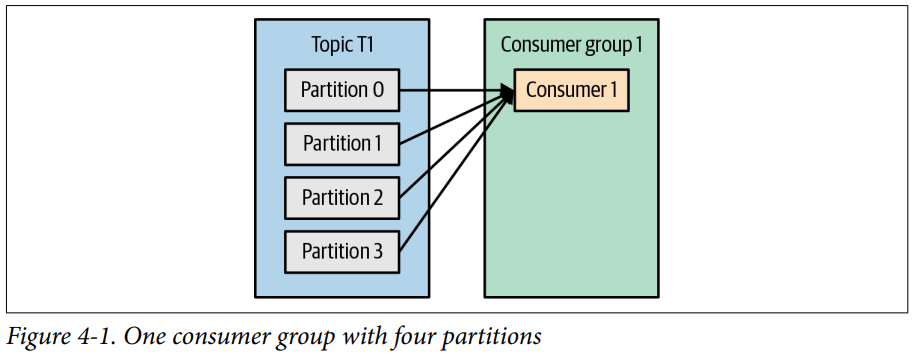
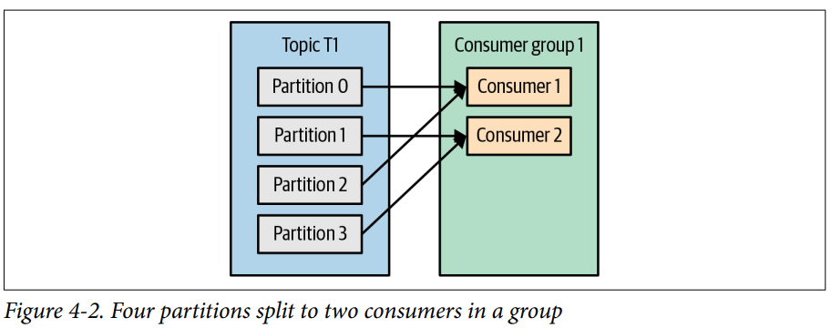
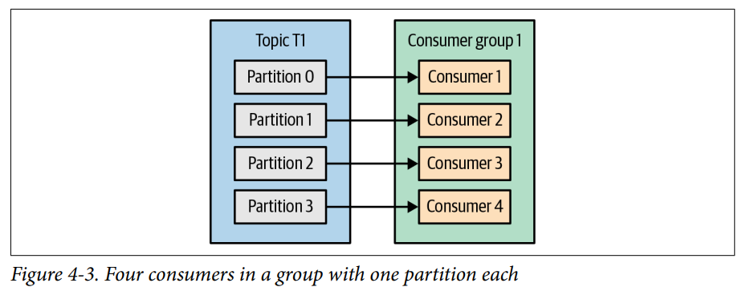
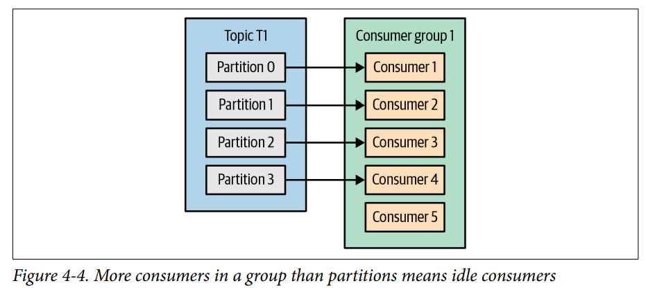
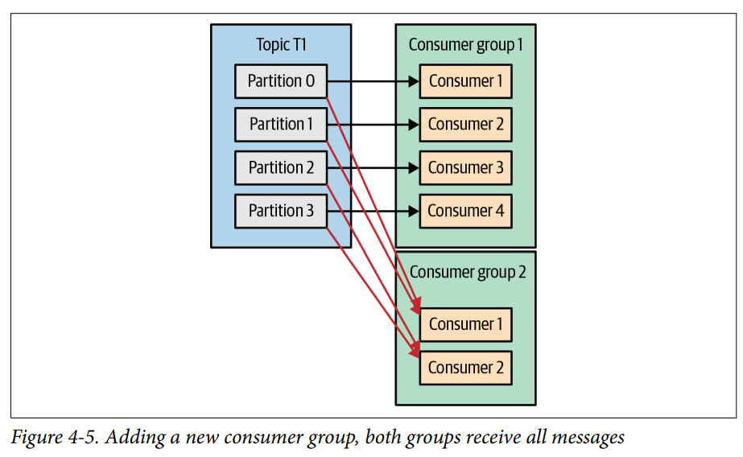
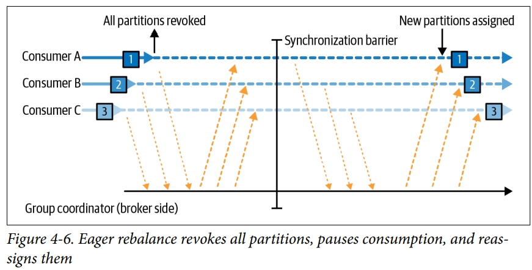
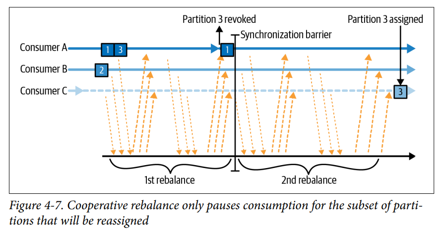

# 4. Kafka Consumers: Reading Data from Kafka

- Kafka Consumer Concepts
- Creating a kafka Consumer
- Subscribing to Topics
- The Poll Loop
- Configuring Consumers
- Commits and Offsets
- Rebalance Offsets
- Rebalance Listeners
- Consuming Records with Specific Offsets
- But How Do We Exit?
- Deserializers
- Standalone Consumer : Why and How to Use a Consumer Without a Group
- Summary

---

- Kafka 데이터를 읽기 위해서는 `KafkaConsumer` 객체를 통해 topic을 subscribe 해야 한다.

## Kafka Consumer Concepts

### Consumers and Consumer Groups

- 같은 topic에 대해 여러 consumer가 읽도록 함
- _consumer group_ : consumer들의 논리적인 그룹
- 같은 consumer group에 속하면 서로 다른 partition으로부터 message를 받음
- appplication은 Consumer group을 추가하고,
    - Consume 성능을 위해 Consumer group에 Consumer를 추가함



- Consumer group에 consumer가 한개일 때



- Consumer group에 consumer가 두개일 때
- C1은 partition 0, 2 C2는 partition 1, 3을 읽음



- Consumer group에 consumer가 4개일 때



- Consumer group에 consumer 수가 partition 수보다 많을 때
- C5는 idle 상태, message를 받을 수 없음

#### Kafka Consumer scaling 전략 : Consumer group에 Consumer 수 늘리기

- 데이터 publish 량이 많다면, Consumer를 늘리는 것이 좋음
- Partition 수보다 늘리는 것은 의미 없음 (idle)
- 따라서 publish 량이 늘어나면, partition 수도 같이 늘어나야함

#### Kafka Consumer scaling 전략 : 여러 application이 같은 topic을 읽을 때

- application 전용의 consumer group을 줌

#### Consumer group이 2개 이상일 때



### Consumer Groups and Partition Rebalance

#### _rebalance_

- partition의 ownership을 다른 consumer에게 넘기는 것
- high availability, scalability를 제공해야함
- Consumer group에 consumer가 추가 / 제거될 때
- topic에 수정이 발생했을 때
- consumer가 꺼지거나 crash가 발생했을 때

#### rebalance type 1 : _Eager Rebalance_



- rebalance 중에 모든 consumer가 stop되고 ownership을 포기
- 다시 partition 할당을 진행함

#### rebalance type 2 : _Cooperative Rebalance (incremental rebalances)_



- 일부 partition 만 rebalance
- consumer들은 계속해서 할당받지 않은 다른 partition으로부터 계속해서 message를 받음
- "stop the world" 현상을 방지함

1. consumer group leader가 모든 consumer들에게 rebalance를 알림
2. consumer가 ownership 포기 (고아 partition 발생)
3. consumer group leader가 고아 partition을 다른 consumer에게 할당
4. 1~3을 몇차례 반복해서 할당

#### _heartbeat_

- Consumer가 COnsumer group의 멤버쉽을 유지하고, partition ownership을 유지하기 위해 주기적으로 보내는 메시지
- consumer의 background thread가 주기적으로 heartbeat를 보냄

#### _group coordinator_

- consumer group의 멤버쉽을 관리하는 broker
- heartbeat가 멈추면 session timeout이 발생 -> rebalance
- consumer가 crashed 되거나, messgae처리를 멈추면 heartbeat가 멈춤
- consumer가 성공적으로 닫히면 group coordinator에게 알려 rebalance를 trigger

> #### Consumer에게 partition을 할당하는 과정 (매 rebalance마다 반복됨)
>
> 1. `JoinGroup` request를 group coordinator에게 보냄
> 2. 첫번쨰 consumer는 Consumer group _leader_ 가 됨
> 3. leader는 group coordinator로부터 consumer list를 받고 partition 할당 책임자가 됨
> 4. `PartitionAssignor`를 구현하여 partition 할당 전략을 정의
> 5. `GroupCoordinator` 와 다른 Consumer들에게 할당 list 전달
> 6. 각 Consumer는 자신의 ownership만 확인 가능

### Static Group Membership

- default로 Conusmer의 소속은 일시적임
    - Consumer가 group을 떠날 때, parittion을 포기
    - 다시 들어오면 새로운 member ID와 partition을 할당받음
- `group.instance.id` : consumer가 gropu의 static member가 되게 함
- static member : consumer가 끝나도 group을 떠나지 않음
    - session timeout 까지 group에 남아있음
    - `session.timeout.ms`
- consummer가 다시들어오면 이전의 partition을 할당받음 (rebalance 없음)
- group coordinator가 static member 정보를 cache하고 있음
- 두 consumer가 동일한 `group.instance.id`를 가지면 두번째 consumer가 error를 받음

#### 장/단점

- rebalance 과정이 없음
- 특정 parition이 특정 consumer에게 할당되어야 할 때 유용함
- consumer가 멈추면 partition이 놀고있다가,
    - consumer가 들어오면 partition의 최신 데이터를 읽을 수 있어야함
- `session.timeout.ms` 만큼 consumer가 join해있기 때문에
    - `session.timeout.ms` 를 적절히 높이 설정하면 rebalance가 자주 일어나지 않음

## Creating a kafka Consumer

````
Properties props = new Properties();

// Kafka cluster conneciton string
props.put("bootstrap.servers", "broker1:9092,broker2:9092");
// Consumer group ID (optional)
props.put("group.id", "CountryCounter");
// Deserializer
props.put("key.deserializer",
    "org.apache.kafka.common.serialization.StringDeserializer");
props.put("value.deserializer",
    "org.apache.kafka.common.serialization.StringDeserializer");
    
// Create KafkaConsumer instance
KafkaConsumer<String, String> consumer =
    new KafkaConsumer<String, String>(props);
````

- `KafkaConumer` 인스턴스 생성

## Subscribing to Topics

````
// topic customerCountries를 subscribe
consumer.subscribe(Collections.singletonList("customerCountries"));

// topic test.*를 subscribe (regular expression)
consumer.subscribe("test.*");
````

- `KafkaConsumer` 인스턴스에 topic을 subscribe
- regular expression도 가능 (1개 이상의 topic을 subscribe)
- 만일 구독 후 topic이 생성되면, rebalance 발생 후 새로운 topic 구독 가능

#### 주의사항 : 정규표현식 오버헤드

- 정규표현식에 해당하는 topic 리스트를 필터링하는 건 client의 책임
- client는 interval마다 topic 리스트를 가져와서 정규표현식에 해당하는 topic을 필터링해야함
    - cluster의 모든 topic에 대한 metadata read 권한 필요
- topic 목록이 매우 많으면, 네트워크 오버헤드가 발생할 수 있음

## The Poll Loop

- `poll()` : consumer가 broker로부터 데이터를 가져오는 메소드
- 새로운 consumer로 첫 호출 시 `GroupCoordinator`에게 join request를 보내고, parition 할당을 받음
- rebalance가 트리거되면, poll loop 안에서 rebalance가 발생함
- `poll()`이 `max.poll.interval.ms` 만큼 실행되지 않으면, consumer가 dead로 간주되어 rebalance가 발생함

````
// poll이 blocking 되는 시간 (consumer buffer에 데이터가 있으면 바로 return)
Duration timeout = Duration.ofMillis(100); 

// Kafka data를 얻기위해 무한 루프를 돌면서 poll
while(true) {
    // polling을 유지하지 않으면 consumer dead로 간주되어 다른 consumer에게 rebalance
    ConsumerRecords<String, String> records = consumer.poll(timeout);
    
    // records에 있는 모든 record를 처리
    for(ConsumerRecord<String, String> record : records) {
        System.out.println("topic = %s, partition = %s, offset = %d, customer = %s, country = %s\n",
            record.topic(), record.partition(), record.offset(), record.key(), record.value());
        
        int updatedCount = 1;
        if(custCountryMap.containsKey(record.value())) {
            updatedCount = countryCounter.get(record.value()) + 1;
        }
        custCountryMap.put(record.value(), updatedCount);
        
        JSONObject json = new JSONObject(custCountryMap);
        System.out.println(json.toString());   
    }
}
````

### Thread Safety

- 동일한 스레드에서 2개 이상의 consumer를 가질 수 없음
- 같은 consumer에서 multi-thread를 안전하게 가질 수 없음
- **1 consumer, 1 thread 는 rule**
- 하나의 applicaiton에서 동일한 consumer group의 여러 consumer를 가지려면 각 consumer마다 스레드를 생성해야함
    - `ExecutorService`를 사용하여 thread 마다 consumer를
      할당 [Confluent example](https://www.confluent.io/blog/tutorial-getting-started-with-the-new-apache-kafka-0-9-consumer-client/)
    - [또 다른 방법](https://www.confluent.io/blog/kafka-consumer-multi-threaded-messaging/)

## Configuring Consumers

## Commits and Offsets

## Rebalance Offsets

## Rebalance Listeners

## Consuming Records with Specific Offsets

## But How Do We Exit?

## Deserializers

## Standalone Consumer : Why and How to Use a Consumer Without a Group

## Summary