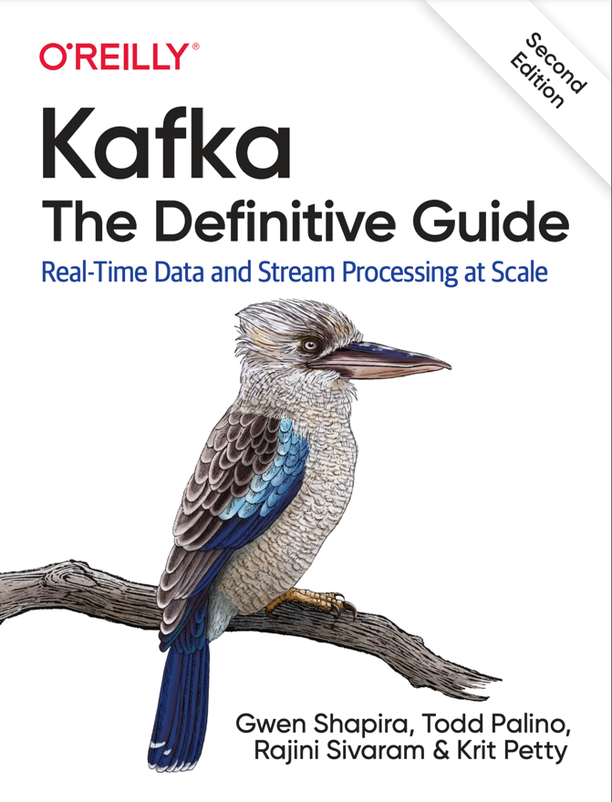

# Kafka The Definitive Guide

Real-Time Data and Stream Processing at Scale

1. [Meet Kafka](1_Meet_Kafka/README.md)
2. [Installing Kafka](2_Installing_Kafka/README.md)
3. [Kafka Producers: Writing Messages to Kafka](3_Kafka_Producers_Writing_Messages_to_Kafka/README.md)
4. Kafka Consumers: Reading Data from Kafka
5. Managing Apache Kafka Programmatically
6. Kafka Internals
7. Reliable Data Delivery
8. Exactly-Once Semantics
9. Building Data Pipelines
10. Cross-Clsuter Data Mirroring
11. Securing Kafka
12. Administering Kafka
13. Monitoring Kafka
14. Stream Processing 
