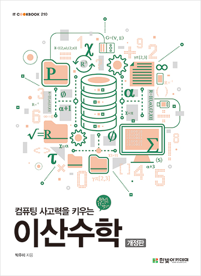

## [Computer Organization and Design](computer_oragnization_and_design/README.md)

#### RISC-V Edition

## [Operating System Concepts](operating_system_concepts/README.md)

### 10th Edition

#### Abraham Silberschatz, Peter B. Galvin, Greg Gagne

## [Database System Concepts](database_system_concepts/README.md)

### Seventh Edition

#### Abraham Silberschatz, Henry F. Korth, S. Sudarshan

## [HTTP 완벽가이드](http-the-definitive-guide)

## [컴퓨팅 사고력을 키우는 이산수학](ubu)

## [이것이 우분투 리눅스다 (개정판)](ubu)

### 우분투 리눅스 설치부터 네트워크와 서버 구축, 운영까지

## [Kafka The Definitive Guide](Kafka_The_Definitive_Guide/README.md)

Real-Time Data and Stream Processing at Scale

## [데이터 중심 어플리케이션 설계](ddia)

## [그림과 실습으로 배우는 도커 & 쿠버네티스](dkkb)

### 개념과 작동 원리가 쏙쏙 이해되는 완벽 입문서

