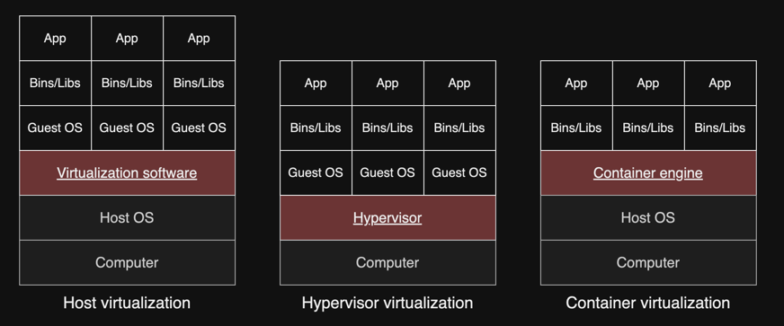

# 3. 클라우드 컴퓨티으이 특징

1. 클라우트 컴퓨팅 장점
2. 클라우드 컴퓨팅 기술
3. 클라우드 컴퓨팅 단점

---

## 1. 클라우드 컴퓨팅 장점

- 대내외 변화에 신속하게 대처해야함

### 클라우드 컴퓨팅의 특성

- 탄력성 (elasticity)
    - 소비자에게 on-demand 방식으로 IT 리소스를 동적으로 할당
- 신속성 (agility)
    - 마우스 클릭 몇회 수준으로 즉작적인 시스템 구축
    - CSP와 소통 없이 리소스 자동화 할당 가능
- 경제성 (economy)
    - 원하는 기능을 사용하고자하는 시간 만큼만 비용 지불
- 가용성 (availability)
    - 사용량 임곗값에 도달하면 탄력적으로 IT 리소스를 제공
    - 임곘값을 초과해도 서비스 중단 문제를 억제시킴
- 신뢰성 (reliability)

#### 가용성 (availability)

- IT 리소스가 중단 없이 작동하고 있을 확률
- 가용성이 높을수록 오랜시간 접근

#### 신뢰성 (reliability)

- 서비스가 정상 작동할 확률, 데이터 손실 없음
- 장애 발생시 백업, 복구 체계 갖춰져 있음

### 도입 효과

- 비용 절감
    - 구축 비용이 거의 없음
    - 도입, 유지 보수 비용 단축
- 인력 문제 해소
    - 시스템 유지보수 리소스 감소

## 2. 클라우드 컴퓨팅 기술

### 클러스터링 (clustering)

- 고속의 네트워크로 동기화되어 단일 시스템인 것처럼 구성된 IT 리소스 그룹
- 가용성, 신뢰성 : 이중화, 장애 복구 기능

### 그리드 컴퓨팅 (grid computing)

- 컴퓨팅 리소스가 논리적 리소스 풀로 등록
- pool에 등록되 리소스가 집합적으로 고성능 컴퓨팅 환경 제공
- 리소스 결합성이 매우 작고, 리소스가 서로 다른 기종, 물리적으로 분산

### 가상화기술

- 가상 인스턴스 (가상 머신)을 생성
- 하나의 물리적인 컴퓨터에서 여러 개의 가상 인스턴스를 생성
- 각 사용자에게 실제 IT 리소스를 논리적으로 할당 (CPU, RAM, HDD 등)

#### 가상화 방식 종류

### 서버리스 컴퓨팅 기술

- 서버를 생성하지 않고, application 코드를 실행할 수 있는 환경
- 사용자 요청을 처리할 때만 서버를 할당하고, 요청이 없을 때는 서버 반환

## 3. 클라우드 컴퓨팅 단점

### 보안 취약성

- 데이터 보안 책임을 CSP와 공유
    - 기업의 데이터가 CSP의 IT 리소스에 저장
- 보안 취약점 : 네트워크 구간이 많아져 도청, 중간자 공격 등 위험
- 책임 소재 불분명
    - 지리적 확장에 따른 지연시간 발생, 대역폭 제약 문제 등
    - 온프레미스 대비 사용자의 권한이 많지 않음
- 과도한 비용 지출
    - 마이그레이션 비용 등

