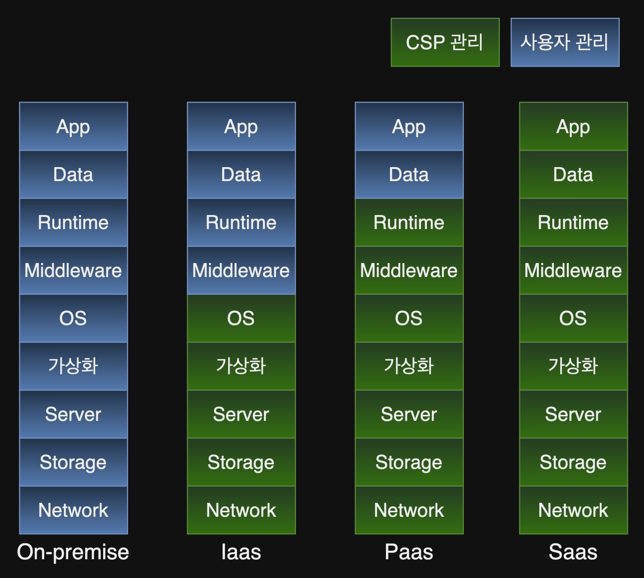

# 5. 클라우드 모델

1. 클라우드 이용 모델
2. 클라우드 배포 모델

---

## 1. 클라우드 이용 모델

### SaaS

- 사용자에게 소프트웨어를 가상화하여 제공하는 모델
- 대부분 웹 브라우저를 통해 소프트웨어 실행 (다운로드, 설치 없음)
- e.g. 구글 워크스페이스, Notion, replit

### PaaS

- 사용자가 직접 소프트웨어 개발, 실행을 위해 CSP로부터 플랫폼을 제공받는 모델
- e.g. 데이터베이스

### IaaS

- 사용자가 요구한 IT 리소스를 가상화하여 제공하는 모델
- 사용자는 IT 리소스에 대한 고수준의 제어권한 획득
- e.g. FaaS (Function as a Service) AWS Lamda, Azure Functions, Google Cloud Functions

### CaaS

- 사용자가 컨테이너 (클러스터)를 구동하기위한 IT 리소스, 기술 제공
- 컨테이너 : Application을 구동하기 위한 리소스 (라이브러리, 바이너리)들이 묶인 패키지
- 다양한 환경에서 오류 없이 사용 가능
- e.g. AWS ECS (Elastic Container Service), Azure AKS(Azure Kubernetes Service)

## 2. 클라우드 배포 모델

- 배포 모델 : 애플리케이션을 배포할 수 있는 클라우드 환경의 유형
- 분류 : Public, Private, Hybrid, Multi, Community

### Public Cloud

- 가장 흔한 모델
- CPS가 네트워크를 통해 사용자가 이요할 수있는 IT 리소스를 제공

### Private Cloud

- 특정 조직만 사용할 수 있도록 독립된 IT 리소스를 제공
- 호스팅형 : CSP가 private cloud를 구성하고 유지, 보수
    - 서버를 CSP가 소유
- 관리형 : CSP에서 private cloud 설정, 관리를 사용자에게 제공
    - 서버를 기업 내부 IDC에 위치

#### vs On-premise

- Private Cloud는 실제 서버를 **가상화**하여 가상 하드웨어를 점유하는 것
- Private Cloud = On-premise + **가상화**
- On-premise는 실제 서버를 사용하는 것

### Hybrid Cloud

- Public Cloud와 Private Cloud를 결합한 모델
- Private Cloud의 보안성과 Public Cloud의 편리성을 동시에 활용 가능
    - Private Cloud에 개인정보 저장
    - Public Cloud에 서비스 제공

### Multi Cloud

- Public Cloud, Private Cloud, Hybrid Cloud를 모두 사용하는 모델

### Community Cloud

- 유사한 업력을 가진 기업들이 공동으로 사용하는 모델