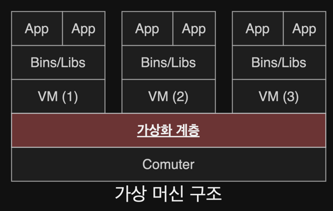
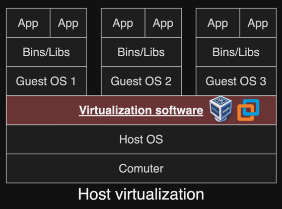
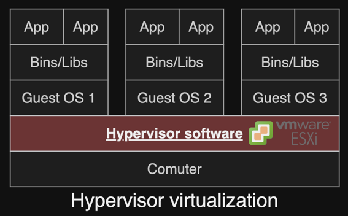
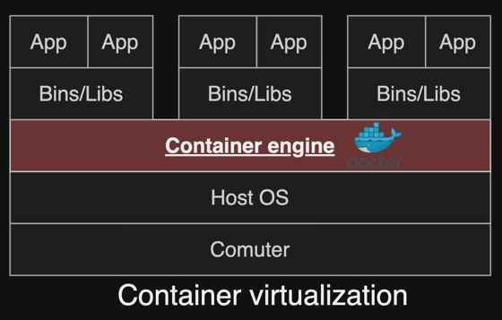

# 5. 클라우드 컴퓨팅 기술 1 - 가상화

1. 가상화 기술
2. 서버 가상화

---

## 1. 가상화 기술

- 가상화 : 소프트웨어적으로 IT 리소스를 논리적으로 분할/통합하는 기술
    - 리소스 이용률, 가용성을 높임
    - 하나의 서버에 여러 실행 환경을 구성
    - 간편한 유지보수

### 가상화 소프트웨어

- 하드웨어 리소스 (CPU, GPU, Memory, Storage)와 소프트웨어 리소스 (OS, runtime)을 가상화
- 사용자의 요청에 탄력적으로 리소스를 제공할 수 있는 클라우드 컴퓨팅의 핵심 기술

### 가상 머신 (Virtual Machine)

- 가상화 기술을 통해 나뉘어진 논리적 기초 머신
- 하드웨어 리소스를 OS를 통해서 제어하지 않고 VM 수준에서 제어
- 하드웨어 위에 서로 다른 OS 실행 가능

#### 가상머신 구조

### 가상화 기술의 역할

- 파티셔닝 : 하나의 물리적 머신을 분할, 분배
- 캡슐화 : 하드웨어 제어를 위한 복잡한 기능을 캡슐화하여 인터페이스를 제공
- 격리 : 가상머신 단위로 격리
- 하드웨어 독립 : 가상머신에 할당된 하드웨어만 사용 가능

## 2. 서버 가상화

- 가상화 방식
    - 호스트 가상화
    - 하이퍼바이저 가상화
    - 컨테이너 가상화

### 호스트 가상화 방식

- 하드웨어의 Host OS상에서 가상화 소프트웨어 설치
- 가상화 소프트웨어에서 게스트 OS가 작동하는 방식
- 단점 : 가상머신별로 운영체제를 설치해야 하므로 비효율적 (성능 저하)
    - **지금은 거의 사용 안함**
- e.g. VMware Workstation, Oracle VirtualBox, Microsoft Virtual Server

### 하이퍼바이저 가상화 방식

- 운영체제에 의존하지 않음
- 하드웨어에 직접 설치됨
- 오버헤드 비용 적음
- 하드웨어를 직접 관리하기 떄문에 리소스 관리가 유연
- e.g. VMware ESXi, Microsoft Hyper-V

### full-virtualization (전가상화)

- 하드웨어를 완전히 가상화하는 방식
- 관리용 가상 머신 DOMO를 통해 게스트 OS들의 커널 요청을 번역, 하드웨어에 전달
- 병목현상 (성능 저하)

### para-virtualization (반가상화)

- 게스트 OS가 하이퍼 콜을 요청
    - 하이퍼콜 : 하드웨어 제어 요구
- OS 커널 수정 필요
    - 리눅스와 같은 오픈소스 OS 외에는 반가상화가 어려움

### 컨테이너 가상화 방식

- 컨테이너 : 애플리케이션 동작에 필요한 라이브러리, 종속 리소스들을 패키지로 묶어 놓은 것
    - Host OS상의 논리적인 구역
- 장점
    - 성능 이점 : **운영체제가 1개뿐**
    - 미들웨어, 라이브러리 버전 등을 모두 컨테이너로 격리해서 해결

#### Docker

- 대표적인 오픈소스 컨테이너 엔진
- 리눅스 컨테이너 기반의 이미지 생성, 배포에 특화

#### Kubernetes

- 컨테이너 분산 배치, 상태 관리, 구동환경을 관리해주는 도구
- **2022부터 Docker 지원 중단**

