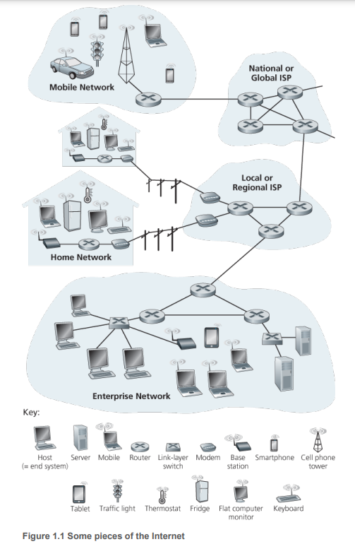

# 1. What is the Internet?

1. A Nuts-and-Bolts Description
2. A Services Description
3. What is a Protocol?

---

## 1. A Nuts-and-Bolts Description

- Internet : 수십억개의 컴퓨팅 디바이스가 상호작용하는 computer network
    - 컴퓨팅 디바이스 : desktop PC, server, smartphone, IoT 디바이스, ...
- **host (end system)** : 인터넷으로 연결된 컴퓨팅 디바이스
- 2015년 기준 약 5억개의 장치가 인터넷에 연결되어 있음
    - 2020년 예상 25억개 (Gartner 2014)
- **communication links**, **packet switches** 로 host들이 연결됨
- **packet** : seding end system이 network를 통해 receiving end system에게 보내는 메시지의 작은 조각

### packet switch (router, link-layer switch)

- packet switch는 communication link를 통해 받은 packet을 받고,
- 다른 communication link를 통해 packet을 forwarding
- 주로 **router** 혹은 **link-layer switch** 로 구현됨
- **link-layer switch** : network 접근 시 사용
- **router** : network core에서 사용
- **route (path)** : packet이 seding end system에서 receiving end system으로 가는 길
- Cisco 예측으로 연간 IP traffic은 제타바이트가 넘는다고 분석 (Cisco VNI 2015)

| 예시                       | 네크워크               |
|--------------------------|--------------------|
| factory (warehouse)      | end systems        |
| 대용량 수하물                  | 전송할 데이터            |
| 트럭 : 수하물을 잘게 나누어 에 실음    | packet             |
| 트럭은 고속도로를 통해 목적지로 이동     | communication link |
| 고속도로의 교차로                | packet switch      |
| 목적지에서 여러 트럭에 담긴 수하물을 재조립 |                    |

### Internet Service Provider (ISP)

- end system이 ISP를 통해 인터넷에 연결됨
- residential ISP : local cable, telephone company
- corporate ISP : university, company, school
    - WIFI
- celullar data ISP : mobile smartphone network
- 각 ISP는 스스로 packet switch와 communication link를 가지고 있음

### Protocol

- Internet 안에서 정보룰 송/수신하는 규칙들의 집합
- Transmission Control Protocol (TCP), Internet Protocol (IP) : 인터넷 프로토콜 중 가장 중요한 프로토콜
- IP 프로토콜은 end system이 송/수신할 packet을 정의
- 인터넷의 주 프로토콜은 TCP/IP

### Internet Standards

- Internet Engineering Task Force (IETF) : 인터넷의 프로토콜과 표준을 개발하는 단체
- request for comments (RFC) : IETF에서 개발한 프로토콜과 표준을 문서화한 것
- RFC는 TCP, IP, HTTP, SMTP 등을 정의

## 2. A Services Description

- Internet은 application에 서비스를 제공하는 infrastructure
- **Distributed applications** : end system들이 서로 통신하는 application
    - 음악, 영화 스트리밍, SNS, 비디오 화상 회의, 온라인 게임 등
- Internet을 사용하기위해 application은 end system에서 실행됨

### Internet : application에 service를 제공하는 Infrastructure

- distributed Internet application 은 서로 다른 end system에서 실행되는 프로그램들로 구성됨
- end system은 Internet을 통해 서로 통신함

### **socket interface** : end system에서 다른 end system으로 메시지를 보내기 위해 사용되는 인터페이스

- end system의 프로그램이 데이터를 인터넷을 통해 송/수신하기 위해 사용하는 인터페이스
- e.g. 편지를 보내기위해 사용되는 우편 서비스

## 3. What is a Protocol?