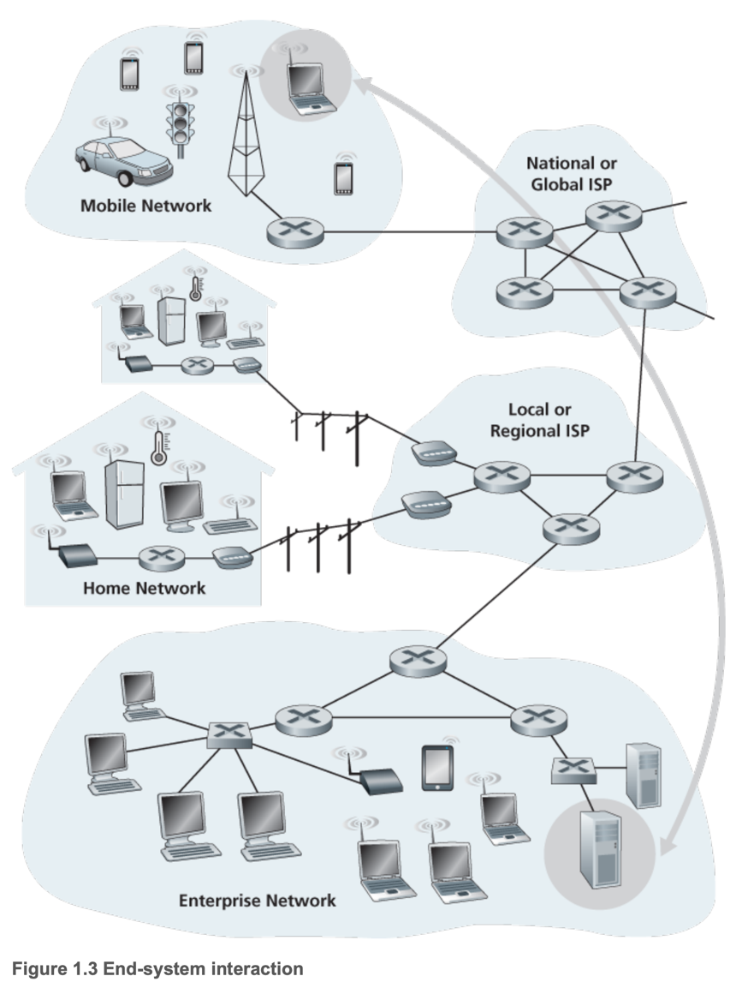
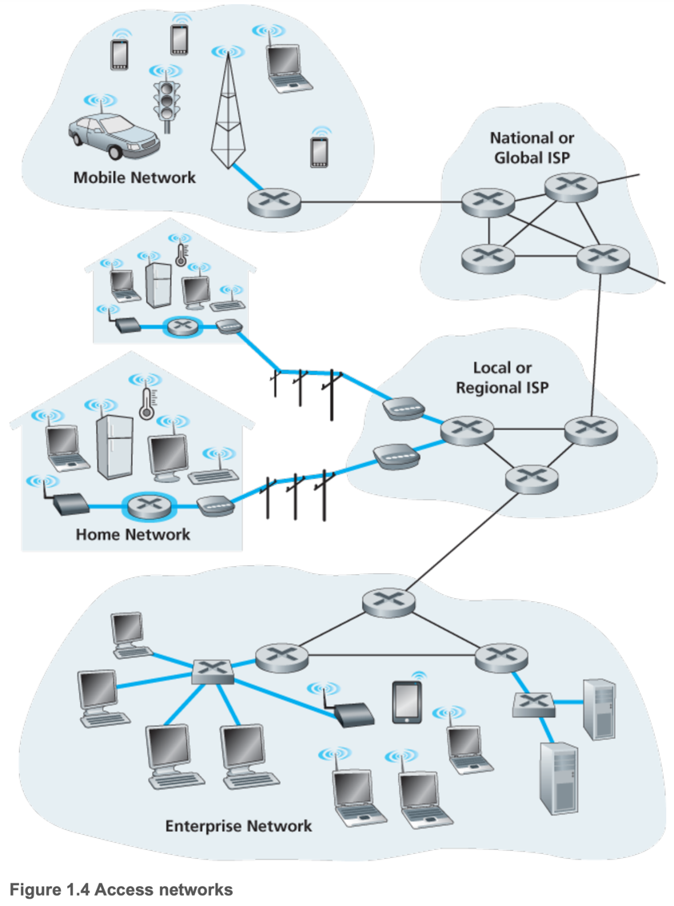
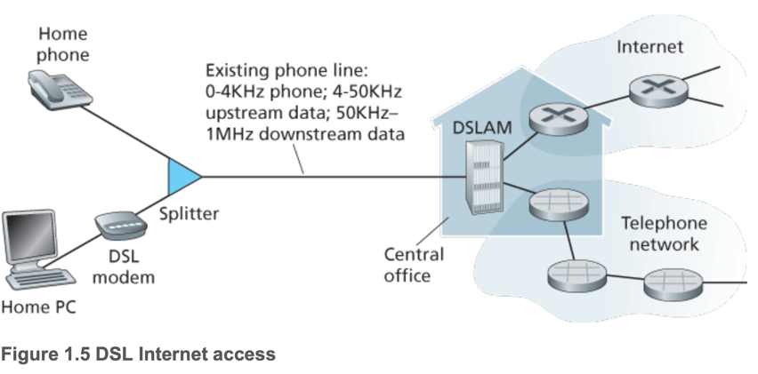
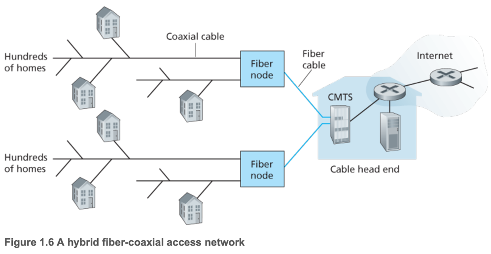
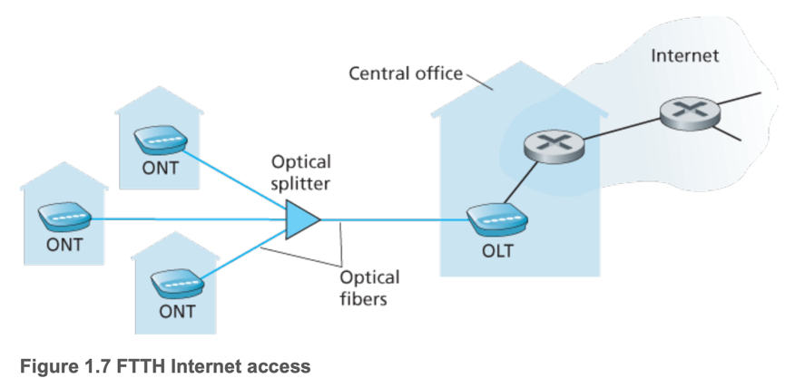
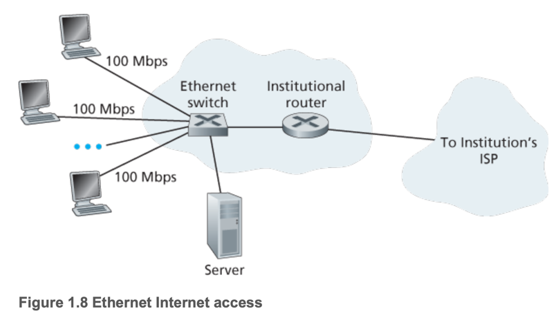
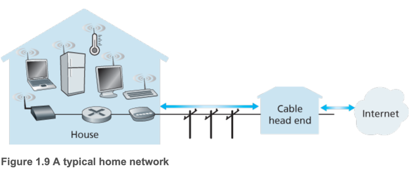

# 2. The Network Edge

1. Access Networks
2. Physical Media

---

- computer network의 컴포넌트 : 컴퓨터, 스만트폰, 태블릿, IoT 장비, ...
- end system (host) : network edge에 있는 컴퓨터들
    - _host_ : end system application을 hosting (running)

### host = client + server

- client : desktop, mobile, IoT 장비, ...
- server : 고성능 머신, web page, stream video 등이 가능한 컴퓨터
    - _data center_ : server가 많이 모여있는 곳

## 1. Access Networks

- end system은 first router (edge router)를 통해 물리적으로 network에 연결되어있음

### Home Access: DSL, Cable, FTTH, Dial-Up, and Satellite

- 80% 이상의 가구가 internet access 중 (대부분 hig-speed broadband connection)
- 대표적 2가지 타입의 broadband access network : **DSL (digital subscriber line)**, **cable**
- 가구에서는 주로 동일한 지역 telco (telephone company)를 통해 DSL 획득
    - 이 때 telco = ISP (internet service provider)

#### DSL (digital subscriber line) : 기존의 전화선을 사용

- 고객의 DSL 모뎀이 기존의 전화선을 통해 DSLAM (DSL access multiplexer)에 연결
- DSL 모뎀이 디지털 신호를 받아서 고주파로 변환 -> 전화선을 통해 CO (central office)로 전송
- 가구의 전화선는 하나의 선으로 3가지 서비스제공
    - 전화선 : 0 ~ 4kHz
    - upstream Data : 4 ~ 50kHz
    - downstream Data : 50 ~ 1MHz
- DSLAM : DSL 모뎀으로부터 받은 신호를 Internet, Telephone으로 전송

#### cable internet access : 기존의 케이블 TV를 사용

- 동일한 company에서 제공하는 케이블 TV로부터 얻음
- HFC (hybrid fiber coax) : fiber + coaxial cable
    - fiber : headend (케이블 TV의 중앙)에서 neighborhood의 fiber node까지
    - coaxial cable : fiber node에서 가구까지
- fiber node : neighborhood의 500 ~ 5000 가구를 담당
- Cable modem : Ethernet port를 통해 가구 PC 연결
- Cable Modem Termination System (CMTS) : cable modem으로부터 받은 신호를 Internet, Telephone으로 전송
    - DSLAM과 같은 역할
- shared broadcast medium : downstream은 모든 가구에게 전송 (공유)
    - head end가 보낸 모든 패킷은 downstream으로 모든 가구에 전송
    - 가구의 패킷은 upstream으로 head end에 전송
    - e.g. 모든 사용자가 동일한 file을 다운로드할 때, 다운로드 속도가 느림

#### fiber to the home (FTTH)

- CO에서 가구까지 fiber를 사용
- 30% 이상의 가구가 FTTH 사용 (2016 FTTH Council)
- CO로 부터 가구까지의 fiber를 여러 가구에서 공유해서 사용
- FTTH의 2가지 타입
    - active optical network (AON)
    - passive optical network (PON)
- 희망적으로 gigabit/sec의 속도를 제공
    - US FTTH는 평균적으로 20Mbps downstream

#### PON 예시 : Verizon FiOS service

- Optical Network Terminator (ONT) : 각 가구에 위치
    - 이웃 splitter와 연결
    - 가구의 사용자는 home router를 통해 ONT에 연결
- splitter는 100 개 이상의 다수 가구를 결함, 광섬유 공유
- Optical Line Terminator (OLT) : CO에 위치
    - splitter와 연결
    - 광신호와 전기신호 변환하며 telco router를 통해 Internet에 연결

#### Satellite link, Dial-up (일부 농촌 지역)

- 앞의 방법들이 불가능할 때
- Satelite는 1Mbps 이상의 속도 제공
    - e.g. StarBand, HughesNet
- Dial-up : 기존의 phone line을 사용
    - 56kbps의 속도 제공
    - phone line을 통해 ISP에 연결

### Access in the Enterprise (and the Home): Ethernet and WiFi

- local area network (LAN) : enterprise, home에서 사용
- 다양한 종류의 LAN 기술이 있음
    - 가장 일반적으로 사용되는 기술 : Ethernet, WiFi

#### Ethernet

- 사용자는 twisted-pair copper wire를 통해 Ethernet switch에 연결
- Ethernet switch는 더 큰 규모의 Internet에 연결
- 사용자는 일반적으로 100Mbps ~ 1Gbps의 속도 제공
- 서버는 1 ~ 10Gbps의 속도 제공

#### WIFI : 802.11 wireless LANs

- 무선으로 인터넷에 연결 (IOT, laptop, smartphone, ...)
- 무선 사용자는 일반적으로 access point의 수십미터 안에 있어야함
- 100Mbps 이상의 속도 제공

#### Home network = broadband residential access + wireless LAN

- 기지국(base station, 무선 access point) : 다른 무선 장치들과 연결
- cable modem : Internet에 boradband access
- router : cable modem, 기지국, 유선 장치들을 연결

### Wide-Area Wireless Access: 3G and LTE

- 기지국으로부터 수십 km 떨어진 곳에서도 무선으로 인터넷에 연결 가능
- 휴대전화 통신에 사용되는 무선 인프라를 통해 기지국에 연결
- third generation (3G) wireless : 1Mbps 이상의 속도 제공
- fourth generation (4G) wireless : 10Mbps 이상의 속도 제공

## 2. Physical Media

- Internet을 사용할 때 주로 사용되는 전송 매체
- **physical medium** : bit를 전송하는 데 사용되는 매체
    - e.g. copper wire, fiber optic cable, radio spectrum
    - 2가지 타입 : **guided media**, **unguided media**
    - **guided media** : physical medium에 bit를 전송하는 데 사용되는 physical wire
        - e.g. twisted-pair copper wire, coaxial cable, fiber optic cable
    - **unguided media** : physical medium에 bit를 전송하는 데 사용되는 physical wire가 없는 매체
        - e.g. radio spectrum, light spectrum
- physical link 설치 비용이 더 비싸기 때문에 건축가들은 방에 wire를 설치해둠
    - 미래에 쓸 것을 대비해서

### Twisted-Pair Copper Wire (꼬임 쌍선)

- 가장 일반적으로 사용되는 guided media, 가장 저렴
- 100년에 걸쳐 전화선에 사용 (전화선 99% 이상)
- **Unshielded Twisted Pair (UTP)** : 빌딩 컴퓨터 네트워크 (LAN) 구축시 사용
- 10 Mbps ~ 10 Gbps의 속도 제공
- 고속 LAN 네트워크 구축의 대부분을 차지
- 사용처 : 빌딩 LAN, 가구 Internet, DSL

### Coaxial Cable (동축 케이블)

- 두 개의 동심원의 전기적 전송 매체
- cable TV system에 주로 사용
- cable tv, cable Internet access에서 디지털 신호를 변환
- **shared medimum** 으로도 사용

### Fiber Optics (광섬유)

- 얇고 유연한 매체
- 빛을 통해 전기 신호를 전송
- 하나의 광 섬유는 수백 gigabits/sec의 속도 제공
- 장거리 전송에 사용 (대륙간 연결)
- 단거리 (집 LAN, 주거용 broadband access)에는 비선호 (비용 문제)

### Terrestrial Radio Channels

- 전자 파장을 통해 전기 신호를 전송
- 물리적 매체가 필요 없음
- 세가지 분류
    - 1 ~ 2m (무선 LAN, 무선 헤드셋, 키보드 등)
    - local area : 10 ~ 수백 m
    - wide area : 수십 km

### Satellite Radio Channels (위성 라디오 채널)

- 위성이 전송을 바다 repeater를 사용해 다시 신호를 생성해서 전송
- 사용되는 2가지 타입 위성 : **geostationary satellites**, **low-earth-orbiting satellites (LEO)**
- **geostationary satellites** : 영구적으로 지구 특정 지점에 위치
    - 위성을 지표면 36000km 떨어진 지점에 위치
    - 280 ms 지연 시간
    - 수백 Mbps의 속도 제공
- **low-earth-orbiting satellites (LEO)** : 지구 주위를 돌면서 전송