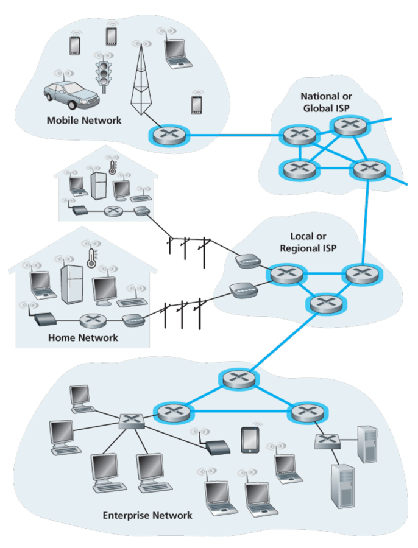
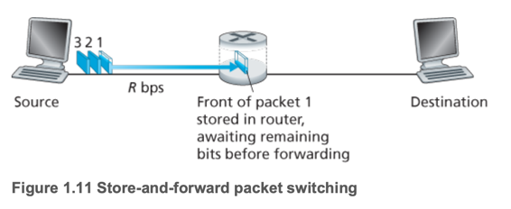
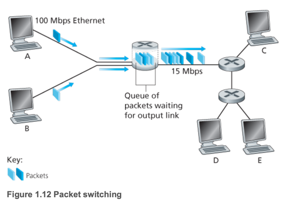
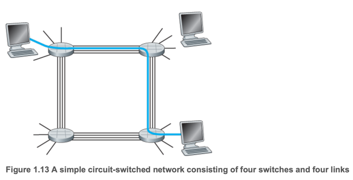
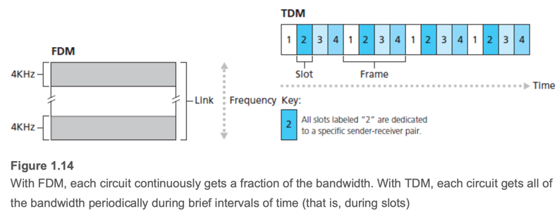
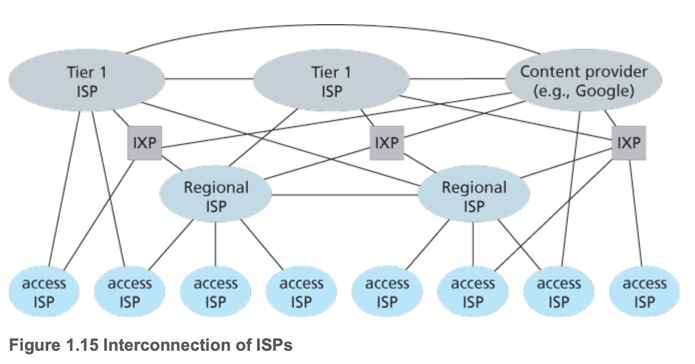

# 3. The Network Core

1. Packet Switching
2. Circuit Switching
3. A Network of Networks

---

- 데이터를 네트워크 링크, 스위치로 전달하는 방법은 크게 **circuit switching** 과 **packet switching**으로 나뉨
- end system : PC, Smartphone, web server 등

| 항목    | Packet Switching  | Circuit Switching                                |
|-------|-------------------|--------------------------------------------------|
| 전송 방식 | store-and-forward | reserved                                         |
| 전송 속도 | variable(delayed) | constant                                         |
|       |                   | silent period 발생, 사전에 연결하는 과정이 복잡하고 처리 소프트웨어가 필요 |

## 1. Packet Switching

- Network app에서 end system 끼리 **message** 를 교환
- message에는 서로가 원하는 정보가 담김 (e.g. 이메일, 웹 페이지, 비디오 스트리밍 등)
- source -> destination
- **packet** : message를 destination까지 전송하기 위해 긴 메시지를 짦은 청크단위로 쪼갬
- 패킷은 각 커뮤니케이션 링크의 최대 전송 속도에 맞춰 전송됨
    - L개의 비트를 R bits/sec 으로 전송하면 속도는 L/R 초 (e.g. L=500bits, R=1000bits/sec -> 0.5초)

### Store-and-Forward Transmission

- 대부분의 패킷 스위치는 **store-and-forward** 방식으로 동작
- **Store-and-forward** transmission : 패킷 스위치는 전체 패킷을 다 받은후 outbound link로 전송
- N개의 링크가있을때 (N-1 : 스위치 수) NLR만큼 소요됨
- 위 그림에서 총 3*2L/R 초가 걸려 Destination까지 도달
    - 2 : destination까지가는 링크 수 (라우터를 1개 거쳐야함)

| time | 동작                                      |
|------|-----------------------------------------|
| L/R  | 라우터가 모든 패킷을 받았고, destination으로 1번 패킷 전송 |
| 2L/R | destination이 모든 패킷을 받게됨                 |

### Queuing Delays and Packet Loss

- **queuing delay** : 패킷이 output buffer에 대기하는 시간
    - 네트워크 혼잡도에 따라 정도가 다름
- **packet loss** : 버퍼가 가득차서 패킷을 더이상 받을 수 없는 경우
    - 기존 버퍼에 있는 패킷을 삭제하거나(1), 큐에 넣어야하는 패킷을 버림
- 패킷스위치에는 각 링크마다 **output buffer (output queue)** 가 존재
- 각 output buffer 각 링크마다 보낼 패킷을 버퍼링
- 링크에 패킷을 보내야하지만 링크가 바쁠때 버퍼링

### Forwarding Tables and Routing Protocols

- 라우터는 패킷을 어떤 링크로 포워딩할 지 결정해야함
- 결정 방법은 컴퓨터 네트워크 타입에 따라 다름
- 인터넷의 경우
    - 모든 end system은 IP 주소를 가짐
    - source는 destination의 IP 주소를 패킷 헤더에 포함
    - 라우터에 패킷이 도착하면 destination IP 주소를 확인 -> 그에 맞는 outbound link로 포워딩
    - **forwarding table** : destinatnion address 와 outbound link의 매핑

## 2. Circuit Switching

- end system 간에 통신에 필요한 경로상의 리소스 (buffer, transmission rate 등)을 통신 세션동안 미리 할당 (_reserved_)
    - 패킷 스위칭에서는 리소스들을 점유하지 않고, 요청할때마다 할당 on-demand
- e.g. 전통적인 전화망 : 전화통화를 하기위해 수신/발신자 간에 연결(리소스)을 먼저 설정
- **circuit**(회선) : 전화를 걸기위해 서로 연결된 경로
- 회선이 연결되면 전송속도가 일정하게 보장되므로 안정적으로 데이터 전송 속도 보장

### Multiplexing in Circuit-Switched Networks

- circuit을 구현하는 2가지 방법
- **frequency division multiplexing (FDM)** : 링크에서 서로 다른 주파수 대역을 사용하여 회선 연결
    - 링크는 각 연결마다 사용되는 주파수 대역을 가짐
    - **bandwidth** : 링크마다 전송할떄 점유하는 주파수 대역폭
    - e.g. FM 라디오 방송은 88MHz ~ 108MHz 대역폭을 공유하여 사용
- **time division multiplexing (TDM)** : 서로 다른 시간 슬롯을 사용하여 회선 연결
    - e.g. 1초에 4개의 전화 통화가 이루어짐
    - **silent period** : slot안에서 end 간에 리소스를 사용하지 않더라도 점유되고있음

### Packet Switching Versus Circuit Switching

| 항목                   | 패킷 교환 (Packet Switching)                 | 회선 교환 (Circuit Switching)              |
|----------------------|------------------------------------------|----------------------------------------|
| 전송 자원 할당 방식          | 필요할 때마다 동적으로 공유 (on-demand)              | 통신 시작 시 고정적으로 할당 (reserved in advance) |
| 전송 효율성               | 높은 자원 활용도 (유휴 자원 없음)                     | 비활성 기간 동안 자원 낭비 발생                     |
| 실시간 서비스 적합성          | 지연이 가변적이므로 부적합할 수 있음                     | 고정된 대역폭으로 안정적인 지연 제공                   |
| 구현 복잡도 및 비용          | 단순하고 저렴함                                 | 복잡한 신호 처리 소프트웨어 필요                     |
| 사용자 수용 능력            | 통계적 다중화로 많은 사용자 수용 가능                    | 사용자 수에 따라 고정된 자원 필요                    |
| 예시 1: 35명 중 10%만 활동  | 지연 없이 대부분 처리 가능 (0.9996 확률로 10명 이하 동시활동) | 회선당 100kbps 고정 할당 → 최대 10명만 수용 가능      |
| 예시 2: 1명만 100만 비트 전송 | 1초 내 전송 완료 가능                            | 10초 소요 (TDM 기준)                        |
| 공유 방식 차이             | 패킷 단위로 필요한 만큼만 공유                        | 미리 시간/대역폭을 고정 할당                       |
| 최신 동향                | 대부분의 네트워크가 패킷 교환 채택                      | 전화망도 점차 패킷 교환으로 전환 중                   |

## 3. A Network of Networks

- 오늘날 인터넷은 수십만 개의 하위 ISP와 소수의 상위 ISP, 그리고 콘텐츠 제공자 네트워크들이 상호 연결된 다계층 구조.
- 콘텐츠 제공자는 자체 글로벌 네트워크를 운영하며, 가능한 한 상위 ISP를 우회하여 하위 ISP 또는 IXP에 직접 연결.