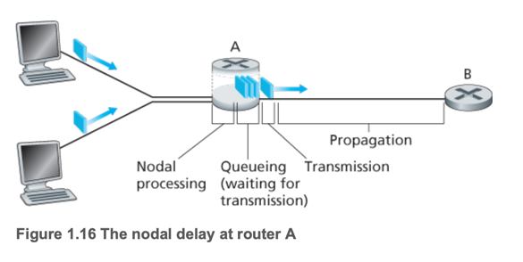
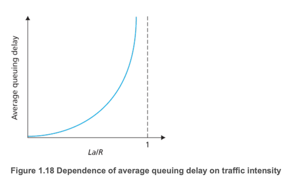
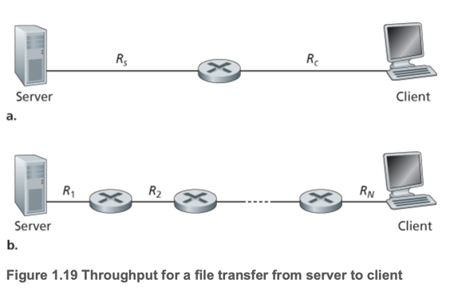
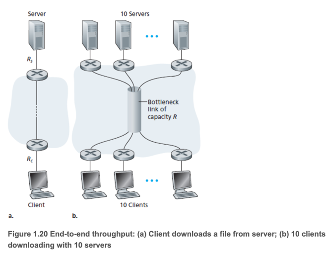
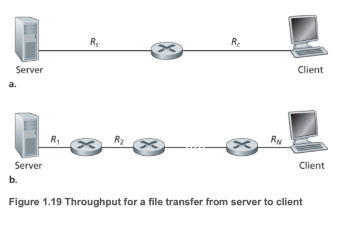

# 4. Delay, Loss, and Throughput in Packet-Switched Networks

1. Overview of Delay in Packet-Switched Networks
2. Queuing Delay and Packet Loss
3. End-to-End Delay
4. Throughput in Computer Networks

---

- throughput : end system간에 단위 시간당 전송되는 데이터의 양
- node dealy : 단일 라우터 안에서 발생 가능한 지연
- end-to-end delay : end system 간에 발생하는 지연 (전체 지연)
- 컴퓨터 네트워크 성능 지표 : 지연(Delay), 손실(Loss), 처리량(Throughput)
- mbps : megabits per second

## 1. Overview of Delay in Packet-Switched Networks

- node : host or router
- 패킷이 destination으로 가는 동안 node 별로 몇 종류의 delay가 발생함
- 인터넷 app들은 이러한 네트워크 딜레이에 매우 영향을 받음

### Types of Delay



- **nodal processing delay** : 패킷을 수신한 node가 패킷을 처리하는데 걸리는 시간
    - packet header 검사
    - 비트 오류 검사
    - 일반적으로 수 microsecond
- **queuing delay** : 패킷이 node의 queue에 대기하는 시간
    - outbound link를 기다리며 큐에서 대기하는 시간
    - 큐에 대기중인 패킷의 수에 따라 달라짐
    - 0~ 수 microsecond
- **transmission delay** : 패킷을 node의 link로 내보내는데 걸리는 시간 (거리와 무관)
    - 패킷 전체를 링크로 밀어 넣는데 걸리는 시간
    - ~ millisecond
- **propagation delay** : 패킷이 node의 link를 통해 전송된 후, link의 물리적 매체를 통해 전파되는 시간
    - ~ 수 millisecond
- **total nodal delay** : nodal processing delay + queuing delay + propagation delay

## 2. Queuing Delay and Packet Loss



- queuing delay는 다음에 의존
    - 트래픽 도착률
    - 링크의 전송 속도 (R)
    - 도착 트래픽의 성격 (주기적? 폭주?)
- 트래픽 강도 (Traffic Intensity) : 트래픽 도착률 * 패킷길이 / 링크의 전송 속도
    - 트래픽 강도가 1보다 작으면 패킷이 큐에 대기하지 않음
    - 트래픽 강도가 1보다 크면 패킷이 큐에 대기함
    - **핵심 원칙** : 트래픽 강도를 1 이하로 유지해야함

### Packet Loss

- 큐가 가득차면 새로온 패킷은 버려짐 (packet loss)
- end system 간에는 마치 패킷이 손실된 것처럼 보임
- 트래픽 강도가 커질수록 패킷 손실 확률이 커짐
- 손실된 패킷은 재전송(retransmission) 되면서 복구됨

## 3. End-to-End Delay

라우터가 N-1개 존재하고, 혼잡이 없을때

```
end to end delay = N * (nodal processing delay + queuing delay + transmission delay + propagation delay)
```

trace route 프로그램 사용시 end-to-end delay 측정 가능

### End System, Application, and Other Delays

- WIFI와 같은 공유 자원에 패킷을 전송할때 발생하는 지연
- packetization delay : end system이 패킷을 생성하는데 걸리는 시간 (VoIP application)

## 4. Throughput in Computer Networks



- throughput : end system 간에 단위 시간당 destination이 수신하는 데이터의 양 (bits/sec)
- e.g. P2P File sharing system
- **instantaneous throughput** (순간 처리량) : 특정 순간에 end system이 수신하는 데이터의 양
    - e.g. 1초 동안 1000bits를 수신했다면 순간 처리량은 1000bits/sec
    - p2p application에서 peer가 다른 peer에게 데이터를 전송할때 순간 처리량을 측정함
- **average throughput** (평균 처리량) : end system이 수신하는 데이터의 양을 전송 시간으로 나눈 것
    - e.g. 10초 동안 1000bits를 수신했다면 평균 처리량은 100bits/sec
- 처리량은 경로상의 병목 링크 (**bottleneck link**)에 의해 결정됨



- 10쌍의 서버/클라이언트가 있고, 동시에 파일을 다운로드, 공통 링크를 공유함
- 코어 링크의 전송률 5 Mbps, 서버의 업로드 최대 2Mbps, 클라이언트의 다운로드 최대 1Mbps
- 각 destination은 500kbps (0.5Mbps)로 다운로드 가능