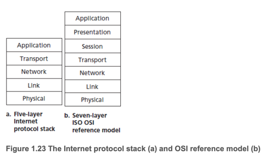
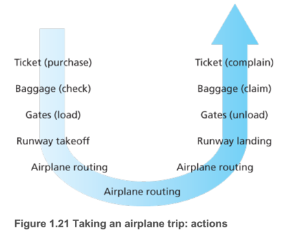
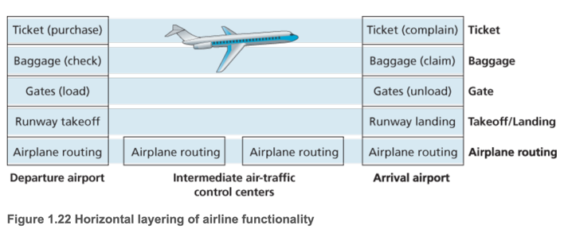
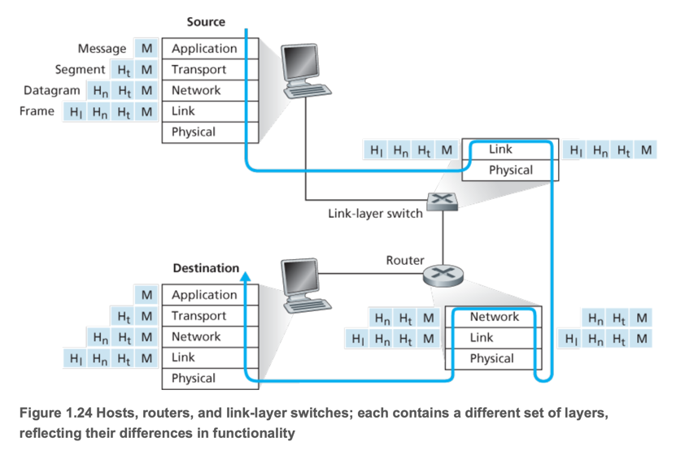

# 5. Protocol Layers and Their Service Models

1. Layered Architecture
2. Enca

---

- 인터넷엔 많은 apps와 프로토콜, end system 타입, packet switch, link-level media(e.g. fiber, copper, radio) 등이 존재함
- network architecture 를 정의해서 복잡성을 줄임

## 1. Layered Architecture

- 프로토콜 계층화는 네트워크 기능을 역할별로 분리하여 모듈화함
- 각 계층은 하위 계층의 서비스를 이용하고 상위 계층에 서비스 제공
- 인터넷은 5계층 모델: 애플리케이션 / 전송 / 네트워크 / 링크 / 물리
- OSI는 7계층 모델로, 표현 계층과 세션 계층이 추가됨
- TCP/UDP, IP, Ethernet/WiFi, DNS/HTTP 등은 각 계층의 주요 프로토콜
- 계층화는 구조적 장점이 있지만 기능 중복 및 계층 간 정보 공유 문제라는 단점도 있음
- 인터넷은 필요 기능을 애플리케이션 수준에서 구현하도록 설계됨

- 각 계층(layer)은 하위 계층의 서비스를 활용해 상위 계층에게 서비스 제공
- 모듈화를 제공하고 레이어의 서비스 구현체를 수정하기 쉬움
    - `Baggage` 레이어에서 수정이 발생해도 `Runaway takeoff` 레이어는 영향을 받지 않음

### Protocol Layering

- 프로토콜을 정의(1), 프로토콜 네크워크 하드웨어/소프트웨어를 구현하여 Layer를 구성
- 프로토콜은 특정 계층에 속함
- **Service** : 상위 계층에게 제공하는 행위
- **Service model** : 상위 계층에게 제공하는 서비스의 정의
- 각 계층은 레이어에서 특정 액션을 한뒤 하위 계층의 서비스를 이용해 상위 계층에게 서비스를 제공함
    - e.g. n계층은 n-1 계층이 제공한 비신뢰 메시지를 신뢰 메시지로 가공해 n+1 계층에게 제공함
- 프로토콜 계층은 하드웨어, 소프트웨어, 혹은 둘의 조합으로 구현됨
    - Application Layer prodtocol (HTTP/SMTP)는 end system에서 실행되는 소프트웨어로 구현됨
    - physical layer, data link layer (Ethernet, WIFI interface Card)는 하드웨어로 구현됨
- **protocol stack** : 계층별 프로토콜을 모아놓은 것

### Application Layer (애플리케이션 계층)

- HTTP(웹), SMTP(이메일), FTP(파일 전송), DNS(도메인 이름 시스템)
- 전송 단위 : **message**

### Transport Layer (전송 계층)

- application endpoint간에 메시지 전달
- 전송 단위 : **segment**
- TCP, UDP
- 둘 다 application layer의 메시지를 전달 가능
- TCP : connection-oriented
    - 메시지 전송 보장
    - flow control(흐름 제어 = 전송 속도 조절)
    - long message를 작은 segment로 나누어 전송, source는 네트워크가 혼잡할때 전송 속도를 조절함
- UDP : connectionless
    - 메시지 전송 보장 안함
    - flow control 없음

### Network Layer

- 전송 단위 : **datagram**
- 한 host에서 다른 host로 datagram을 전송
- IP 프로토콜만 사용

### Link Layer

- 전송 단위 : **frame**
- 패킷을 인접 노드간에 전달
- Ethernet, WiFi, DOCSIS, ...
- 링크마다 다른 프로토콜 사용 가능

### Physical Layer (물리 계층)

- 구리선, 광섬유, 무선 주파수 등 물리적 매체를 통해 비트 전송

### The OSI Model

- 1970 ISO가 정의한 7계층 모델
- Application, Presentation, Session, Transport, Network, Data Link, Physical
- 추가 계층 : Internet stack 에는 없는 계층이며, 필요하면 application 개발자가 직접 구현
    - Presentation : 데이터 압축, 암호화, 데이터 포맷 변환
    - Session : 동기화, 체크포인트, 복구기능

## 2. Encapsulation and Protocol Data Units

- Link-layer siwtch, router는 1~2계층의 프로토콜을 사용 (구현) -> MAC주소 인식
- router는 1~3계층의 프로토콜을 사용 (구현)
- 즉, router는 3계층 (Network Layer)의 IP프로토콜을 구현하지만, Link Layer의 프로토콜은 구현하지 않음
- **encapsulation** : 상위 계층 데이터에 헤더를 추가해 하위 계층으로 전달하는 것
    - source에서는 메시지를 캡슐화
    - destination에서는 캡슐화된 메시지를 디캡슐화