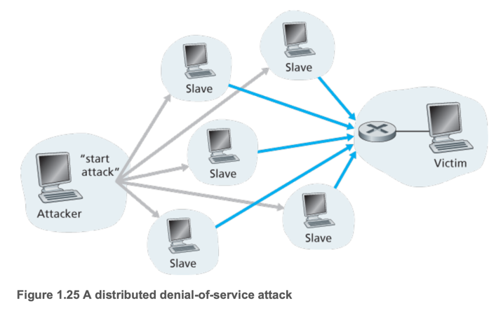

# 6. Networks Under Attack

---

- Internet에 수많은 것드리 연결되어있음 (wearable devices, smart appliances, smart cars, etc.)
- bad guys들은 이런 Internet에 연결된 것들을 공격할 수 있음
- Malware, Dos/Ddos, Packet sniffing IP spoofing, etc.

### The Bad Guys Can Put Malware into Your Host Via the Internet

- **malware** : malicious software
- **botnet** : 감연된 host들의 집합
    - bot : 감염된 host
    - botnet : 감염된 host들의 집합
- **self-replicating** : 스스로 복제해가면서 host들을 감염시켜나감
    - host가 감염되면 Internet을 통해 다른 host를 감염시킴
    - **Viruses** : 사용자의 상호작용이 필요한 self-replicating malware
        - 사용자가 감염된 파일을 다운로드하거나 실행해야 감염됨
    - **Worms** : 사용자의 상호작용 없이 스스로 복제되는 self-replicating malware
- 장치를 감염시켜 파일 삭제, 데이터 훔치기, 시스템 파괴 등

### The Bad Guys Can Attack Servers and Network Infrastructure

- **denial-of-service (DoS) attacks** : 사용자들이 서버에 접근하지 못하게 하는 공격
    - 유형 1. Vulnerability 공격 : 조합된 message를 취약한 host의 application이나 os로 전송
    - 유형 2. Bandwidth flooding : 대상 host에 대량의 패킷을 보내 대역폭을 소모
    - 유형 3. Connection flooding : 대상 host에 대량의 TCP connection을 연결
- **distributed denial-of-service (DDoS) attacks** : 여러대의 감염된 장치가 동시에 서버에 접근하여 서버를 마비시키는 공격

### The Bad Guys Can Sniff Packets

- **packet sniffer** : 패킷을 가로채는 프로그램
- 패킷에는 sns 비밀번호, 이메일 비밀번호, 신용카드 번호 등 중요한 정보가 담겨있음
- 무선 네트워크 환경에서 전송되는 패킷을 복사해서 가져감
- 유선 환경에서는 LAN을통해 전송되는 패킷을 가로챔
    - router나 link에 접근가능하면 패킷을 가로챌 수 있음
- packet sniffer 프로그램은 무료/유료로 쉽게 구할 수 있음 **WireShark**
- 예방 : 패킷을 암호화하여 전송

### The Bad Guys Can Masquerade as Someone You Trust

- **IP spoofing** : 가짜 source IP 주소를 사용하여 패킷을 전송
- **End-point Authentication** : 메시지의 진짜 source를 확인하는 방법