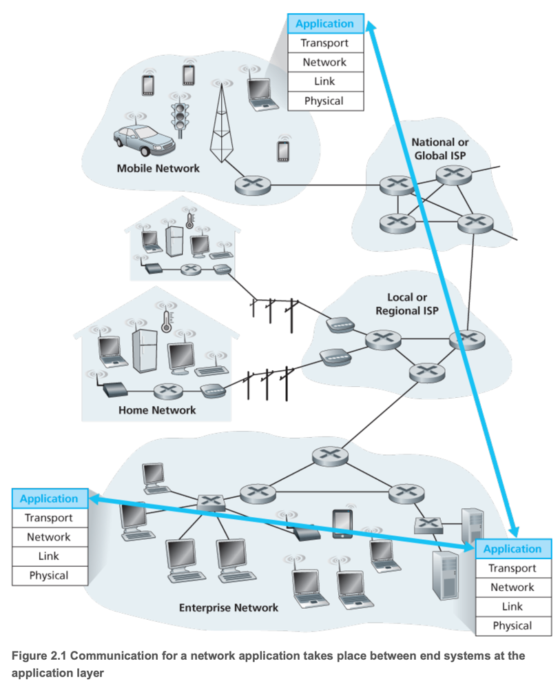
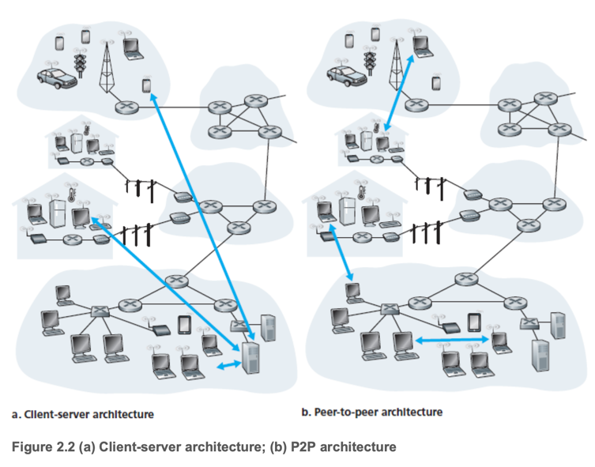
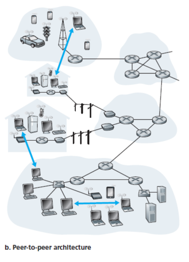
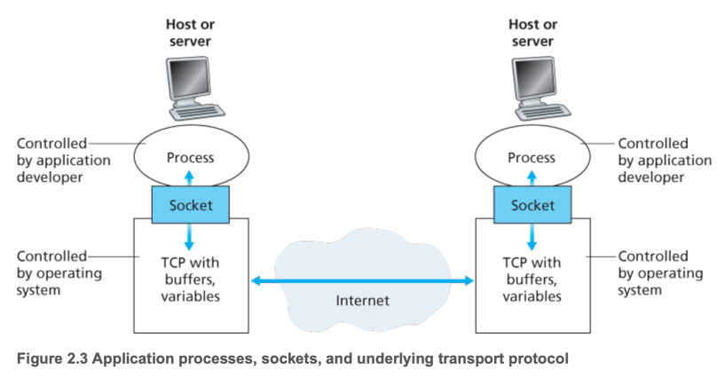
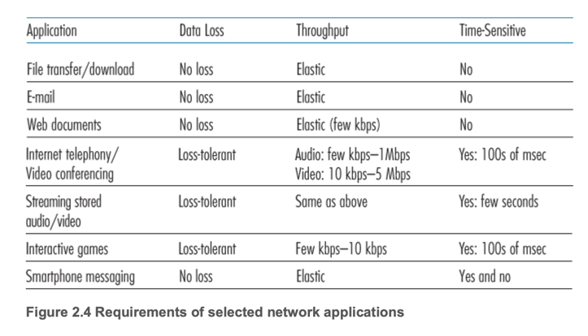
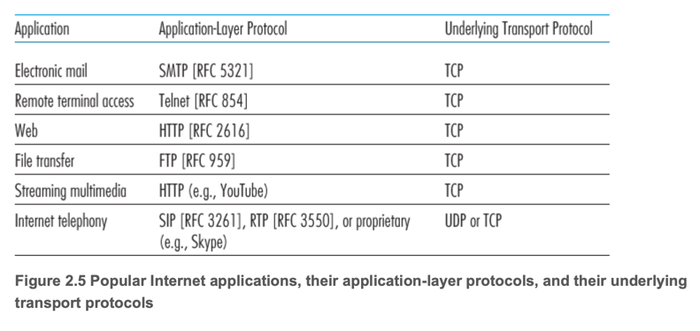

# 1. Principles of Network Applications

1. Network Application Architectures
2. Processes Communicating
3. Transport Services Available to Applications
4. Transport Services Provided by the Internet
5. Application-Layer Protocols
6. Network Applications Covered in This Book

---

- end system 에서 실행되는 프로그램들이 네트워크를 통해 통신한다 (e.g. 웹브라웆 <-> 웹서버)
- 개발자는 end system에서 실행되는 소프트웨어만 개바하면 됨 (C, Java, Python 등)
- 라우터, 스위치 등에는 애플리케이션 소프트웨어 작성 불가 (network layer 이하에서 동작하는 장치)

## 1. Network Application Architectures

- Network Application Architectures : 개발자가 end system에서 실행되는 소프트웨어의 배치, 동작을 정의

- **client-server architecture** : host가 N개의 클라이언트 요청을 처리 (e.g. 웹서버, 이메일 서버)
- 서버는 고정된 IP 주소를 가지고 있음
- 클라이언트끼리 직접 통신하지 않음
- data center에서 대규모 서비스를 위해 서버를 여러 대 운영함

- **peer-to-peer architecture** : 모든 end system이 동등한 지위로 서로 통신함 (BitTorrent, Skype)
- 서버 비용, 인프라 비용 부담 적음
- **self-scalability** : peer-to-peer architecture의 장점, peer가 늘어날수록 서비스 성능이 향상됨

## 2. Processes Communicating

- Network application은 end system에서 process로서 구동되면서 서로 통신함

### Client and Server Processes

- **client process** : 서버에 요청을 보내는 프로세스 (통신을 시작함)  e.g. 웹브라우저
- **server process** : 클라이언트의 요청을 처리하는 프로세스 (통신을 수신함) e.g. 웹서버
- P2P에서는 모든 프로세스가 클라이언트와 서버 역할을 수행함

### The Interface Between the Process and the Computer Network

- **socket** : 프로세스가 소켓을 통해 네트워크에 메시지를 보내고 받아들임
- 즉, 소켓은 프로세스와 네트워크 사이의 인터페이스
- application layer와 transport layer 사이의 인터페이스 (API)
- application 개발자는 소켓의 application layer를 제어 가능
    - transport layer는 일부만 제어가능 : trnasport protocol, tranport layer 버퍼 크기 등

### Addressing Processes

- process 의 주소 = IP주소 + port 번호
- **IP Address** : host의 주소
- **port number** : host 내의 프로세스 주소

## 3. Transport Services Available to Applications

- application은 socket을 통해 네트워크에 메시지를 송/수신함
- transport protocol은 메시지를 목적지 socket까지 전달함
- 개발자는 TCP, UDP 같은 다양한 transport layer의 protocol을 선택할 수 있음

### Reliable Data Transfer

- TCP는 **reliable data transfer**를 제공함
- UDP는 보장하지 않음
- **loss-tolerant applications** (e.g. video streaming) 는 UDP를 사용할 수 있음

### Throughput

- **throughput** : sending process가 수신 프로세스에게 메시지를 전송하는 속도
- 보장된 처리량이 필요한 application (인터넷 전화, 스트리밍)은 일정 속도 _r_ bps를 요구
- **bandwidth-sensitive applications** (e.g. video streaming) 은 일정한 throughput 필수
- **elastic applications** (e.g. file transfer, 메일) 은 throughput에 민감하지 않음

### Timing

- 실시간 애플리케이션 (인터넷 전화, 게임, 가상현실)은 지연시간에 민감
- socket 도착시간 소요시간이 100msec 이하여아함

### Security

- 데이터 암호화, 무결성 검사, 송/수신자 인증 동의
- e.g. sending process는 모든 메시지를 암호화하여 전송 -> 수신 프로세스는 복호화하여 수신

## 4. Transport Services Provided by the Internet

- 인터넷이 transport layer에 제공하는 2가지 프로토몰 : TCP, UDP

### TCP Services

- **Connection-oriented service**
    - 데이터를 주고 받기전에 3-way handshaking 으로 **TCP Connection**을 맺음
- **Reliable data transfer service** : 모든 데이터를 순서대로 오류, 중복 없이 전달
- congestion-control mechanism (혼잡 제어) : 네트워크 혼잡 시 sending process가 전송 속도를 조절하여 대역폭 배분
- 이메일, 웹, 파일 전속, 원격 로그인 등 애플리케이션에서 사용

### SSL (Secure Sockets Layer) : TCP의 메시지 암호화

- TCP, UDP는 기본적으로 평문을 전달
- 민감한 정보 보호를 위해 TCP에는 SSL을 사용하여 암호화된 메시지를 전달함
- SSL : application layer에서 TCP를 확장한 것
- Encryption, Data Integrity, Authentication 제공
- SSL은 본인 고유의 socket API를 가지고 있음 (TCP Socket API와 유사)
    1. sending porcess가 평문을 SSL socket에 전달
    2. SSL socket은 평문을 암호화하여 TCP socket에 전달
    3. 도착지 Process TCP Socket에 도착
    4. 도착지 SSL에 암호문을 전달
    5. SSL은 암호문을 복호화하여 평문을 도착지 Process에 전달

### UDP Services

- Connection less : handshaking 없이 데이터 전송
- Unreliable : 데이터 손실, 순서 뒤바뀜, 재전송 없음
- no congestion control
- 낮은 지연, 간단한 구조
- e.g. 스트리밍, VoIP, 실시간 게임
- 단점 : 일부 방화벽이 UDP를 차단하기 때문에 백업 기능 필요

### Services Not Provided by Internet Transport Protocols

- 과도한 지연과 낮은 throughput은 여전히 문제이고 application 설계로 해결

## 5. Application-Layer Protocols

- **application-layer protocol** : application porcess가 end system간의 메시지 교환 방식을 저으이하는 것
- 메시지 유형 : request or response
- 메시지 구문 (Syntax) : 메시지의 형식, 필드 구성
- 메시지 의미 (Semantics) : 메시지 각 필드의 의미
- 통신 규칙 (Rules) : 메시지 송/수신 규칙
- 공개 프로토콜 vs proprietary protocol
    - 공개 프로토콜 : RFC기반의 누구나 참조, 구현 가능한 프로토콜 e.g. HHTP, SMTP
    - proprietary protocol : 특정 회사에서 개발한 프로토콜 e.g. Skype
- 중요 : 프로토콜은 network application의 동작을 정의하는 것 (protocol != network application)

## 6. Network Applications Covered in This Book

