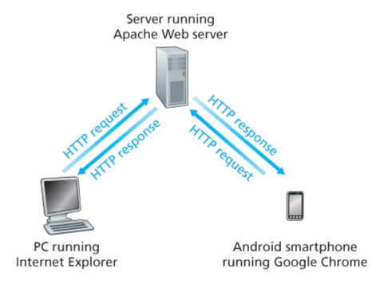
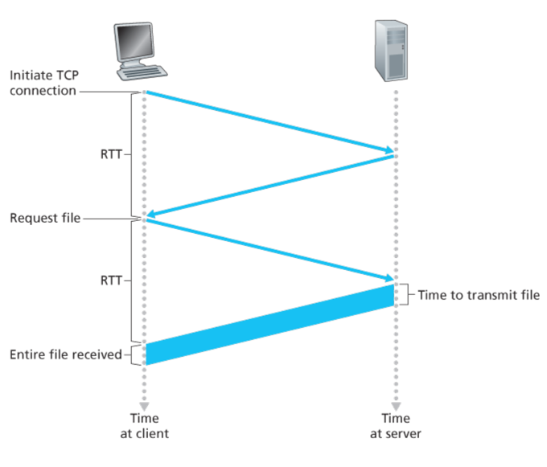
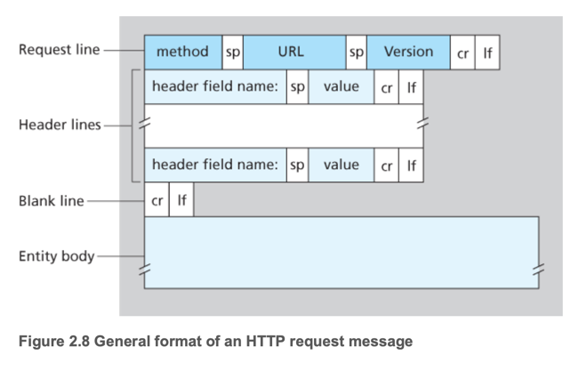
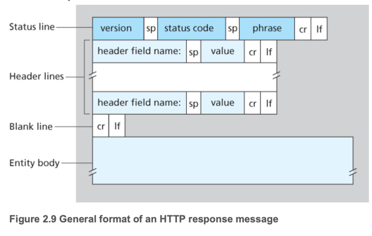
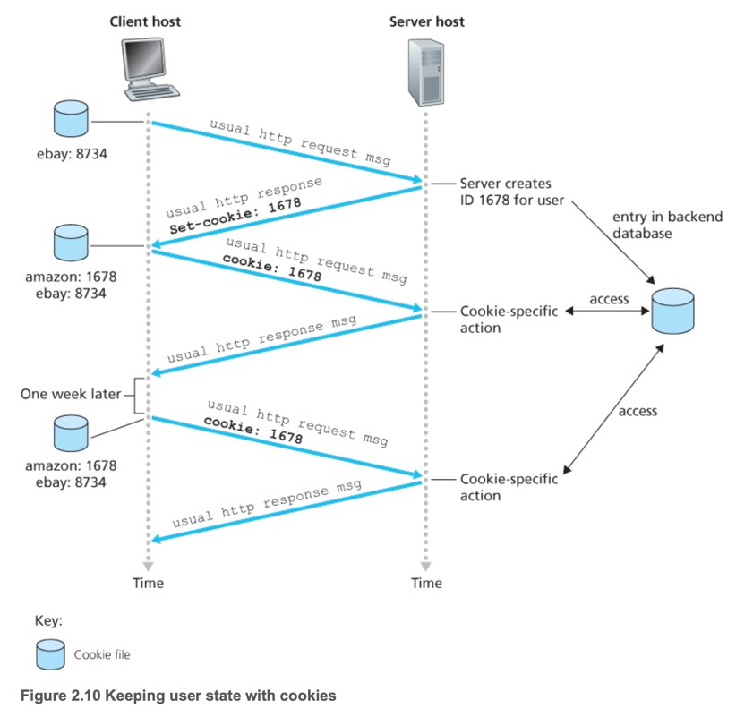
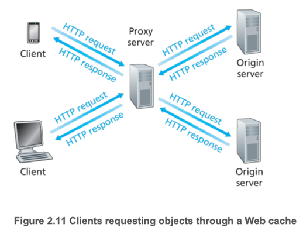
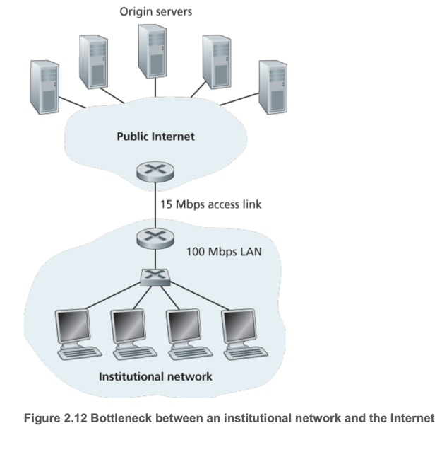
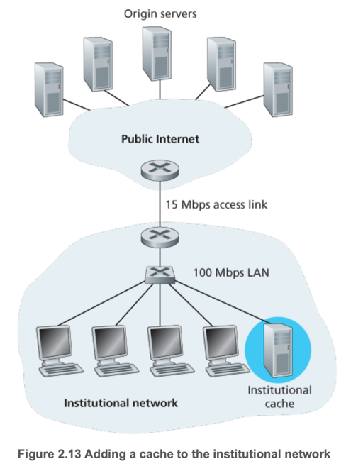

# 2. The Web and HTTP

1. Overview of HTTP
2. Non-Persistent and Persistent Connections
3. HTTP Message Format
4. User-Server Interaction: Cookies
5. Web Caching

---

- 1990년대 초 웹의 등장은 인터넷의 대중화를 이끌었으며, 인터넷을 중심 데이터 네트워크로 탈바꿈시켰음
- 웹은 온디맨드 방식으로 작동, 사용자가 원하는 정보를 원하는 시점에 제공
- 웹의 장점: 누구나 저비용으로 정보 게시 가능, 하이퍼링크/검색엔진으로 탐색, 멀티미디어 지원, 사용자와의 상호작용 기능.
- 웹은 현대 대부분의 인터넷 서비스 (YouTube, Gmail, Instagram 등)의 기반이 되는 플랫폼 역할 수행.

## 1. Overview of HTTP

- **HTTP** : 웹의 application layer protocol, client와 server 간의 메시지 전송을 위한 프로토콜
- **Web page** : HTML로 작성된 문서 + 객체(이미지 영상 등), URL로 식별
- **Web browser** : 웹 페이지를 요청하고 표시하는 프로그램
- **Web server** : 웹 페이지를 저장하고 클라이언트의 요청에 응답하는 프로그램
- TCP 위에서 동작
- web browser가 web page를 요청하면 -> 모든 객체에 대해 HTTP request를 보냄 -> 웹 서버는 HTTP response로 객체를 전송
- stateless protocol : HTTP는 각 요청을 독립적으로 처리, 이전 요청의 상태를 저장하지 않음
- client-server model : client가 요청을 보내고 server가 응답을 보내는 구조
- web server는 고정 ip로 항상 요청을 받을 수 있어야함

## 2. Non-Persistent and Persistent Connections

| 구분             | Non-Persistent                                     | Persistent                                 |
|----------------|----------------------------------------------------|--------------------------------------------|
| HTTP version   | HTTP/1.0                                           | HTTP/1.1 ~                                 |
| TCP connection | 매 요청마다 TCP connection을 생성하고 종료                     | 하나의 TCP connection을 유지하며 여러 요청을 처리         |
| connection 수   |                                                    | 요청 object 수                                | 하나의 TCP connection으로 여러 요청을 처리하므로 connection 수가 적음 |
| latency        | 매 요청마다 2 RTT가 걸림 (TCP connection 생성, 요청 전송, 응답 수신) | 1 RTT로 여러 요청을 처리할 수 있음 (TCP connection 유지) |
| 서버 부하          | 매 요청마다 TCP connection을 생성하고 종료하므로 서버 부하가 큼         | 하나의 TCP connection을 유지하므로 서버 부하가 적음        |
| TCP 자원         | 매 요청마다 버퍼/변수 생성 (비효율)                              | 하나의 TCP connection을 유지하므로 자원 사용이 효율적       |
| 병렬성            | 브라우저가 여러 TCP 연결을 병렬 요청 가능                          | 한 Connection에서 파이프라인으로 처리 가능               |

- RTT : round trip time, client가 보낸 packet이 server에 도착하고 응답을 받기까지 걸리는 시간
- 파이프라인 처리 : 응답을 받기 전에 다음 요청을 보내는 방식

### HTTP with Non-Persistent Connections

1. client가 http://www.someschool.edu/somefile.html을 요청
2. client HTTP 프로세스가 TCP connection을 생성하고 서버 80 포트에 연결 (**1 RTT**)
3. client가 socket을 통해 HTTP request message (`/somefile.html`)를 전송
4. server가 socket을 통해 HTTP request message를 수신
5. server가 storage에 있는 `/somefile.html`을 찾고, HTTP response message를 생성 후 socket을 통해 client에게 전송
6. server HTTP 프로세스가 TCP connection을 종료 전달
    - client가 response 메시지를 수신할떄까지 대기
7. client가 response 메시지를 수신하고 TCP connection을 종료 (**1 RTT**)

## 3. HTTP Message Format

### HTTP Request Message

- e.g. `GET /somefile.html HTTP/1.1`
- method : HTTP request의 종류 (GET, POST 등)
- Header lines : HTTP request에 대한 추가 정보 (Host, User-Agent 등)
- Entity body : HTTP request에 포함된 데이터 (POST 요청 시 사용)

### HTTP Response Message

- e.g. `HTTP/1.1 200 OK`
- status line : HTTP response의 상태 (200 OK, 404 Not Found 등)
- Header lines : HTTP response에 대한 추가 정보 (Content-Type, Content-Length 등)
- Entity body : HTTP response에 포함된 데이터 (HTML 문서, 이미지 등)

## 4. User-Server Interaction: Cookies

- HTTP는 stateless protocol로, 각 요청을 독립적으로 처리
- cookie : 클라이언트와 서버 간의 상태 정보를 저장하는 방법
- client 브라우저에 cookie를 저장하고, 이후 요청 시 cookie를 서버에 전송
- 정의요소 4가지
    - **Set-Cookie** header : 서버가 클라이언트에게 cookie를 설정하는 방법
    - **Cookie** header : 클라이언트가 서버에 cookie를 전송하는 방법
    - cookie file : 클라이언트 브라우저에 저장되는 cookie 파일 (브라우저가 관리)
    - server-side database : 서버에서 cookie 정보를 저장하는 데이터베이스
- 활용 : 로그인 유지, 장바구니, 맞춤 추천 (방문 기록 기반)

## 5. Web Caching

- **Web cache (a.k.a proxy server)** : 클라이언트와 서버 사이에 위치하여 웹 페이지를 저장하고 요청 시 응답하는 서버
- 최근 요청된 객체를 웹캐시 로컬 디스크에 저장
- client browser는 웹 캐시를 경유하여 서버에 요청
- 동작 방식
    1. client browser가 웹 캐시에게 요청
    2. 웹 캐시가 로컬 디스크에 요청한 객체가 있는지 확인
    3. 로컬 디스크에 객체가 있으면 웹 캐시가 클라이언트에게 응답
    4. 로컬 디스크에 객체가 없으면 웹 캐시가 서버에게 요청
    5. 서버가 웹 캐시에게 응답
    6. 웹 캐시가 로컬 디스크에 객체를 저장
    7. 웹 캐시가 클라이언트에게 응답
- 장점 :
    - 서버의 부하를 줄이고, 클라이언트의 응답 속도를 높임
    - 대역폭을 절약하고, 서버의 트래픽을 줄임

- 요청량 : _15 req/sec_
- 객체 크기 : _1 Mbit_
- 인터넷 링크 : _15 Mbps_
- Traffic intensity : 1.0 (혼잡 상태)
- 해결 : 링크 업그레이드 (_100 Mbps_)
- 문제 : 비용 증가

- 해결 : web cache 설치
- hit rate : _0.4_
- Traffic intensity : 0.6 (혼잡 상태 아님)

- **CDN (Content Delivery Network)** : 웹 캐시를 여러 지역에 분산하여 서버의 부하를 줄이고, 클라이언트의 응답 속도를 높임
- **conditional GET** : 웹 캐시가 서버에게 객체의 변경 여부를 확인하는 방법
    - `If-Modified-Since` header를 사용하여 서버에게 객체의 변경 여부를 확인
    - 서버가 객체가 변경되지 않았으면 `304 Not Modified` 응답
    - 서버가 객체가 변경되었으면 `200 OK` 응답
