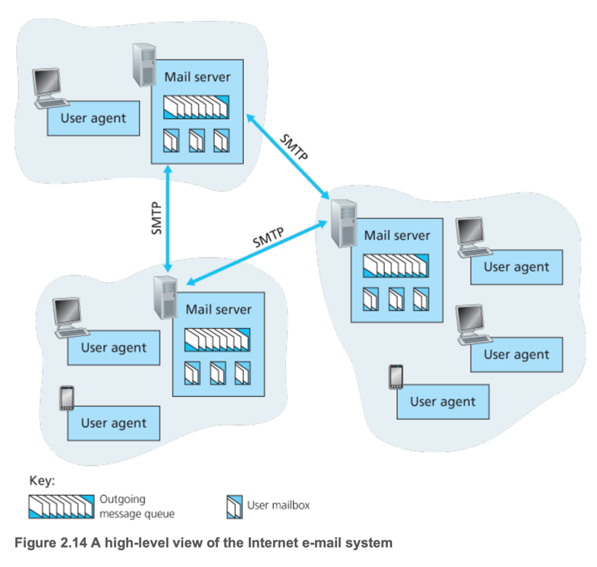
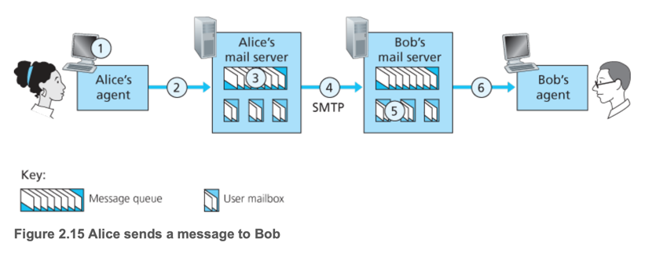
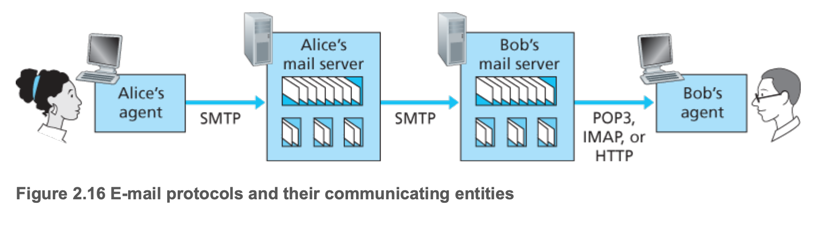

# 3. Electronic Mail in the Internet

1. SMTP
2. Comparison with HTTP
3. Mail Message Formats
4. Mail Access Protocols

---

- electronic mail은 인터넷에서 가장 오래된 application 이면서 가장 많이 사용되는 application
- 현대 e-mail은 첨부, 하이퍼링크, HTML, 이미지 등 다양한 기능을 지원
- **user agent**, **mail server**, **Simple Mail Transfer Protocol (SMTP)** 으로 구성
- **user agent** : 사용자가 이메일을 작성하고 읽는 프로그램 e.g. Gmail, Outlook
- **message queue** : mail server로 전송하지 못할때 임시로 저장하는 공간
- SMTP : TCP/IP 프로토콜로, 이메일을 전송하는 프로토콜
    - client-side : user agent가 SMTP를 사용하여 메일 서버에 이메일을 전송
    - server-side : mail server가 이메일을 수신하고 저장, 또 다른 mail server로 이메일을 전달

1. user agent가 SMTP를 사용하여 메일 서버에 이메일을 전송
2. mail server가 이메일을 수신하고 저장
3. 받는이 user agent가 SMTP를 사용하여 메일 서버에서 이메일을 가져옴



## 1. SMTP

- **Simple Mail Transfer Protocol (SMTP)** : 이메일 전송을 위한 프로토콜



1. user agent를 사용해 수신자로의 email을 작성
2. User agent는 client의 mail server의 message queue에 email을 저장
3. SMTP client는 message queue에 있는 email을 mail server로 전송 (TCP connection을 통해)
4. mail server는 email을 수신하고, 수신자의 mailbox에 저장
5. 수신자는 user agent를 사용해 자신의 mail server에 접속

## 2. Comparison with HTTP

| 항목       | SMTP                                        | HTTP                                               |
|----------|---------------------------------------------|----------------------------------------------------|
| 전송방식     | **push protocol** : client가 server로 이메일을 전송 | **pull protocol** : client가 server에서 웹 페이지를 요청     |
| 연결 주체    | sender가 connection을 시작하고 유지                 | client(receiver)가 connection을 시작하고 server가 응답 후 종료 |
| encoding |                                             | 7-bit ASCII encoding (text/plain)                  | binary encoding (이미지, 비디오 등 다양한 형식 지원)         |
| 여러 미디어   | 하나의 메시지에 모두 포함                              | object 단위로 요청 및 응답                                 |

## 3. Mail Message Formats (RFC 5322)

- **Header** + **Body** 구성
- Header : 메일의 메타데이터 (`From`, `To`, `Subject` 등)
- **CRLF** 로 Header와 Body를 구분

```
From: alice@crepes.fr
To: bob@hamburger.edu
Subject: Searching for the meaning of life.

Do you like ketchup?
```

## 4. Mail Access Protocols



- 수신자 mail box로부터 이메일 수신을 위한 전용 프로토콜
- **Post Office Protocol (POP3)**
- **Internet Message Access Protocol (IMAP)**
- **POP3**

### Post Office Protocol (POP3)

1. Authorization 단계
    - client가 서버에 접속하고 사용자 인증
    - 서버는 사용자 인증 정보를 확인하고, 인증 성공 시 메일 박스에 접근 허용
2. Transaction 단계
    - client가 서버에 저장된 이메일 목록을 요청
    - 메일 조회 삭제 표시 등
3. Update 단계
    - `quit` 명령어로 세션 종료

```
telnet mailServer 110
+OK POP3 server ready
user bob
+OK
pass hungry
+OK user successfully logged on
```

- 가장 단순한 메일 수신 프로토콜
- TCP 110 포트 사용
- 모드
    - download-and-delete : 서버에서 이메일을 다운로드하고 삭제
    - download-and-keep : 서버에서 이메일을 다운로드하고 유지
- 서버에서 폴더 구성 지원 안함
- 세션 상태 정보를 유지 하지 않음 e.g. 읽은 메일, 삭제된 메일 등

### Internet Message Access Protocol (IMAP)

- POP3 보다 복잡하지만 더 많은 기능 제공
- 서버에서 폴더 구성 지원, 세션 상태 정보 유지 e.g. 메일 상태 기억
- 폴더 생성, 이동, 조건 검색, 부분 다운로드

### Web-Based E-Mail

- web browser가 user agent 역할을 함
- HTTP를 사용하여 이메일을 전송하고 수신
- web browser(user agent) <--> HTTP <--> mail server <--> SMTP <--> mail server <--> HTTP <--> web browser(user
  agent)
- e.g. Gmail, Outlook, 회사 메일