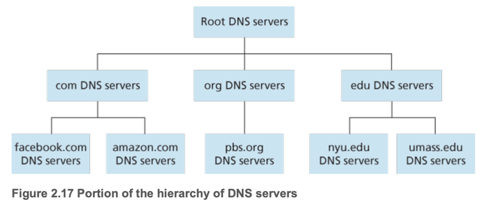
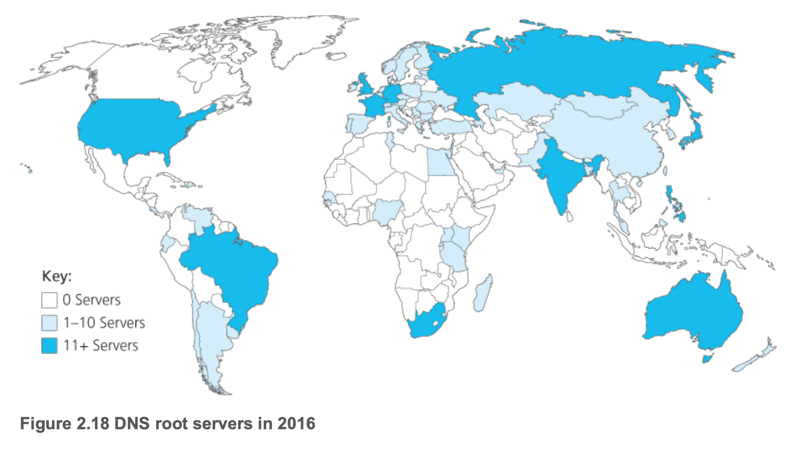
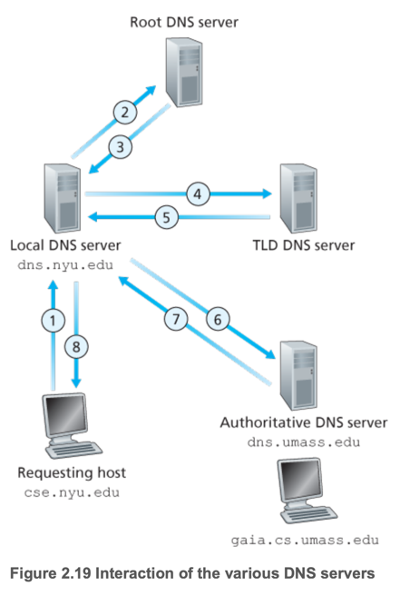
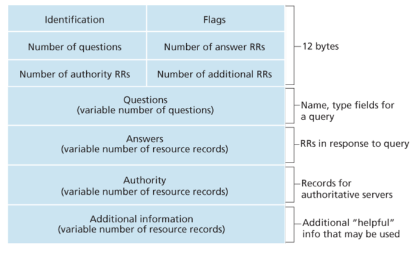

# 4. DNS—The Internet’s Directory Service

1. Services Provided by DNS
2. Overview of How DNS Works
3. DNS Records and Messages

---

| 구분         | description                                         |
|------------|-----------------------------------------------------|
| Host name  | 사람이 읽기 쉬운 식별자 (e.g. www.google.com)                 |
| IP address | 컴퓨터가 이해할 수 있는 숫자, 네트워크 상의 위치 식별 (e.g. 121.7.106.83) |

## 1. Services Provided by DNS

- **DNS (Domain Name System)** : 인터넷의 디렉토리 서비스, 호스트 이름을 IP 주소로 변환
- **DNS Server** + UDP기반의 application layer protocol (DNS protocol, UDP 53 port)
    - DNS Server 는 Distributed database
- client-server model

1. client가 URL 입력 (e.g. www.google.com)
2. browser가 host name 추출
3. DNS client가 DNS server에 host name을 IP 주소로 변환 요청
4. DNS server가 host name에 대한 IP 주소를 반환
5. browser가 IP 주소를 사용하여 TCP connection

### 역할

- host name을 IP 주소로 변환
- **host aliasing** : 복잡한 hostname에 대해 여러 별칭 제공
    - e.g. relay1.west-coast.example.com -> mail.example.com or www.mail.example.com
- **Mail server aliasing** : 이메일 서버에 대한 별칭 제공
    - e.g. boby@gmail.com
- Load balancing : host name 1개를 여러 IP 주소에 매핑하여 부하 분산
    - e.g. www.example.com -> www.example1.com, www.example2.com, www.example3.com,...

## 2. Overview of How DNS Works

- protocol : UDP 기반 port 53
- 중앙 집중 DNS 서버의 한계 :  scale 문제
    - **SPOF(Single Point of Failure)** : 중앙 집중식 서버가 다운되면 전체 서비스 중단
    - Traffic volume : 많은 트래픽이 중앙 서버로 집중되어 병목 현상 발생
    - 거리 : 중앙 서버와의 거리로 인한 지연 시간 증가
    - 유지보수 : 매우 많은 레코드를 유지해야 하므로 관리가 어려움

### A Distributed, Hierarchical Database

| 구분                       | 설명                                                       |
|--------------------------|----------------------------------------------------------|
| Root DNS server          | TLD(Top-Level Domain) 서버의 IP 주소 관리, 400개 이상의 서버 존재       |
| TLD DNS server           | 특정 도메인(예: .com, .org)에 대한 authoritative DNS 서버의 IP 주소 관리 |
| Authoritative DNS server | 특정 도메인에 대한 IP 주소를 반환, 도메인 소유자가 관리 (e.g. example.com)     |
| Local DNS server         | ISP가 운영, 클라이언트의 DNS 요청을 처리, 캐싱하는 프록시                     |

- **recursive query** : 클라이언트가 로컬 DNS 서버에 요청, 로컬 DNS 서버가 다른 DNS 서버에 요청을 전달하여 최종 IP 주소를 반환
    - client <-> local DNS server
- **iterative query** : 로컬 DNS서버가 반복적으로 계층별 DNS 서버에 요청을 보내 IP 주소를 찾음
    - local DNS server <-> root DNS Server
    - local DNS server <-> TLD DNS Server
    - local DNS server <-> authoritative DNS Server
- host cs.nyu.edu가 gaia.cs.umass.edu에 대한 DNS 질의
    1. cs.nyu.edu의 로컬 DNS 서버(dns.nyu.edu)에게 gaia.cs.umass.edu의 IP 주소 요청
    2. local DNS server -> root DNS server
        - edu TLD DNS 서버의 IP 주소를 반환
    3. local DNS server -> edu TLD DNS server
        - umass.edu의 authoritative DNS 서버의 IP 주소를 반환
    4. local DNS server -> umass.edu authoritative DNS server
        - gaia.cs.umass.edu의 IP 주소를 반환
    5. local DNS server가 gaia.cs.umass.edu의 IP 주소를 클라이언트에게 반환

### DNS Caching

- **DNS caching** : 로컬 DNS 서버가 이전에 조회한 IP 주소를 저장하여 다음 요청 시 빠르게 응답
- TLD 서버 IP를 캐싱하면 Root DNS 서버에 대한 요청을 줄일 수 있음

## 3. DNS Records and Messages

- **Resource Record (RR)** : DNS 데이터베이스의 기본 단위, 호스트 이름과 IP 주소 매핑 정보
    - Name, Value, Type, TTL (Time to Live)
    - Name : 호스트 이름
    - Value : 호스트 이름에 대한 IP 주소
    - Type : 레코드의 유형 (A, CNAME 등)
    - TTL : 레코드의 유효 시간, 초 단위로 지정
- `A` 레코드 : 호스트 : IP 주소
    - e.g. `www.example.com 1145.23.123.45 A`
- `NS` 레코드 : 도메인 이름 : authoritative DNS 서버
    - e.g. `example.com ns1.example.com NS`
- `CNAME` 레코드 : 별칭 : 정식 이름
    - e.g. `example.com relay1.example.com CNAME`
- `MX` 레코드 : 별칭 : 메일 서버 정식 이름
    - e.g. `example.com mail.example.com MX`

### DNS Messages

- 쿼리, 응답 메시지는 동일한 포맷
- 헤더 : 16 bit ID, 쿼리/응답 여부 플래그, 권한 여부, 재귀요청/가능 여부 플래그 등
- Question Section : 쿼리된 호스트 이름과 타입
- Answer Section : 쿼리된 이름에 대한 실제 리소스 레코드
- Authority Section : Authoritative DNS 서버에 대한 정보
- Additional Section : 추가 정보 (e.g. 메일 서버의 IP 주소)
- **nslookup** : DNS 메시지를 생성하고 파싱하는 program
    - e.g. `nslookup www.example.com`

### Inserting Records into the DNS Database

`networkutopia.com` 도메인 등록 예시

1. **registrar**에 `networkutopia.com` 등록
    - registrar : 도메인 이름을 DNS 데이터베이스에 등록하고 관리하는 기관
2. authoritative DNS 서버 를 **registrar**에 제공
    - e.g. `(networkutopia.com, dns1.networkutopia.com, NS)`, `(dns1.networkutopia.com, 212.212.212.1, A)`
    - registrar는 authoritative DNS 서버의 IP 주소를 NS, A 레코드로 등록
3. 웹/메일 서버 레코드 추가
    - e.g. www.networkutopia.com → Type A, mail.networkutopia.com → Type MX
4. 등록 완료
5. client가 `www.networkutopia.com` 요청
6. client의 로컬 DNS 서버가 `com` TLD DNS 서버에 요청 (캐싱되어있다면 root DNS 안거칠것임)
7. `com` TLD DNS 서버가 authoritative DNS 서버의 NS, A 레코드를 반환
8. local DNS server가 authoritative DNS 서버(212.212.212.1)에게 `www.networkutopia.com`의 A 레코드를 요청
9. authoritative DNS 서버가 `www.networkutopia.com`의 IP 주소를 반환
