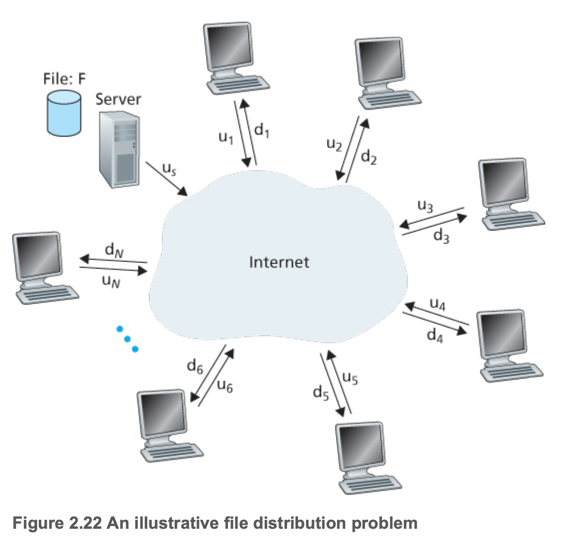
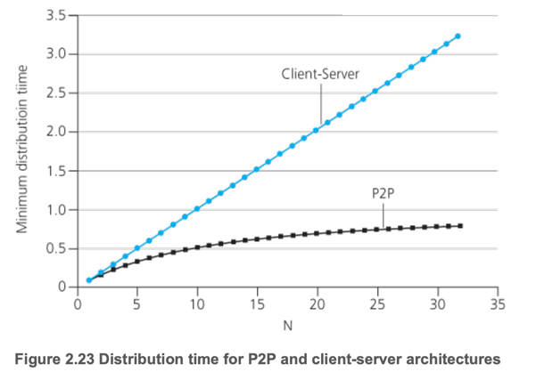
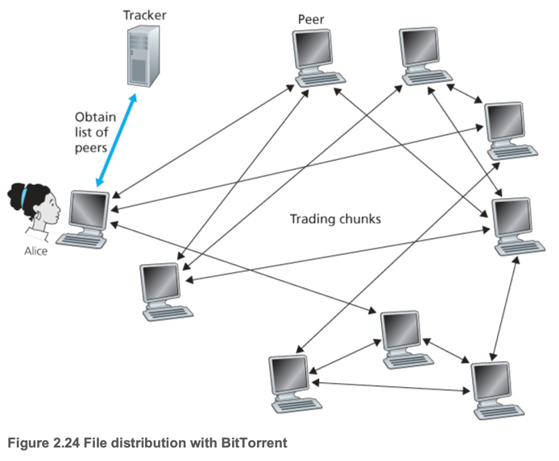

# 5. Peer-to-Peer File Distribution

- client-server architecture는 중앙 집중식 서버가 클라이언트의 요청을 처리하는 구조
    - 서버가 모든 피어에게 데이터 복사본을 전송해야함 (대역폭 소모)
- P2P (Peer-to-Peer) architecture는 모든 참여자가 동등한 지위를 가지며, 직접적으로 서로 연결되어 데이터를 공유하는 구조
    - 각 피어는 다른 피어와 직접 연결되어 데이터를 공유
- BitTorrent protocol : P2P architecture를 사용하여 대용량 파일을 효율적으로 분산 전송하는 프로토콜

### Scalability of P2P Architectures

- client-server architecture는 중앙 서버에 의존하여 확장성이 제한됨
    - 피어 수가 증가할수록 중앙 서버의 부하가 증가
- P2P architecture는 각 피어가 다른 피어와 직접 연결되어 데이터를 공유하므로 확장성이 뛰어남
    - 피어들이 업로드와 다운로드를 동시에 수행

### BitTorrent

- _torrent_ : BitTorrent 프로토콜을 사용하여 파일을 공유하기 위한 피어 집합
- 각 피어들은 동일한 사이즈의 청크를 서로 공유 (256KB)
- _tracker_ : 피어들의 위치를 추적하고 연결을 관리하는 노드 (토렌트 마다 존재)
    - 신규 피어에게 무작위로 피어 목록 (피어의 IP) 제공 -> 피어는 TCP connection을 통해 다른 피어와 연결
    - neighboring peer : 서로 연결된 피어들
- 파일 다운로드가 끝나면 떠나거나, 남아서 다른 피어에게 파일을 업로드 가능
- 피어가 토렌트에 참여 : 트래커에 자신을 등록 후 주기적으로 상태를 업데이트
- **rarest first** : 가장 희귀한 청크를 먼저 다운로드하여 전체 파일의 분산을 최적화
- tit-for-tat 매커니즘으로 업로드 : 최근에 가장 높은 다운로드 속도를 제공한 피어에게 더 많이 업로드
    - **unchoked** : 가장 빠르게 데이터를 보내준 피어를 선정해 업로드 중인 대상 피어
    - **optimistically unchoked** : 30초마다 무작위로 피어를 선정하여 업로드를 시도
- Distributed Hash Table (DHT) : P2P 시스템에서는 피어에 걸쳐 레코드가 분산 저장되는 데이터베이스 