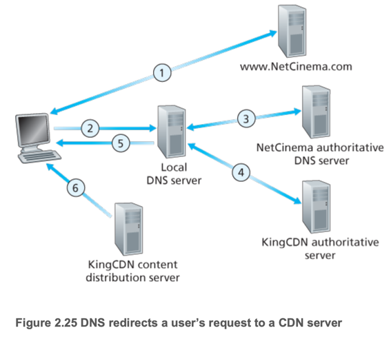
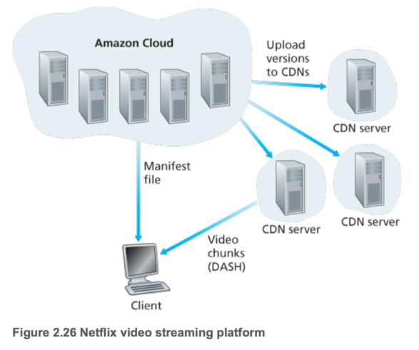

# 6. Video Streaming and Content Distribution Networks

1. Internet Video
2. HTTP Streaming and DASH
3. Content Distribution Networks (CDNs)
4. Case studies: Netflix, YouTube, and Kankan

---

- video streaming service = application layer protocol + cache server

## 1. Internet Video

- 스트리밍은 사전에 녹화된 영상을 서버에 저장하고 사용자가 요청할 때마다 전송하는 방식
- 비디오는 초당 24~30 프레임으로 구성되며, 압축을 통해 원하는 비트레이트 조정
    - 고 비트레이트 (e.g. 3Mbps) : 고화질 영상, 1초에 3Mbit 전송, 더 많은 네트워크 자원 요구
- 연속 재생을 위해 평균 네트워크 처리량이 비디오 비트레이트 보다 높아야 함
    - e.g. 3Mbps 비디오를 스트리밍하려면 평균 네트워크 처리량이 3Mbps 이상이어야 함
- 동일 비디오를 여러 화질 (e.g. 300Kbps, 1Mbps, 3Mbps)로 제공하여 사용자가 네트워크 상태에 따라 선택할 수 있도록 함

## 2. HTTP Streaming and DASH

- 단순히 GET으로 비디오를 요청하면 네트워크 상황에 동적으로 적응하지 못함
- Dynamic Adaptive Streaming over HTTP (DASH) : HTTP를 통해 비디오 스트리밍을 제공하는 기술 (GET)
- 비디오를 여러 화질/비트레이트로 인코딩
- 클라이언트는 네트워크 상태에 따라 적절한 화질을 선택하여 비디오를 요청
- **manifest file** : 비디오의 메타데이터를 포함하는 파일, 클라이언트가 비디오 스트리밍을 시작할 때 요청
    - 비디오의 여러 화질/비트레이트 정보, 각 세그먼트의 URL 등을 포함
- 클라이언트는 manifest file을 통해 현재 네트워크 상태에 맞는 비디오 세그먼트를 선택하여 요청

## 3. Content Distribution Networks (CDNs)

- 단일 IDC는 전 세계 사용자에게 비디오를 제공하기 어려움
    - latency : 사용자와 IDC 간의 거리로 인해 지연 발생
    - bandwidth : IDC의 대역폭이 제한되어 있어 많은 사용자가 동시에 요청할 경우 속도 저하
    - SPOF (Single Point of Failure) : IDC가 다운되면 모든 사용자에게 서비스 중단

### CDN 배치 전략

- **Enter Deep** (Akamai 방식) : 각 지역에 IDC를 배치하여 사용자와 가까운 위치에서 서비스 제공
    - 낮은 latency, 높은 대역폭 제공
    - 많은 서버를 운영해야 하므로 비용이 많이 듦
- **Bring Home** (Limelight 방식) : IXPs(Internet Exchange Points)에 CDN 서버를 배치하여 사용자와 가까운 위치에서 서비스 제공
    - IXPs는 인터넷 서비스 제공업체(ISP) 간의 트래픽 교환 지점
    - 서버 수가 적어 비용이 적게 듦
    - 상대적으로 높은 latency와 낮은 대역폭 제공

### CDN 으로 비디오 스트리밍 순서

1. 사용자가 `www.NetCinema.com`에 접속
2. 사용자가 `http://video.NetCinema.com/10Gds0DAWo` 요청 -> 사용자 host가 DNS를 통해 `video.NetCinema.com`의 IP 주소 질의
3. LDNS -> authoritative DNS 서버 -> `KingCDN.com` CDN authoritative DNS 서버로 릴레이
4. `KingCDN.com` CDN authoritative DNS 서버가 KingCDN.com의 IP 주소를 LDNS에 응답 (**DNS Redirection**)
5. LDNS가 KingCDN.com의 IP 주소를 사용자 host에 응답
6. 사용자 host가 KingCDN.com의 IP 주소로 TCP connection을 생성

### Cluster Selection Strategies (클러스터 선택 전략)

- **geographically closest** : 사용자와 가장 가까운 클러스터를 선택
    - LDNS 의 위치 정보 사용
- **real-time measurements** : LDNS와 클러스터 간의 실시간 측정 정보를 기반으로 선택
    - 각 CDN 클러스터가 전세계 LDNS에 ping, DNS probe를 전송해 지연/손실률 측정

## 4. Case studies: Netflix, YouTube, and Kankan

| 항목     | Netflix                    | YouTube | Kankan                        |
|--------|----------------------------|---------|-------------------------------|
| CDN 방식 | 자체 CDN, PUSH, 직접 CDN 서버 지정 |         | 자체 CDN, PULL, DNS Redirection |P2P 기반, 하이브리드 CDN-P2P|
| 캐싱 방식  | Push (offpeak일떄 미리 CDN에 저장 |         | PULL (요청시 CDN에 저장)            | P2P 기반, 초기 CDN에서 시작 후 P2P로 전환 |

### Netflix

- AWS cloud + 자체 CDN
- AWS cloud : 웹 사이트, 사용자 인증, 추천 시스템, 콘텐츠 인코딩/포맷 변환 등
- 자체 CDN : 비디오 스트리밍 전용 인프라
    - IXP/ISP에 서버 랙 설치
    - 서버는 최대 수백 TB저장공간, 10Gbps 포트
- PUSH cache : 사용자가 요청하기 전에 콘텐츠를 CDN 서버에 미리 저장
- **Content ingestion (콘텐츠 수집)** : 콘텐츠 분배 전에 AWS cloud로 업로드
- **Content processing (콘텐츠 처리)** : AWS cloud에서 콘텐츠를 여러 화질/비트레이트로 인코딩
    - HTTP DASH 대비
- **Content distribution (콘텐츠 배포)** : 자체 CDN으로 콘텐츠 배포

1. 사용자가 비디오 클릭
2. aws cloud에서 manifest file과 적절한 CDN 서버 IP를 판단
3. 사용자 host가 CDN 서버 IP로 TCP connection을 생성
4. 사용자는 CDN서버와 DASH를 통해 비디오 스트리밍

### YouTube

- GCP (Google Cloud Platform) + 자체 CDN
- Netflix처럼 여러 IXP/ISP에 서버 랙 설치해 CDN 구축
- PULL cache : 사용자가 요청할 때마다 콘텐츠를 CDN 서버에 저장
- DNS Redirection 사용
    - RTT(Round Trip Time) 측정하여 가장 빠른 CDN 서버 선택
    - 필요시 부하분산을 위해 더 먼 CDN 서버로 리디렉션
- HTTP streaming

### Kankan

- P2P 기반 비디오 스트리밍 서비스 (BitTorrent와 유사)
- 하이브리드 CDN-P2P 구조
    - 초기에는 CDN에서 시작 구간 다운로드
    - 충분한 피어가 확보되면 P2P로 전환
    - 피어가 부족해지면 다시 CDN으로 전환
- 인프라 비용 절감 (서버 대역폭 사용 최소화)
- 시작 지연 최소화 + 지속 가능한 스트리밍 품질
