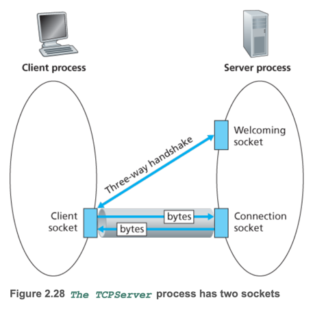

# 7. Socket Programming: Creating Network Applications

1. Socket Programming with UDP
2. Socket Programming with TCP

---

- Network application : client-server architecture
    - end system끼리 Socket을 통해 통신
- 애플리케이션
    - open application : RFC 등 표준 프로토콜을 구현 (e.g. HTTP)
    - proprietary application : 특정 회사의 프로토콜을 구현 (e.g. Skype)
- 프로토콜
    - TCP : 연결 지향, 신뢰성 보장, byte stream 전송
    - UDP : 비연결 지향, 신뢰성 보장 안함, 빠름, datagram 전송
- 포트 번호
    - open application protocol : well-known port number (e.g. HTTP: 80, HTTPS: 443)
    - proprietary application protocol : 충돌을 피하기 위해 임의의 포트 번호 사용

## 1. Socket Programming with UDP


```python
# client.py
# socket module : Python에서 소켓 프로그래밍을 위한 모듈
from socket import *
# 서버 주소와 포트 번호 설정
serverName = ’hostname’
serverPort = 12000
# 소켓 생성
# AF_INET : IPv4 주소 체계
# SOCK_DGRAM : UDP 소켓
clientSocket = socket(AF_INET, SOCK_DGRAM)
# 사용자로부터 메시지 입력
message = raw_input(’Input lowercase sentence:’)
# 메시지를 서버로 전송 (비연결형)
clientSocket.sendto(message.encode(),(serverName, serverPort))
# 서버로부터 응답 메시지 수신 (2048 : 버퍼 크기)
modifiedMessage, serverAddress = clientSocket.recvfrom(2048)
print(modifiedMessage.decode())
# 소켓 닫기
clientSocket.close()
```

```python
# server.py
from socket import *
# 포트 번호 설정
serverPort = 12000
# 소켓 생성
serverSocket = socket(AF_INET, SOCK_DGRAM)
# 소켓을 포트에 바인딩
serverSocket.bind((’’, serverPort))
# 서버 시작 메시지 출력
print(”The server is ready to receive”)
# 무한 루프를 통해 클라이언트의 메시지를 수신하고 응답
while True:
 message, clientAddress = serverSocket.recvfrom(2048)
 modifiedMessage = message.decode().upper()
 serverSocket.sendto(modifiedMessage.encode(), clientAddress)
```

## 2. Socket Programming with TCP

- 통신 전에 3-way handshake를 통해 연결을 설정
- UDP는 비연결형이기떄문에 통신마다 목적지 주소 명시




1. 서버 준비 단계
    - 서버가 실행중
    - welcoming socket 생성
2. 클라이언트 연결 요청
    - 클라이언트가 서버 ip, port를 지정해 TCP 소켓 생성 후 `connect()` 호출
    - 3-way handshake를 통해 연결 설정
3. 서버 연결 수락
    - 서버가 `accept()` 호출하여 클라이언트 연결 수락
    - connection socket 생성
4. 데이터 송/수신
    - 클라이언트가 `send()` 호출하여 데이터 전송
    - 서버가 `recv()` 호출하여 데이터 수신
    - 서버가 `send()` 호출하여 응답 전송
    - 바이트 순서 보장, 신뢰성 보장
5. 연결 종료
    - 클라이언트가 `close()` 호출하여 연결 종료
    - 서버가 `close()` 호출하여 연결 종료

```python
from socket import *
serverName = ’servername’
serverPort = 12000
# TCP 소켓 생성
# SOCK_STREAM : TCP 소켓
clientSocket = socket(AF_INET, SOCK_STREAM)
# 서버에 연결 - 3-way handshake
clientSocket.connect((serverName, serverPort))
# 사용자로부터 메시지 입력
sentence = raw_input(’Input lowercase sentence:’)
# 메시지를 서버로 전송
clientSocket.send(sentence.encode())
# 서버로부터 응답 메시지 수신
modifiedSentence = clientSocket.recv(1024)
print(’From Server: ’, modifiedSentence.decode())
# 소켓 닫기
clientSocket.close()
```

```python
from socket import *
serverPort = 12000
# TCP 소켓 생성 (SOCK_STREAM : TCP 소켓, welcoming socket)
serverSocket = socket(AF_INET, SOCK_STREAM)
# 소켓을 포트에 바인딩
serverSocket.bind((’’, serverPort))
# 소켓을 리슨 상태로 설정 (1개의 클라이언트 연결 대기)
serverSocket.listen(1)
print(’The server is ready to receive’)
while True:
 # 클라이언트 연결 수락 & connection socket 생성
 connectionSocket, addr = serverSocket.accept()
 sentence = connectionSocket.recv(1024).decode()
 capitalizedSentence = sentence.upper()
 # 클라이언트에게 응답 메시지 전송 
 connectionSocket.send(capitalizedSentence.encode())
 # connectino Socket 닫기
 connectionSocket.close()
```

- `serverSocket` : TCP 3-way handshake를 통해 연결을 수립하는 welcoming socket
- `serverSocket.listen(1)` : welcoming socket을 리슨 상태로 설정, 최대 1개의 클라이언트 연결 대기