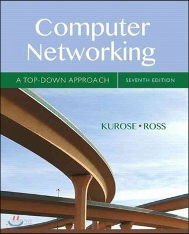

# Computer Networking A Top-Down Approach

- [Chapter 1 Computer Networks and the Internet](1_computer_networks_and_the_internet/README.md)
- [Chapter 2 Application Layer](2_application_layer/README.md)
- Chapter 3 Transport Layer
- Chapter 4 The Network Layer : Data Plane
- Chapter 5 The Network Layer : Control Plane
- Chapter 6 The Link Layer and LANs
- Chapter 7 Wireless and Mobile Networks
- Chapter 8 Security in Computer Networks
- Chapter 9 Multimedia Networking

