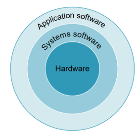
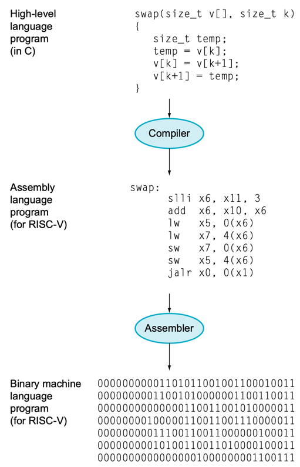

# 3. 프로그램 밑의 세계

- 상위 수준 언어에서 기계어까지

---

- 추상화
    - 복잡한 수준의 응요프로그램 명령이 단순한 컴퓨터 명령어로 해독해나가기 위한 여러겹의 소프트웨어
- 시스템 소프트웨어 : 하드웨어와 응용 프로그램 사이에 여러개 존재
- 오늘날의 컴퓨터 시스템에서의 핵심 시스템 소프트웨어
    - 운영체제 operating system
        - 사용자와 하드웨어 간의 인터페이스 역할
        - ex. Windows, Linux, macOS, ...
    - 컴파일러 compiler
        - 고급 언어로 작성된 프로그램을 기계어로 변환
        - 고급언어 : C, C++, Java, ...

## 상위 수준 언어에서 기계어까지

- 이진수 : 기계어, 0과 1로 이루어진 언어, on and off
- 이진 자릿수 binary digit : 비트 bit, 이진수로 이루어진 문자
- 명령어 instruction : 컴퓨터 하드웨어에게 내리는 이진 자릿수로 이루어진 지시

### 어셈블러 assembler와 어셈블리 언어 assembly language

- 하드웨어와 이진수로 대화하기 힘들어서 고안
- 기호식 표현으로 작성하면 어셈블러가 이진수로 변환
- `add A, B` -> `1001010100101110`
- 어셈블리 언어 assembly language : 어셈블러가 인식하는 기호식 언어
- 기계어 machine language : 하드웨어아 인식하는 언어, 이진수로 이루어짐

### 상위 수준 언어 high-level language

- 어셈블리 언어의 표현 한계
- 상위 수준 언어 high-level language : 어셈블리 언어보다 더 복잡한 표현 가능
- 장점 1 : 영단어, 수학기호를 사용하여 자연스러운 표현 가능, 목적에 맞게 설계 가능
- 장점 2 : 프로그래머의 생산성을 높임, 간결성
- 장점 3 : 하드웨어에 의존하지 않고 프로그래밍, 컴파일러, 어셈블러가 기계어로 변환
