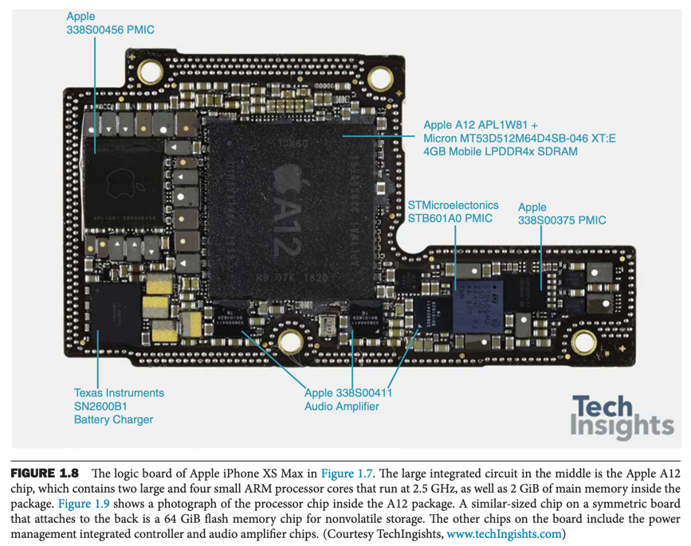
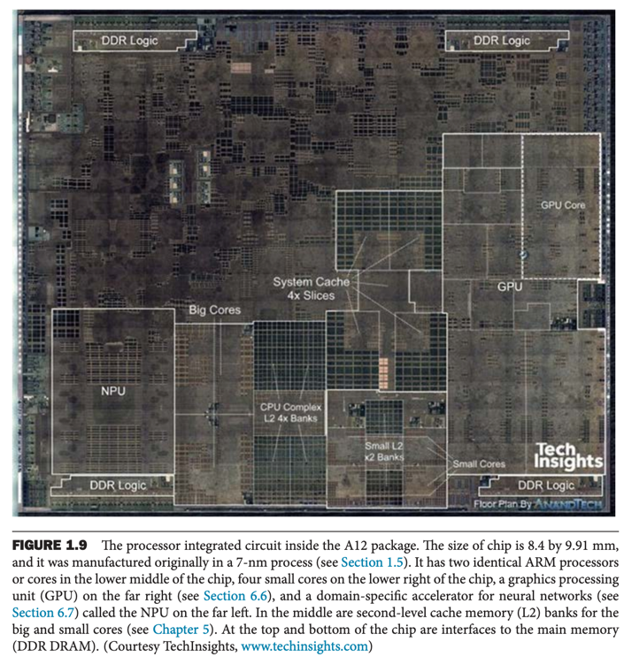

# 4. 케이스를 열고

- 디스플레이
- 터치스크린
- 상자를 열고
- 데이터의 안전한 저장소
- 컴퓨터 간의 통신

---

### 컴퓨터 하드웨어의 주요 기능

- 데이터 입력
- 데이터 출력
- 데이터 처리
- 데이터 저장

### 컴퓨터 주요 구성요소

- 입력 : 키보드, 마우스처럼 컴퓨터에 정보를 공급하는 장치
- 출력 : 연산의 결과를 사용자나 다른 컴퓨터에 내주는 장치
- 메모리
- 프로페서
    - 데이터패스 datapath
    - 제어유닛

## 디스플레이

- LCD liquid crystal display : 액정 디스플레이
    - 통과하는 빛을 제어
    - active matrix 능동 행렬 : 픽셀 pixel을 제어하기 위해 트랜지스터를 사용
    - bitmap : pixel 화소, bit의 행렬로 구성
    - frame buffer 프레임 버퍼 : 화면의 모든 픽셀을 저장하는 메모리

## 터치스크린

- PC는 LCD, 태플릿, 스마트폰은 터치 스크린
- 정전용량 감지 기법 capacitive sensing
    - 사람이 손을 댔을 때 전기가 통하는 원리 사용

## 상자를 열고

  

- 스마트폰에서 입출력장치가 5대 구성요소 중 비중이 큼
    - 아이폰의 입출력 장치 : LCD 디스플레이, 전면 카메라, 후면 카메라, 마이크, 자이로 스코프 등

- IC integrated circuit, chip, 직접회로이 진보하는 기술력의 원동력
    - 프로세서 CPU : 보드 내에서 가장 역동적인 부분
        - 숫자 연산, 입출력 장치에 신호 보냄
-

- 마이크로프로세서
- datapath : 연산 수행
- control unit 제어유닛 : 명령어에 따라 데이터패스, 메모리, 입출력 장치에게 지시
- 메모리 : 실행중인 프로그램과 프로그램이 필요로하는 데이터를 기억
    - cache memory : 프로세서 내부의 메모리
        - DRAM의 버퍼역할
        - SRAM static random access memory 이용
            - DRAM보다 빠름
    - DRAM dynamic random access memory
        - RAM : 메모리의 어떤 부분을 읽던 똑같은 시간이 걸림

### 명령어 집합 구조 instruction set architecture, ISA, architecture

- 하드웨어와 최하위 소프트웨어 간의 인터페이스
- 하드웨어에게 작업을 시키기 위한 모든 정보
- 추상화 : 실행 하드웨어와 독립적으로 어플리케이션을 설계하게 함
- ABI application binary interface : 응용 프로그래머에게 제공하는 기본 명령어 집합 + OS 인터페이스

## 데이터의 안전한 저장소

- volatile memory primary memory, 휘발성 메모리 : 전원이 꺼지면 데이터가 사라짐 e.g. DRAM
- nonvolatile memory 비휘발성 메모리 : 전원이 꺼져도 데이터가 사라지지 않음 e.g. DVD
- main memory 1차 메모리: volatile memory
- secondary memory 보조기억장치: nonvolatile memory
    - magnetic disk 자기 디스크, flash memory

## 컴퓨터 간의 통신

- network 네트워크 : 컴퓨터 간의 통신
    - 통신 communication : 컴퓨터간에 고속으로 정보를 주고 받음
    - resource sharing 자원 공유 : 입출력 장치를 공유
    - Nonlocal access 원격 접근 : 원격지의 컴퓨터에 접근
- Ethernet : LAN의 일종
- World Wide Web WWW : WAN을 기반으로 광섬유를 이용하여 전 세계의 컴퓨터를 연결
- 무선장비 늘고 있음