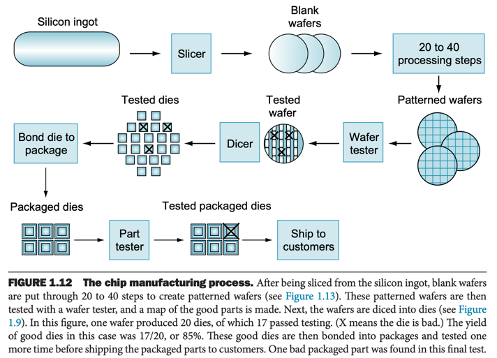

# 5. 프로세서와 메모리 생산 기술

- transistor : 전기로 제어되는 온/오프 스위치
- 집적회로 : 수십, 수백개의 트랜지스터로 구성된 하나의 칩
- VLIS Very Large Scale Integration : 수백만개의 트랜지스터로 구성된 하나의 칩

### 집적회로 공정

- silicon : 반도체의 천연 원소
- 반도체 semiconductor : 전기가 썩 잘 통하지 않는 물질
- 불순물을 첨가해 실리콘의 한부분을 다음으로 대체
    - 전기의 양도체
    - 전기 절연체
    - 조건에 따라 도체가 되거나 절연체가 되는 물체 (스위치) : **transistor**

#### 공정 과정

- wafer : silicon crystal ingot를 0.1 인치 이하로 얇게 잘라 생성
    - defect 결함 : wafer에 작은 흠지이라도 나면 못 쓰게됨
    - die, chip : 결함을 최소화하기 위해 나눈 작은 컴포넌트
    - 결함이 생기면 die만 버리고 나머지는 사용
    - yield 수율 : wafer의 전체 die 중 사용 가능한 die의 비율
- wafer에 화학물질을 첨가하여 부분부분을 트랜지스터, 도체, 절연체로 바꿈