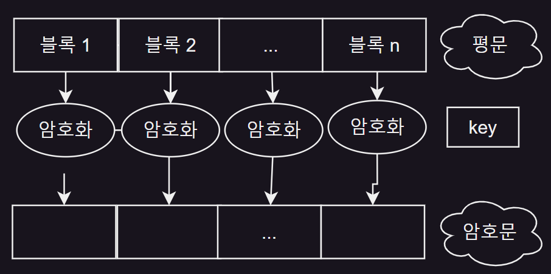
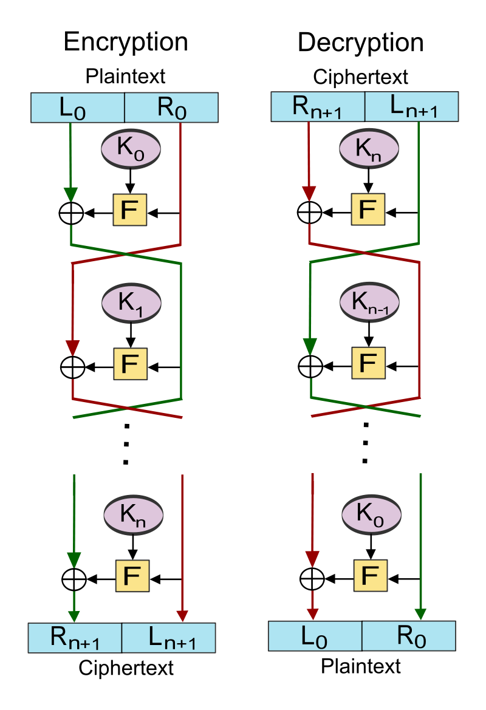

# 대칭키 암호

- 대칭키 암호
- 블록 암호
- 스트림 암호
- 대칭키 암호 알고리즘

## 대칭키 암호

- 암호화 키 = 복호화 키
- C = E(K, P)
- P = D(K, C)
- 대칭키 암호, 비밀키 암호, 단일키 암호, 관용 암호

## 블록 암호

- 평문을 고정된 크기의 블록으로 나누어, 각 록마다 암호화하는 방식

### 블록 암호 알고리즘의 구조

- 출력 블록의 각 비트는 입력 블록과 키의 모든 비트에 영향을 받음
- 주로 단순함 함수를 반복적으로 적용하여 강한 함수를 만듬
    - 라운드 함수 : 반복되는 함수
    - 라운드 키 : 라운드 함수에 적용하는 키
    - 키 스케줄 : 키를 입력하여 라운드 키를 발생시키는 과정

### 파이스텔 구조 Feistel

- 하나의 입력 블록을 분할하여 좌우 두개의 블록으로 구분 후 짝수번의 라운드 진행
- 각 라운드의 출력 블록이 다음 라운드의 입력 블록
- i 번째 라운드
    - Li = Ri-1
    - Ri = Li-1 ⊕ F(Ri-1, Ki)
        - F : 라운드 함수
        - Ki : 라운드 키
- 라운드 함수와 관계 없이 역변환 가능
- 두번의 수행으로 블록 간의 완전한 확산 이루어짐
- e.g. DES, SEED

### SPN 구조 Substitution-Permutation Network

- 하나의 입력 블록을 여러개의 소블록으로 나눈 후 라운드 진행
- 각 라운드의 출력브롥이 다음 라운드의 입력 블록
- i번째 라운드 처리과정
    - 각 소블록을 S-Box를 이용하여 치환
    - S-box 출력을 P-Box로 전치
- 라운드 함수가 역변환 가능해야 함
- 더 많은 병렬성 제공
- e.g. AES, ARIA

### 블록 암호의 사용 모드

- 전자 코드 북 모드 ECB
- 암호 블록 연결 모드 CBC
- 암호 피드백 모드 CFB
- 출력 피드백 모드 OFB
- 카운터 모드 CTR

#### 전자 코드북 모드 Electronic Code Book

- 암/복호화 시 병렬처리 가능
- 암호문 블록의 오류가 다른 블록에 영향을 미치지 않음
- 패턴 생성 가능 : 동일한 평문 블록은 동일한 암호문 생성

#### 암호 블록 연결 모드 Cipher Block Chaining

- 암호화 시 병렬 처리 불가능
- 암호화 시 평문 블록 오류가 그 다음 모든 암호문에 영향
- 메시지 인증에 사용

#### 암호 피드백 모드 Cipher Feedback

- 암호화 시 특정 입력 이후로 영향을 미침
- 메시지 인증에 사용
- 복호화 함수 필요 없음

#### 출력 피드백 모드 Output Feedback

- 암호문 블록의 오류가 한 블록에만 영향을 미침
- 영상 / 음성 같은 디지털 신호화된 아날로그 신호에 사용
- 복호화 함수 필요 없음

#### 카운터 모드 Counter

- 암 / 복호화 시 병렬 처리 가능
- 오류의 확산 없음
- 복호화 함수 필요 없음

## 스트림 암호

- 평문과 같은 길이의 키 스트림을 생성하여 평무노가 키를 비트 단위로 XOR 하여 암호문을 얻는 방식

## 대칭키 암호 알고리즘

