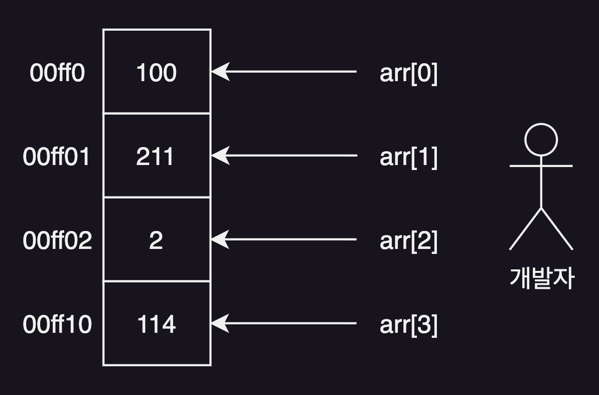
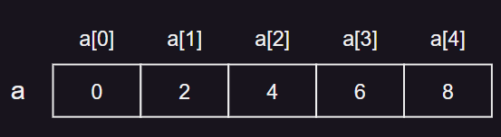
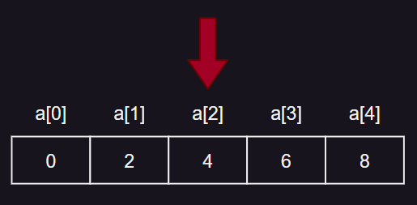
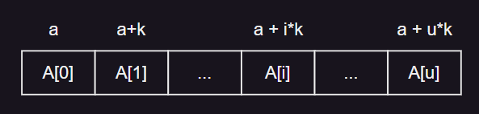
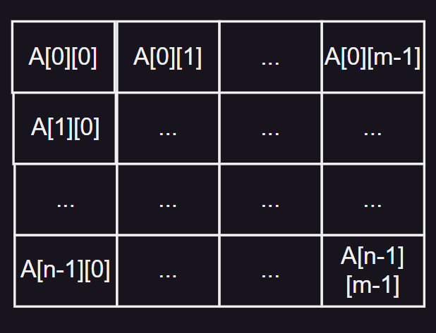
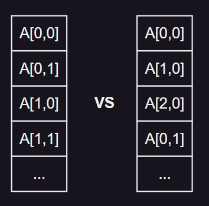
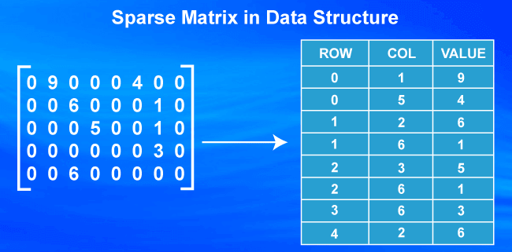

# 1. 배열

- 배열
- 배열의 추상 자료형
- 배열의 연산의 구현
- 1차원 배열 및 배열의 확장
- 희소행렬

## 배열



### 배열의 정의

- 일정한 차례나 간격에 따라 원소를 벌여 놓음
- 차례 <sup>순서</sup> 와 관련된 기본적인 자료구조
- <index, value> 쌍으로 구성된 집합

#### 배열의 순서

- **원소의 메모리 공간의 물리적 위치를 순서적으로 결정**
- 배열 원소의 순서 = 메모리에 저장되는 물리적 순서

### 배열의 의미

- 보통 인덱스 원소는 0 부터 시작
- 원소들이 모두 같은 자료형, 같은 크기의 공간을 가짐
- 인덱스 값을 이용해 직접 원소에 접근
- 인덱스 값 : 원소의 물리적 메모리 주소와 무관한 **추상화된 값**
- 주소값 : 원소의 실제 물리적인 메모리 주소값

## 배열의 추상 자료형

- 추상자료형 : 객체 및 관련된 연산의 정의
- 자료형 : 메모리 저장 할당을 위한 선언

### 추상 자료형

#### <i∈Index, e∈Element> 쌍들의 집합

- Index : 순서를 나타내는 원소의 유한집합
- Element : 타입이 같은 원소의 집합

> a∈Array; i∈Index; item∈Element; n∈Integer 인 모든 a, item, n 에 대해여 다음과 같은 연산이 정의됨
> - a : 0 개 이상의 원소를 갖는 배열
> - item : 배열에 저장되는 원소
> - n : 배열의 최대 크기를 정의하는 정수값

```
Array create (n) ::=
    배열의 크기가 n인 빈 배열을 생성하고 배열을 반환한다;

Element retrieve (a, i) ::=
    if (i ∈ Index) then 
      a[i] 
    else 
      error;

Array store (a, i, item) ::=
    if (i ∈ Index) then 
      a[i] ← item 
    else 
      error;
```

## 배열의 연산의 구현

### 배열의 생성

```c
void create (int *a, int n){
    int i;
    for (i = 0; i < n; i++)
        a[i] = i * 2;
}
```

#### 결과 (n = 5일 때)



### 배열의 검색

```c
# define array_size 5
int retrieve (int *a, int i){
    if (i < 0 || i >= array_size)
        return -1;
    else
        return a[i];
}
```

#### 결과 (i=2일 때) : 4




### 배열의 저장

```c
#define array_size 5
void store (int *a, int i, int item){
    if (i < 0 || i >= array_size)
        printf("error");
    else
        a[i] = item;
}
```

#### 결과 (i = 3, item = 999일 때)


## 1차원 배열 및 배열의 확장

### 1차원 배열

- 한 줄짜리 배열
- 인덱스 하나로 요소 구분

### 1차원 배열의 주소 계산



> 사이즈가 i 인 1차원 배열 A
> - A[0], A[1], A[2], ..., A[i-1]
> - A의 시작주소가 a라면 A[i]의 저장 주소는 a + i * k (k는 A의 원소의 크기)

### 행렬의 2차원 배열 표현

- 행렬을 컴퓨터에서 표현하기에 적합한 배열은 2차원 배열

### m*n 2차원 배열



### 행 / 열 우선 배열

- 행 우선 배열 : 1차원 배열을 여러개 쌓아 놓은 것
- 열 우선 배열 : 1차원 배열을 여러개 세워 놓은 것

### 행 / 열 우선할당

- 행 우선 할당 : 가로 1차원 배열 단위로 메모리에 우선 할당
    - C 언어의 2차원 배열은 행 우선 할당
- 열 우선 할당 : 세로 1차원 배열 단위로 메모리에 우선 할당



## 희소 행렬

- 원소값이 0인 원소가 그렇지 않은 원소보다 상대적으로 많은 행렬
- 메모리 낭비를 막고자 0인 원소가 아닌 값만을 따로 모아서 저장하는 방법
    - 0인 원소는 애초에 메모리 할당을 안함



* 출처 : https://www.javatpoint.com/types-of-sparse-matrices

## 참고

- https://www.javatpoint.com/types-of-sparse-matrices


