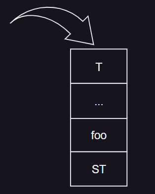
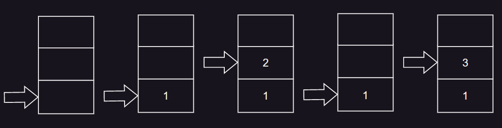

# 2. 스택

- 스택의 개념과 추상 자료형
- 스택의 응용과 구현
- 사칙 연산식의 전위 / 후위 / 중위 표현

## 스택의 개념과 추상 자료형

### 스택의 정의



- 가장 먼저 입력된 자료가 가장 나중에 출력되는 관계
- 객체와 객체가 저장된 순서를 기억하는 자료구조
- 0 개 이상의 원소를 갖는 유한 순서 리스트
- push()<sup>add</sup>, pop()<sup>delete</sup> 연산이 한곳에서 발생

### 스택의 추상 자료형

#### CreateS 연산

```
Stack createS(maxStackSize) ::=
    스택의 크기가 maxStackSize인 빈 스택을 생성 후 반환;
```

#### Push 연산

```
Element Push(S, newItem) ::=
    if(isFull(S)) then 
      오류 출력;
    else 
      S에 newItem을 삽입;
```

#### Pop 연산

```
Element Pop(S) ::=
    if(isEmpty(S)) then 
      오류 출력;
    else 
      S의 top에 있는 원소를 삭제 후 반환;
```

#### Pop & Push 연산 실행

```
createS(3);
push(S, 1);
push(S, 2);
pop(s);
push(S, 3);
```



## 스택의 응용과 구현

### 다양한 응용

- 시스템 스택 : 변수에 대한 메모리 할당과 수집
- 서브루틴 호출 관리
- 수식 계산 : 연산자들 간의 우선순위에 의해 계산 순서 결정
- 인터럽트의 처리, 이후 리턴할 명령 수행지점 저장
- 컴파일러, 순환 호출 관리

### 삭제 연산

- top-- 에서 -- 연산자의 위치에 따라 연산의 적용 순서 달라짐

```
int a = 5;
a = a--;

int b = 5
b = --b;
```

### 구현

#### 생성

```c
#define STACK_SIZE 100
typedef int element;
element stack[STACK_SIZE];
int top = -1;
```

#### 삽입

```c

void push(element item) {
    if (top >= STACK_SIZE - 1) {
        printf("Stack is Full\n");
        return;
    }
    else stack[++top] = item;
}

```

#### 삭제

```c
element pop() {
    if (top == -1) {
        printf("Stack is Empty\n");
        return 0;
    }
    else return stack[top--];
}
```

## 사칙 연산식의 전위 / 후위 / 중위 표현

### 수식의 표현

#### 수식의 계산

- 연산자의 계산순서
- A+B*C+D
    1. B*C
    2. A + B*C
    3. A + B*C + D

#### 수식의 표기 방법

- 중위 표기법 <sup>Infix Notation</sup>
    - 연산자를 피연산자의 가운데 표기
    - A+B
- 전위 표기법 <sup>Prefix Notation</sup>
    - 연산자를 피연산자의 앞에 표기
    - +AB
- 후위 표기법 <sup>Postfix Notation</sup>
    - 연산자를 피연산자의 뒤에 표기
    - AB+

#### 전위 표기법

1. (A-(B+K)/D)
2. (A-((+BK)/D))
3. (A-(/(+BK)D))
4. -A(/(+BK)D)

#### 후위 표기법

1. (A-(B+K)/D)
2. (A-(BK+)/D)
3. (A-((BK+)D)/)
4. A(((BK+)D)/)-

#### 후위 표기식 계산 알고리즘

```c
element evalPostfix(char *exp){
    int oper1, oper2, value, i = 0;
    int length = strlen(exp);
    char symbol;
    top = -1;
    
    for(i=0; i<length; i++{
      symbol = exp[i];
      
      if(symbol != '+' && symbol != '-' && symbol != '*' && symbol != '/'){
        value = symbol - '0';
        push(value);
      } else{
        oper2 = pop();
        oper1 = pop();
        switch(symbol){
          case '+': push(oper1 + oper2); break;
          case '-': push(oper1 - oper2); break;
          case '*': push(oper1 * oper2); break;
          case '/': push(oper1 / oper2); break;
        }
      }
  
  return pop();
    
}


```

