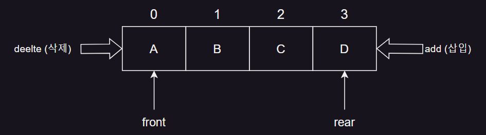
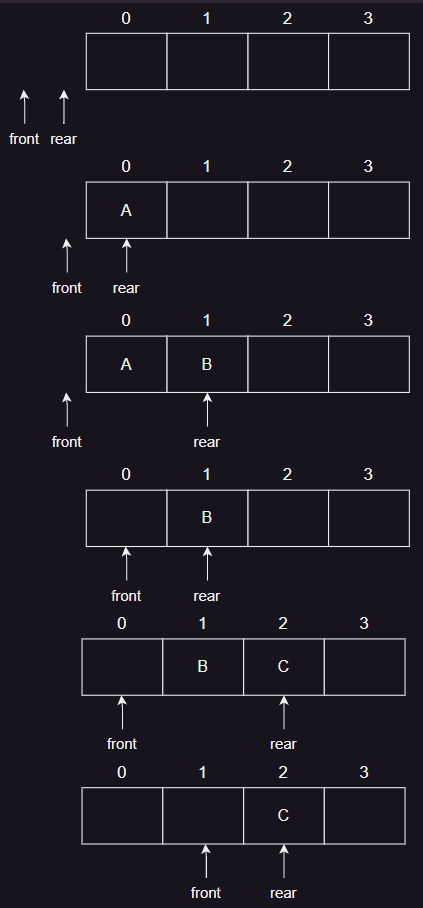

# 3. 큐

## 큐의 개념 및 추상 자료형

### 큐의 정의



- ex. 병원의 접수대, 은행 대기줄
- First In First Out <sup>FIFO</sup>
- 한쪽에서는 삽입 연산만
- 다른 한쪽에서는 삭제 연산만 가능한 양쪽이 뚫린 관

### 큐의 추상 자료형

#### 삽입

```
Que Add_q(queue, item) ::=   
    if queue is full then 
        error   
    else
        add item to the rear of queue
```

#### 삭제

```
Element Delete_q(queue) ::= 
    if queue is empty then 
        error 
    else 
        delete and return the front element of queue
```

#### 빈 큐 검사

```
Boolean Empty_q(queue) ::= 
    if rear == front then 
        return true 
    else 
        return false
```

#### 큐 만원 검사

```
Boolean Full_q(queue) ::= 
    if queue element count == maxQueueSize then 
        return true 
    else 
        return false
```

#### 큐 연산

```
1. create_q(4);
2. Add_q('A');
3. Add_q('B');
4. Delete_q();
5. Add_q('C');
6. Delete_q();
```



## 큐의 응용

### CPU 관리 방법

- FCFS <sup>First Come First Served</sup>
    - 작업 큐에 도착한 순서대로 CPU를 할당
- RR <sup>Round Robin</sup>
    - 작업 큐에 도착한 순서대로 CPU를 할당
    - 대화형 시스템의 스케줄링 방식

## 배열을 이용한 큐의 구현

### 큐의 연산

#### 큐 생성

- rear 초기값 : -1
    - 큐가 공백상태를 나타내는 값

```c
#define QUEUE_SIZE 5
typedef int element;
element queue[QUEUE_SIZE];
int rear = -1;
int front = -1;
```

#### 큐 삽입

- 삽입 시 : rear 변수 오른쪽 이동
- 삭제 시 : front 변수 오른쪽 이동

```c
void Add_q(int *rear, element item) {
    if (*rear == QUEUE_SIZE - 1) {
        printf("Queue is Full\n");
        return;
    }
    else queue[++(*rear)] = item;
}
```

#### 큐 삭제

```c
element Delete_q(int *front, int rear) {
    if (*front == rear) {
        printf("Queue is Empty\n");
        return;
    }
    else return queue[++(*front)];
}
```

## 원형 큐


* 출처 : https://www.geeksforgeeks.org/introduction-to-circular-queue/

### 배열로 구현한 큐의 문제점

- front 가 비었어도 rear가 마지막 원소를 가리키면 삽입 불가능

### 원형 큐의 개념

- 배열의 문제점을 해결하기 위한 원형 큐
- 배열의 처음과 끝이 연결된 형태

## 참고

- https://www.geeksforgeeks.org/introduction-to-circular-queue/
