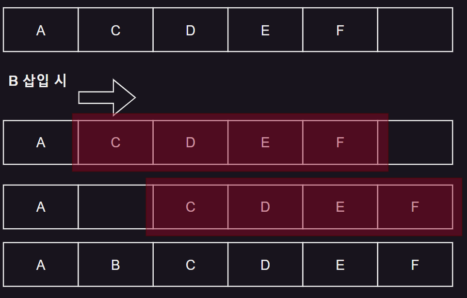
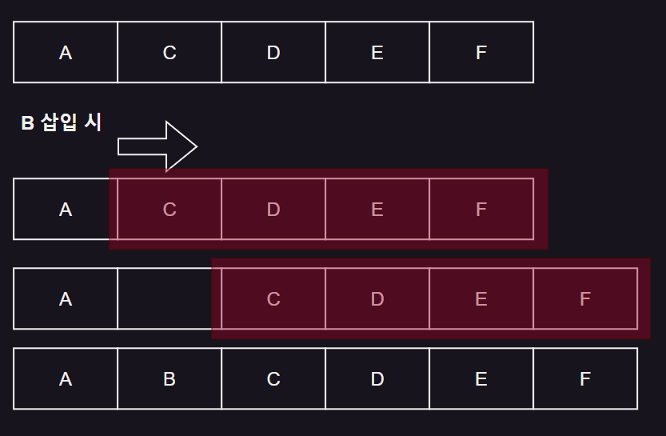
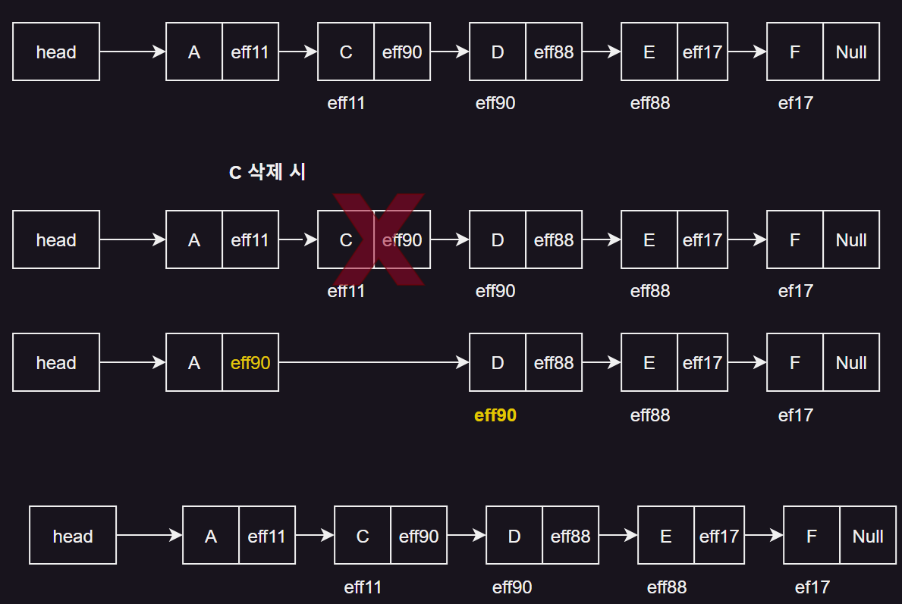
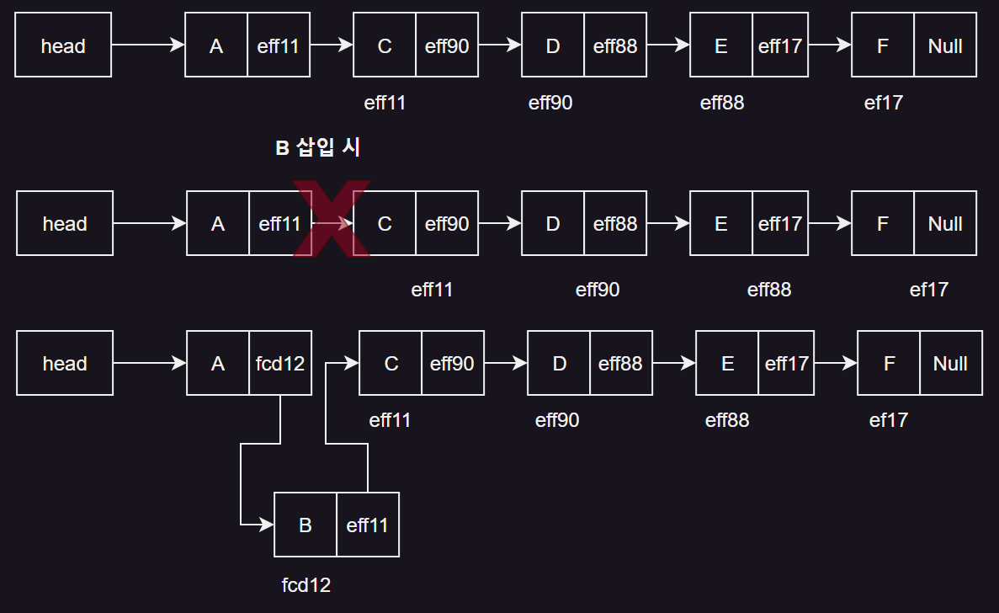

# 4. 연결 리스트

- 리스트의 개념
- 배열을 이용한 리스트의 구현
- 포인터를 이용한 리스트의 구현
- 포인터 변수 및 리스트의 삭제 / 삽입
- 연결 리스트에서 노드의 삭제와 삽입

## 리스트의 개념

- **일정한 순서**의 나열
- **논리적 순서**의 나열
- 리스트의 순서는 데이터가 저장된 물리적 위치와 상관 없이,
- 논리적 순서에 따라서 정해짐
    - 논리적 순서 : 의미적 순서, 개발자 머릿속의 논리적 순서
- ex. 31운동, 625 전쟁, 서울 올림픽

### vs 배열

- 배열은 물리적 순서가 논리적 순서와 같음
- 리스트의 순서는 어떤 정의에 의해 결정된 논리적 순서
- 리스트 원소들의 물리적 순서는 논리적 순서와 일치하지 않음

### 리스트 구현 방법

- 포인터를 이용 : 원소값을 저장하는 공간 + 다음 원소를 가리키는 위치 정보
- 배열을 이용 : 원소 삽입, 삭제 시 불필요한 데이터 이동 발생

## 배열을 이용한 리스트의 구현



- 배열 선언 시 최대 원소 개수를 미리 지정
- 원소 삽입 / 삭제 시 데이터 이동 발생
- 프로그램 수행 시간이 원소의 개수에 비례
- **실무에 사용되지 않음**

## 포인터를 이용한 리스트의 구현



### 노드의 구조

- 데이터 필드 : 원소의 값을 저장
- 링크 필드 : 다음 원소의 위치 정보를 저장
- 노드 : 데이터 필드 + 링크 필드

## 포인터 변수 및 리스트의 삭제 / 삽입

### 구조체 구현

#### 리스트 생성

```c
struct linked_list_node{
     int data;
     struct linked_list_node *link;
};
```    

### 포인터 구현

```c
int a, *p_a;
float b, *p_b;
p_a = (int *)malloc(sizeof(int));
p_b = (float *)malloc(sizeof(float));

*p_a = 10;
*p_b = 3.14;

printf("%d %f", *p_a, *p_b);
free(p_a);
free(p_b);
```

## 연결 리스트에서 노드의 삭제와 삽입

### 노드 삭제



- 삭제할 노드의 선행 노드의 링크필드가 후행 노드를 가리키게 함

### 노드 삽입



1. 삽입할 원소의 메모리 공간 할당
2. 삽입할 원소의 선행노드가 삽입할 원소를 가리키게 함

### 연결리스트 마지막에 노드 삽입

```c
//리스트 마지막에 삽입할 데이터 x = 100
void addNote(linked_h* H, int x) {
  listNode* newNode;
  listNode* lastNode;
  newNode = (listNode*)malloc(sizeof(listNode));
  newNode->data = x;
  newNode->link = NULL;
  
  if(H -> head == NULL) {
    H -> head = newNode;
    return;
  }
  
  lastNode = H -> head;
  while(lastNode -> link != NULL) {
    lastNode = lastNode -> link;
  }
    
  lastNode -> link = newNode;
}
```

### 연결 리스트 특정 노드 다음에 삽입 연산

```c
void addNode(linkedList_h* H, listNode* prevNode, int data){
  newNode -> link = prevNode -> link;
  prevNode -> link = newNode;
  return;
}
```


