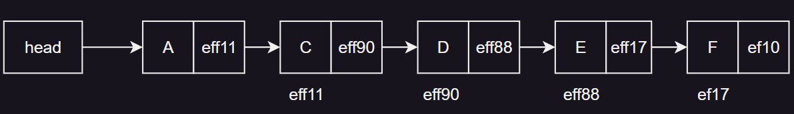
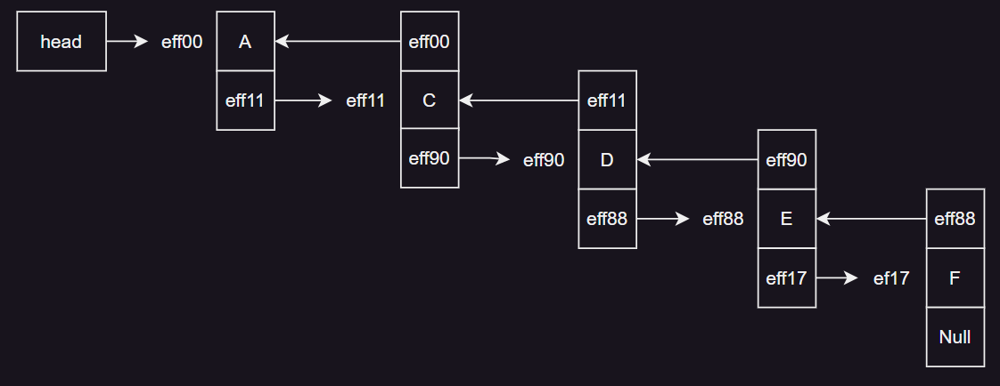
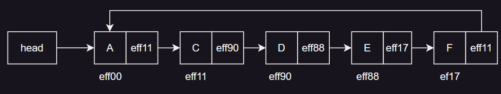
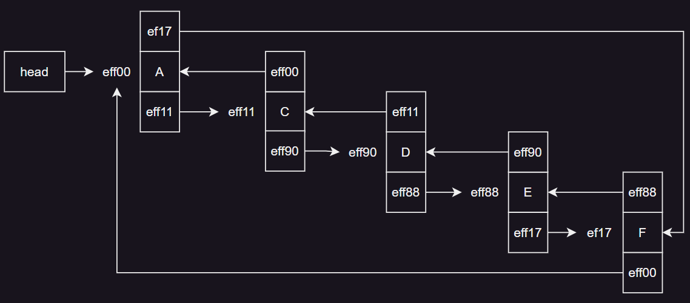

# 연결 리스트의 응용

- 연결 리스트의 변형
- 원형 연결 리스트
- 이중 연결 리스트

## 연결 리스트의 변형

- 단순 연결 리스트 <sup>singly linked list</sup>
- 이중 연결 리스트 <sup>doubly linked list</sup>
- 원형 연결 리스트 <sup>circular linked list</sup>
- 원형 이중 연결 리스트 <sup>circular doubly linked list</sup>

### 단순 연결 리스트



- 하나의 링크만 있고 **각 노드의 링크는 후행노드만 가리킴**
- 장점 : 후행 노드에 쉽게 접근 가능
- 단점 : 후행 노드에 접근하기 위해 선행 노드 재검색이 필요

### 이중 연결 리스트



- 특정 노드는 선행노드를 가리키는 링크와 후행노드를 가리키는 링크를 가짐

### 원형  연결 리스트



- 단순 / 이중 연결리스트의 마지막 노드의 링크 필드가 Null
- 마지막 노드의 링크필드를 활용하고, 성능에 도움하기 위해 제안된 원형 연결 리스트

### 원형 이중 연결 리스트



## 원형 연결 리스트


### 원형 연결 리스트 생성

```c
// 원형 연결리스트의 노드 구조 
typedef struct ListNode{
    int data;
    struct ListNode *link;
} listNode;

// 헤드 노드 구조
typedef struct{
    listNode *head;
} linkedList_h;

// 헤드 노드 생성
linkedList_h* createlinkedList_h(void){
    linkedList_h* H;
    H = (linkedList_h*)malloc(sizeof(linkedList_h));
    H->head = NULL;
    return H;
}
```

### 노드 삽입

```c
void addFIrstNode(linkedList_h* H, int x){
    listNode* tmpNode;
    listNode* newNode;
    newNode = (listNode*)malloc(sizeof(listNode));
    newNode->data = x;
    newNode->link = NULL;
    
    // 현재 리스트가 공백인 경우
    if(H->head == NULL){
        H->head = newNode;
        newNode->link = newNode;
        return;
    }
    
    tmpNode = H->head;
    while(tmpNode->link != H->head){
        tmpNode = tmpNode->link;
    }
    newNode->link = tmpNode->link;
    tmpNode->link = newNode;
    H->head = newNode;
}
```

## 이중 연결 리스트


- 이중 연결리스트는 양쪽 방향으로 노드를 탐색할 수 있음
- 선행, 후행 노드를 가리킬 수 있는 링크 필드 2개 가짐

### 이중 연결 리스트 정의 및 생성

```c
// 이중 연결리스트의 노드 구조
typedef struct ListNode{
    sturct ListNode* Llink;
    int data;
    struct ListNode* Rlink;
} listNode;

// 헤드 노드 구조
typedef struct{
    listNode* lHead;
    listNode* fHead;
} linkedList_h;

// 헤드 노드 생성
linkedList_h* createlinkedList_h(void){
    linkedList_h* H;
    H = (linkedList_h*)malloc(sizeof(linkedList_h));
    H->lHead = NULL;
    H->fHead = NULL;
    return H;
}
```

### 노드 삽입

```c
void addDNode(linkedList_h* H, listNode* prevNode, int x){

    listNode* newNode;
    newNode = (listNode*)malloc(sizeof(listNode));
    newNode->data = x;
    newNode->Llink = NULL;
    newNode->Rlink = NULL;
    
    newNode->Rlink = prevNode->Rlink;
    prevNode->Rlink = newNode;
    newNode->Llink = prevNode;
    newNode->Rlink->Llink = newNode;
}
```

### 노드 삭제

```c
void deleteDNode(linkedList_h*H, listNode* delNode){
    delNode->Llink->Rlink = delNode->Rlink;
    delNode->Rlink->Llink = delNode->Llink;
    free(delNode);
}
```
