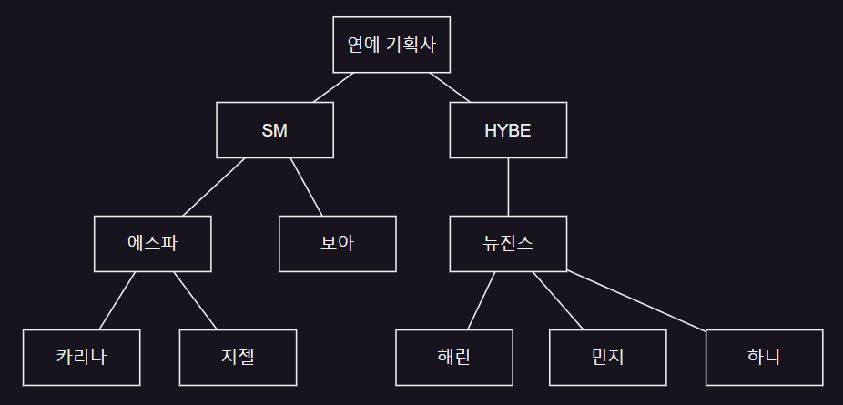
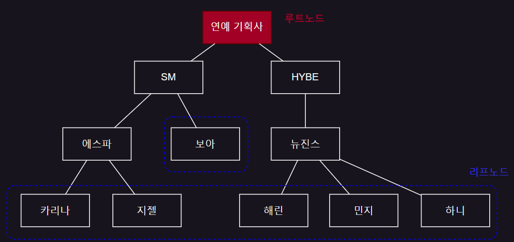

# 6. 트리

- 트리
- 용어와 논리적 표현 방법
- 이진 트리
- 이진 트리의 구현
- 이진 트리 연산
- 일반 트리를 이진 트리로 변환

## 트리

- 검색 편리
- 논리적 계층
- 계급적 특성

## 용어와 논리적 표현 방법

- 노드 : 트리의 항목 / 트리에 저장된 데이터의 묶음
- 부모노드 - 자식노드
    - 상하 계층 구조
    - 부모 자식 간의 직접적인 연결

### 트리의 구성

- 루트 노드 : 트리의 최상위 노드, 부모 없음
- 서브 트리 : 부모 노드를 삭제하면 생기는 트리들
- 리프 노드 : 트리의 맨 끝 바닥 에 있으면서, 자신의 서브 트리를 갖지 않는 노드

### 진입 / 진출 차수

- 루트 노드 : 진입차수 0
- 루트를 제외한 모든 노드의 진입 차수 : 1
- 리프 노드 : 진출 차수 : 0

### 트리의 레벨

- 노드의 레벨 : 루트로부터 그 노드까지 이어진 선의 길이

## 이진 트리

## 이진 트리의 구현

## 이진 트리 연산

## 일반 트리를 이진 트리로 변환

## 참고

- https://www.geeksforgeeks.org/data-structures/
