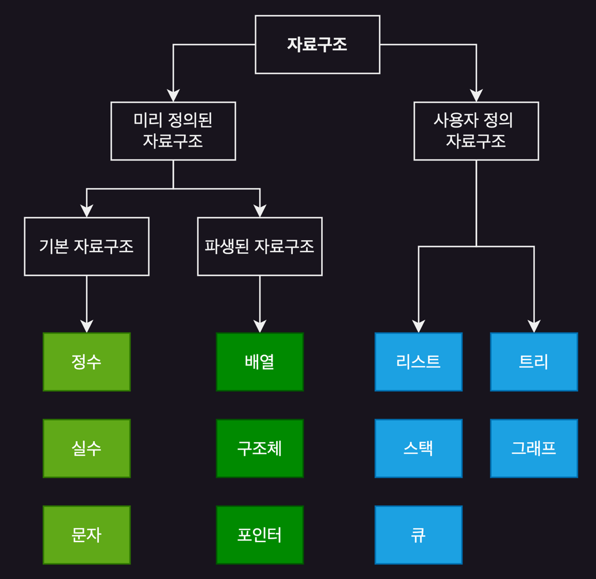

# Data Structure

### 자료구조

1. [배열](1_배열/README.md)
2. [스택](2_스택/README.md)
3. [큐](3_큐/README.md)
4. [연결 리스트](4_연결_리스트/README.md)
5. 연결리스트의 응용
6. 트리
7. 스레드 트리
8. 힢
9. 선택트리, 숲, 이진트리 개수
10. BS, Splay, AVL, BB
11. 멀티웨이 탐색 트리 1
12. 멀티웨이 탐색 트리 2
13. 그래프 1
14. 그래프 2

# 자료구조란 무엇인가?

  

## 자료와 정보 (Data and Information)

> I = P(D)

Information = Process(Data)  
정보는 컴퓨터가 처리한 자료다.

  

### 자료 (Data)

- 현실 세계에서 관찰된 값이나 사실

### 정보 (Information)

- 의사 결정을 도와주는 유효한 해설이 담긴 자료 혹은 내용
- 처리과정을 거쳐 정돈된 자료의 2차 처리 결과물
    - 처리과정 : 가공 / 분류되어 정돈

## 추상화

- 공통적인 개념을 이용하여 같은 종류의 다양한 객체를 정의
- 사람의 의사를 간결하게 전달

### 자료의 추상화

- 자료의 추상화 : 다양한 객체를 컴퓨터에서 편하게 활용하기 위해 공통의 특징만 뽑아 정의
- **컴퓨터의 이진수 표현, 저장위치 등은 포함하지 않고 개발자가 머릿속에 그림을 그리듯이 개념화**

## 자료구조

- 추상화를 통해 알고리즘에 사용할 자료의 논리적인 구조
- 자료구조가 제대로 설계되지 않으면 알고리즘의 효율성이 떨어짐

## 자료구조와 알고리즘

### 알고리즘

- 컴퓨터에게 일을 시키는 **연속된 명령어 덩어리**
- 명령어의 유한집합이 사람 머릿속에 추상화
- 개발자의 언어(글)

### 알고리즘의 조건

- 출력
- 유효성
- 입력
- 명확성
- 유한성

### 자료구조와 알고리즘의 관계

- 컴퓨터는 자료구조를 알고리즘에 넣어 출력
- 자료구조 : 입력 값의 추상화
- 알고리즘 : 프로그램 실행 명령의 추상화

## 알고리즘의 성능 분석, 측정

- 실행 시간 분석 
- 실행 메모리 분석
- 성능 측정

### 실행시간 분석

- 알고리즘 실행에 필요한 예측 실행시간 추정치
- O(n) : 알고리즘 실행 횟수
- 같은 O(n)이라는 것은, **실행 시간의 증가 경향**이 유사하다는 의미

### 실행 메모리 분석

- 알고리즘이 실행하는데 필요한 공간 memory의 추정치

### 실행 메모리 예측

- 공간 복잡도 Space Complexity : 알고리즘의 실행부터 오나료까지 필요한 메모리 공간
- 고정 공간 Static Space : 프로그램의 크기, 입출력 회수에 상관없이 컴파일시 결정되어 종료될때까지 고정적으로 필요한 공간
- 가변 공간 Dynamic Space : 동적으로 할당되어 자료구조와 변수들을 위해 할당되는 메인메모리 공간

> Sp = Sc + Se   
> Space Complexity = Static Space + Dynamic Space

### 성능 측정

- 컴퓨터가 실제로 프로그램 실행시 걸리는 시간 측정
- 실제로 실행시간을 재는 것
- 시스템 시계 사용
