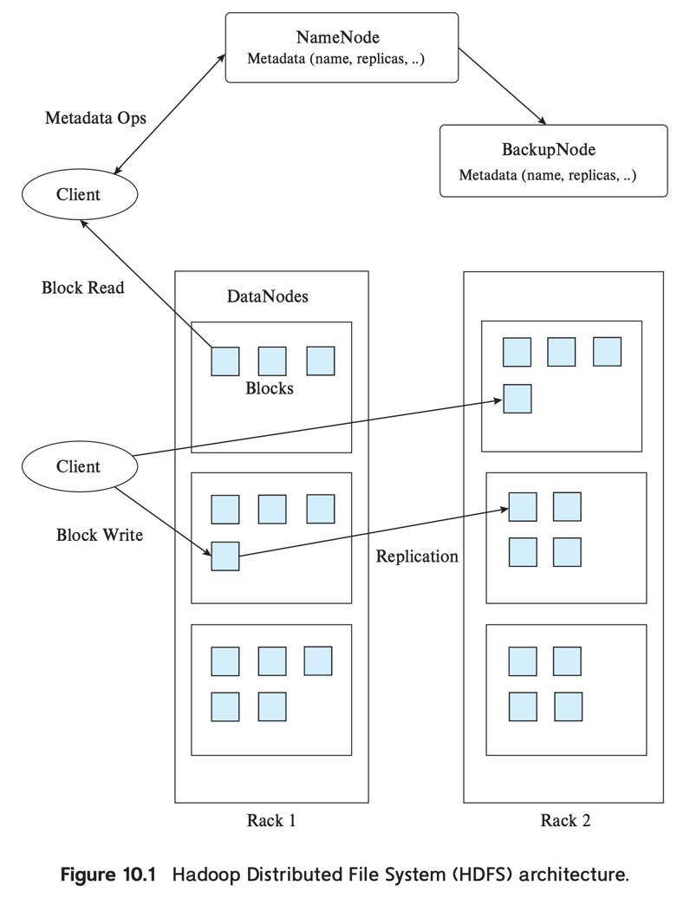

# 2. Big Data Storage Systems

1. Distributed File Systems
2. Sharding
3. Key-Value Storage Systems
4. Parallel and Distributed Databases
5. Replication and Consistency

---

- Big Data를 다루는 application은 높은 확장성을 요구함
- 수백만 user, 많은 applcation이 동시에 접근
- 수천개의 computing, storage node에 걸쳐 partitioning되어 저장

### Big Data 저장소 유형

- distributed file system : 파일을 몇개의 machine에 걸쳐 저장
    - 파일에 접근은 전통적인 file-system interface를 통해
    - 큰 file을 저장할 때 사용 (e.g. log file)
- sharding across multiple databases :
    - _Sharding_ : record를 여러 시스템에 걸쳐 partitioning해서 저장
    - client software가 record를 저장할 DB를 결정
- key-value storage systems : 저장, 질의를 key를 통해
    - 일부 제한된 쿼리 기능 제공
    - 완전한 독립된 데이터베이스 시스템은 아님
    - NoSQL system이라고 불림 (SQL 지원 안함)
- Parallel and distributed databases : 인터페이스는 전통적인 DB
    - 데이터를 1개 이상의 machine에 걸쳐 저장
    - 쿼리 처리를 병렬로

## 1. Distributed File Systems

- 파일을 여러개의 machine에 걸쳐 저장
- client에게는 single file-system interface 제공
    - client는 파일의 저장위치를 알 필요 없음
- 적합 데이터 : 비구조화된 데이터
    - e.g. web page, web server logs, image, ...
    - 용량 : 수십 MB ~ 수백 GB 이상
- e.g. Google File System (GFS), Hadoop Distributed File System (HDFS)
- 파일은 1개 이상의 block에 걸쳐 저장
    - 1개 파일에 대한 block은 여러 machine에 걸칠 수 있음
    - 각 block은 여러 machine에 걸쳐 replicated 될 수 있음 (fault-tolerance)

#### File System의 기본 지원

- directory system : 파일을 계층형의 디렉토리로 저장 가능
- block의 식별자 번호와 file을 매핑
- 식별자로 data를 저장하고, 탐색
    - centralized file system에서는 식별자로 disk를 특정
    - distributed file system에서는 식별자로 machine + disk를 특정

### Distributed File System 예시 : Hadoop Distributed File System (HDFS)



- **NameNode** : 파일의 metadata를 저장 (Hadoop의 코어)
    - file system의 모든 요청은 NameNode로 전달
    - 파일별 block 식별자 정보를 유지
    - block replication 정보를 유지
- **DataNode** : block을 저장
- Read : block이 있는 machine 식별자, file이 있는 block 식별자를 가져옴
- Write : block 식별자를 생성해서 각 machine에 할당
- API 지원
    - Java, Python 등의 언어로 구현된 API 제공

## 2. Sharding

- 대용량 파일, 수백만 이상 사용자, SNS application 등에서는 single application으로 역부족
- **sharding** : data를 partition 하여, 여러 DB (or machine)에 걸쳐 저장

### paritioning 방법

- _partitioning attributes (partitioning keys, shard keys)_ : data를 partitioning하는데 사용되는 attribute
    - 1개 이상의 속성 사용 e.g. 사용자 식별 키 등
- _range partitioning_ : partitioning attribute의 값의 범위에 따라 partitioning
    - e.g. 사용자 식별 키의 범위에 따라 partitioning
    - e.g. 1 ~ 100,000은 DB1, 100,001 ~ 200,000은 DB2, ...
- _hash partitioning_ : partitioning attribute의 hash 값에 따라 partitioning
    - e.g. 사용자 식별 키의 hash 값에 따라 partitioning
    - e.g. hash(1) % 10 = DB1, hash(2) % 10 = DB2, ...

### application에서 query 처리

- query를 처리하기 위해, client는 어떤 DB에 접근해야 하는지 알아야 함
    - paritioning attribute에 대한 정보를 알고 있어야 함
- 하나의 query를 여러 DB에 걸쳐 질의해야할 수도 있음

### 한계

- application이 paritioning 정보를 기반으로 query를 라우팅해야함
- 특정 DB에 부하가 생기면, 데이터를 다른 DB로 이동시켜야 함
- Key-Value Storage System이 일부 해결 (parallel key-value store)

## 3. Key-Value Storage Systems (Key-Value Store, NoSQL)

- 많은 web-app은 작은 사이즈의 레코드를 수십억 이상 저장 (작은 사이즈 : KB ~ MB)
- 작은 record를 각자 file에 저장하는 것은 비효율적
- **key-value storage system** : key를 통해 record를 저장, 질의
    - 대용량 데이터 저장 가능
    - 수천개의 machine으로 scaling
- NoSQL system
    - SQL을 지원하지 않기 떄문에 붙여짐

### Parallel Key-Value store

- 직접 각 machine 별 partition key를 유지
    - application code에서 partition 을 고려할 필요 없음
    - 오늘날 sharding 보다 더 사용되는 이유
- replication 지원
- load balancing 지원
- Google Bigtable, Apache HBase, Amazon Dynamo, Facbook Cassandra, MongoDB, ...

### document stores (e.g. MongoDB)

- value에 대해 단순히 byte sequence로 간주
- value에 간결하게 schema를 정의해서 쿼리를 지원
- MongoDB는 JSON document를 value로 저장

### 동작

- `put(key, value)` : key-value pair를 저장
- `get(key)` : key에 해당하는 value를 가져옴
- 주로 API를 통해 접근이 이루어짐
- Bigtable은 range query 지원
- Document store는 여러 추가 쿼리 지원

### cluster

- 다수의 machine에 걸쳐 cluster를 구성
- 대용량 데이터를 저장 가능
- record는 cluster안의 machine에 partitioning되어 저장

### 한계

- 표준 DB system이 제공하는 여러 기능을 미지원
    - declarative quering (SQL)
    - transcation
- 기본적으로 non-key 속성에 대한 쿼리 지원이 제한적
    - e.g. 사용자의 나이가 20살 이상인 사용자를 찾는 쿼리

### 예시 : MongoDB

#### DB 연결, 데이터 생성, 조회, 삭제

```Javascript
show dbs // Shows available databases
use sampledb // Use database sampledb, creating it if it does not exist
db.createCollection("student") // Create a collection
db.createCollection("instructor")
show collections // Shows all collections in the database
db.student.insert({ "id" : "00128", "name" : "Zhang",
    "dept name" : "Comp. Sci.", "tot cred" : 102, "advisors" : ["45565"] })
db.student.insert({ "id" : "12345", "name" : "Shankar",
    "dept name" : "Comp. Sci.", "tot cred" : 32, "advisors" : ["45565"] })
db.student.insert({ "id" : "19991", "name" : "Brandt",
    "dept name" : "History", "tot cred" : 80, "advisors" : [] })
db.instructor.insert({ "id" : "45565", "name" : "Katz",
    "dept name" : "Comp. Sci.", "salary" : 75000,
    "advisees" : ["00128","12345"] })
db.student.find() // Fetch all students in JSON format
db.student.findOne({"ID": "00128"}) // Find one matching student
db.student.remove({"dept name": "Comp. Sci."}) // Delete matching students
db.student.drop() // Drops the entire collection
```

- `use` : database를 선택하고, 없으면 생성
- `db.createCollection` : collection 생성 (_document_ 저장 용도)
- `student`, `instructor` collection 생성
    - 각 collection에 JSON 형태의 document를 저장
    - 자동으로 식별자를 지정 (key), `_id` 속성에 저장, index 생성
- value에 대한 쿼리 지원 `db.student.find({"dept name": "Comp. Sci."})`
- `remove()`, `drop()` : document, collection 삭제

#### 기타 특징

- 저장된 데이터 대한 인덱스 생성 지원
- 2개 이상의 machine으로 cluster 구성 지원
    - 데이터는 machine에 걸쳐 sharding되어 저장
    - **partitioning attribute (shard key)** : 데이터를 partitioning하는데 사용되는 attribute
    - replication 지원
    - request -> MongoDB router -> machine

### 예시 : Bigtable

- record에 여러 속성을 가질 수 있고, record 마다 속성 구성이 다를 수 있음
- key는 (record-identifier, attribute-name, timestamp)로 구성
    - record-identifier : record를 식별하는 식별자
    - attribute-name : record의 속성을 식별하는 식별자
    - timestamp : 속성의 값이 변경된 시간
- Json을 지원하지 않고 단순 문자열로 취급
- application과 1:N으로 연결 가능
    - 각 application마다 table을 생성해서 사용

````json
{
  "ID": "22222",
  "name": {
    "firstname": "Albert",
    "lastname": "Einstein"
  },
  "deptname": "Physics",
  "children": [
    {
      "firstname": "Hans",
      "lastname": "Einstein"
    },
    {
      "firstname": "Eduard",
      "lastname": "Einstein"
    }
  ]
}
````

- record identifier : `ID`
- attribute name : `name.firstname`, `name.lastname`, `deptname`, `children.firstname`, `children.lastname`

## 4. Parallel and Distributed Databases

- N개의 machine에서 운용되는 DB
- cluster
- 현대 Big Data system의 기반
- programmer 입장에서는 single machine으로 보임
- replication 지원 (fault-tolerance)
- machine이 늘어날수록 fail이 발생할 확률이 높아짐
- _map-reduce_ : parallel query processing을 위한 기법
    - fail 발생시 fail이 발생한 machine에서 다시 실행

## 5. Replication and Consistency

- replication : 데이터를 여러 machine에 복제해서 저장
- fault-tolerance의 핵심
- data가 수정되면 모든 replica에 수정이 반영되어야 함
- _consistency_ : 살아있는 모든 replica는 동일한 데이터를 저장하고, 가장 최신 데이터를 read해야함
- _availability_ : client가 DB에 접근, 쿼리를 실행할 수 있어야 함
- 문제 1. 여러 machine에 대한 transaction 처리
- 문제 2. replca에 대한 transaction 전파
    - replica 의 반 이상은 항상 살아있어야 함

#### _network partition_

- network partition : network이 두 개 이상의 partition으로 나뉘는 상황
- 어떤 protocol도 network partition에서 _availability_ 와 _consistency_ 를 모두 보장할 수 없음

#### trade-off : _consistency_ vs _availability_

- _consistency_ : 모든 replica는 동일한 데이터를 저장
- _availability_ : client가 DB에 접근, 쿼리를 실행할 수 있어야 함
- _consistency_ vs _availability_ 는 trade-off 관계

### Key-value store와 RDB의 조합

- 자주 read되는 데이터는 key-value store에 저장
    - e.g. 사용자의 profile, 계정 등
    - select key로 간결하게 처리
    - 더 복잡한 value가 필요하면 key 외의 요소에 index를 지원하는 DB에 저장 (e.g. MongoDB)
- 복잡합 쿼리로 사용되는 데이터는 사용되는 RDB에 저장
    - 데이터 수정을 replica에 전파

### In-memory cashing system (e.g. Redis, Memcached)

- RDB에 대한 read-only access를 확장하기 위해 사용
- 몇 Relationd을 in-memory에 저장
- applicaion이 빠르게 접근할 수 있도록 함
- 데이터 수정은 반드시 RDB에서 수행되어야함
    - application이 수정사항을 cache에 반영
