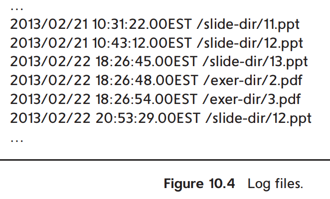
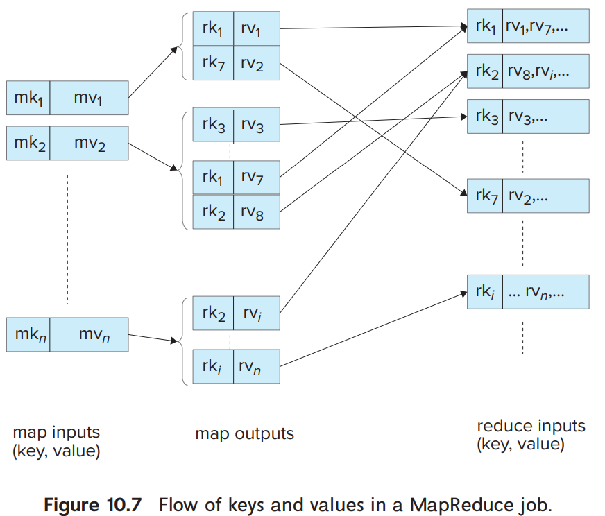
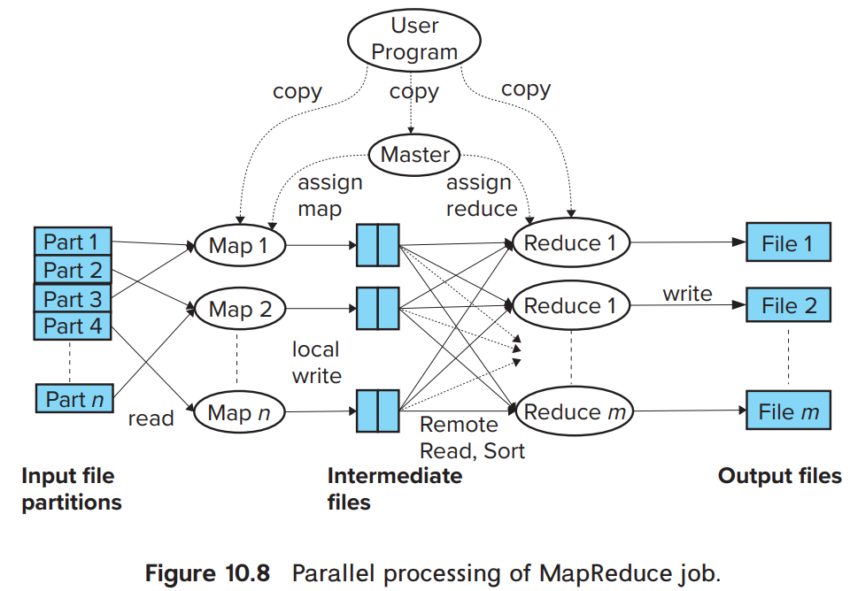

# 3. The MapReduce Paradigm

1. Why MapReduce?
2. MapReduce By Example 1: Word Count
3. MapReduce by Example 2: Log Processing
4. Parallel Processing of MapReduce Tasks
5. MapReduce in Hadoop
6. SQL on MapReduce

---

- parallel processing을 위한 programming model
- `map()` : 대용량 input record에 적용
- `reduce()` : `map()`의 결과를 aggregate

## 1. Why MapReduce?

### 예시 : _word count_ application

- input : text file (대용량)
- output : 각 단어의 등장 횟수
- file이 하나인 경우
    - file을 읽고, in-memory 자료구조에 데이터를 저장
    - 순서대로 텍스트를 탐색해서 각 단어의 등장 횟수를 count
- file이 1개 이상이면,
    - 수 MB의 데이터가 파일별로 저장되어있음
    - 순서대로 탐색하기에는 한계가 있음

#### solution 1. parallel programming

- 여러 machine에 걸쳐 parallel하게 수행하도록 코딩
- count 데이터는 각 machine에 저장된 후 마지막에 aggregate
- 문제점
    - 프로그래머가 각 job을 parallel하게 수행할 수 있도록 코딩해야함
    - 각 machine의 failure를 처리해야함
    - 구현 코드가 복잡해짐

#### solution 2. MapReduce system

- core logic은 개발자가 구현한 뒤
    - `map()`, `reduce()`
- 나머지 부분은 MapReduce system이 처리
    - MapReduce system이 `map()`, `reduce()`를 parallel하게 수행

## 2. MapReduce By Example 1: Word Count

- `map()` : 프로그래머가 구현
    - 각 record에 대해 수행
    - 각 record (line) 을 단어로 쪼개서 pair를 생성 (_word, count_)
    - **reduce key** : _word_
- `reduce()` : 프로그래머가 구현
    - `map()`의 결과를 aggregate
    - 0개 이상의 output을 생성

### 1. map()

````text
map(String record) {
    For each word in record
        emit(word, 1).
}

reduce(String key, List value list) {
  String word = key;
  int count = 0;
  For each value in value list
      count = count + value
  output(word, count)
}
````

````text
“One a penny, two a penny, hot cross buns.”

// map() 결과
(“one”, 1), (“a”, 1), (“penny”, 1),(“two”, 1), (“a”, 1), (“penny”, 1), (“hot”, 1), (“cross”, 1), (“buns”, 1)
````

- **reduce key** : `map()`의 결과에서 _word_

### 2. reduce

- `map()` 결과를 가지고, sorting을 수행
    - 동일한 reduce key를 가지는 pair들이 연속적으로 나타남
- (_key_, _value list_) pair를 `reduce()`에 전달
    - _key_ : reduce key
    - _value list_ : 동일한 reduce key를 가지는 pair들의 list

```text
// reduce()에 전달할 매개변수
(“a”, [1,1]), (“buns”, [1]) (“cross”, [1]), (“hot”, [1]), (“one”, [1]), (“penny”, [1,1]), (“two”, [1])

// reduce() 결과
(“one”, 1), (“a”, 2), (“penny”, 2), (“two”, 1), (“hot”, 1), (“cross”, 1), (“buns”, 1)
```

- `reduce()` 를 통해 output 생성 (_word, total-count_)

### 3. shuffle step (reduce() 수행 전)

- file 별로 생성된 `map()` 결과를 machine들에 걸쳐 shuffle
- single machine에 동일한 reduce key를 가지는 pair들이 모이도록 shuffle

## 3. MapReduce by Example 2: Log Processing



- website의 access log file 예시
- 2013/01/01 ~ 2013/01/31 에 slide-dir 경로의 파일을 각각 몇번씩 access 되었는지 count
- record : 각 log file의 1 line

### 1. map

```text
map(String record) {
  String attribute[3];
  break up record into tokens (based on space character), and
    store the tokens in array attributes
  
  String date = attribute[0];
  String time = attribute[1];
  String filename = attribute[2];
  if(date between 2013/01/01 and 2013/01/31
    and filename starts with “http://db-book.com/slide-dir”)
  emit(filename, 1).
}
```

- input을 field, date, time, filename으로 쪼갬
- 만약 탐색하려는 날짜에 부합하는 date라면, (_filename, 1_) pair를 생성

### 2. shuffle step -> reduce

- 특정 reduce key에 대한 value를 리스트로 모은 다음 reduce에 전달

```text
reduce(String key, List value list) {
  String filename = key;
  int count = 0;
  For each value in value list
  count = count + value
  output(filename, count)
}
```



## 4. Parallel Processing of MapReduce Tasks



- MapReduce system은 `map()`, `reduce()`를 parallel하게 수행
- master node가 `map()`, `reduce()` 코드를 복사해서 각 task에 전달
- Part<sub>i</sub> : input file의 i번째 partition
- Map<sub>i</sub> : map task
    - code를 실행하고 local machine에 씀
    - reduce key를 기준으로 sorting
    - 각 reduce task를 위한 독립적인 file들이 생성됨
    - network를 통해 reduce task에 fetch
- Reduce<sub>i</sub> : reduce task
    - fetch 한 file들을 merge & sort (같은 reduce key는 한 file에 모이도록)
    - `reduce()`를 수행하고 output file에 씀

### distributed file system

- MapReduce system의 input data가 single file system에 저장되어있으면 bottleneck이 될 수 있음
- 병렬 실행을 위해 distributed file system을 사용 e.g. HDFS
- Distributed file system
    - 파일을 여러 machine에 patitioning
    - replication 지원
- HDFS외에도 여러 Big Data storage를 지원
    - e.g. HBase, MongoDB, Cassandra, Amazon Dynamo

## 5. MapReduce in Hadoop

- Hadoop은 Java로 구현된 널리 사용되는 오픈소스 MapReduce system
- `map()`, `reduce()`의 input, output type이 모두 정해져야함
- Hadoop mapper, Reducer class를 상속받아 구현
- file을 record로 쪼갤 수 있음
    - e.g. `TextInputFormat` : file을 line 단위로 쪼갬
- HDFS와 같이 distributed file system을 input, output으로 사용 가능
- `combine()` : `map()`이 실행되는 node에서 `reduce()`를 수행
    - network를 통해 `reduce()`에 전달하는 데이터를 줄임

### 예시 Java 구현

````Java
public class WordCount {
    public static class Map extends Mapper<LongWritable, Text, Text, IntWritable> {
        private final static IntWritable one = new IntWritable(1);
        private Text word = new Text();
        
        public void map(LongWritable key, Text value, Context context) throws IOException, InterruptedException {
            // line을 읽어서 단어로 쪼갬
            String line = value.toString();
            StringTokenizer tokenizer = new StringTokenizer(line);
            while (tokenizer.hasMoreTokens()) {
                word.set(tokenizer.nextToken());
                
                // 단어를 key로, 1을 value로 emit
                context.write(word, one);
        }
    }
}

public static class Reduce extends Reducer<Text, IntWritable, Text, IntWritable> {
    public void reduce(Text key, Iterable<IntWritable> values, Context context) throws IOException, InterruptedException {
        int sum = 0;
        
        // 같은 key를 가지는 value들을 모두 더함
        for (IntWritable val : values) {
            sum += val.get();
        }
        
        // key, sum을 output
        context.write(key, new IntWritable(sum));
    }
}
    public static void main(String[] args) throws Exception {
        Configuration conf = new Configuration();
        
        Job job = new Job(conf, "wordcount");
        job.setOutputKeyClass(Text.class); // output key type 지정
        job.setOutputValueClass(IntWritable.class); // output value type 지정
        
        job.setMapperClass(Map.class); // Map class 지정
        job.setReducerClass(Reduce.class); // Reduce class 지정
        
        job.setInputFormatClass(TextInputFormat.class); // input format 지정
        job.setOutputFormatClass(TextOutputFormat.class); // output format 지정
        
        FileInputFormat.addInputPath(job, new Path(args[0]));
        FileOutputFormat.setOutputPath(job, new Path(args[1]));
        job.waitForCompletion(true);
    }
}

````

- `Mapper`, `Reducer` interface
    - Generic type을 통해 input, output type을 지정
    - `LongWritable` : input key type
    - `Text` : input value type
    - `Text` : output key type
    - `IntWritable` : output value type
- `map()`의 결과물은 MapReduce system 인프라가 list에 저장
    - 같은 reduce key를 가지는 pair들이 모이도록 shuffle
    - sorting
    - 여러 reduce task에 전달될 수 있음
    - distributed setting이면 network를 통해 전달

#### Combiner class

- `map()`의 결과를 aggregate (reduce 전에)
- map task에서만 실행
- `map()`의 결과가 single key-single value pair가 되도록 만듦
    - e.g. <_word_, 1>, <_word_, 1> -> <_word_, 2>
- 실행 후 `reduce()`에 전달
- network traffic을 줄임

## 6. SQL on MapReduce
