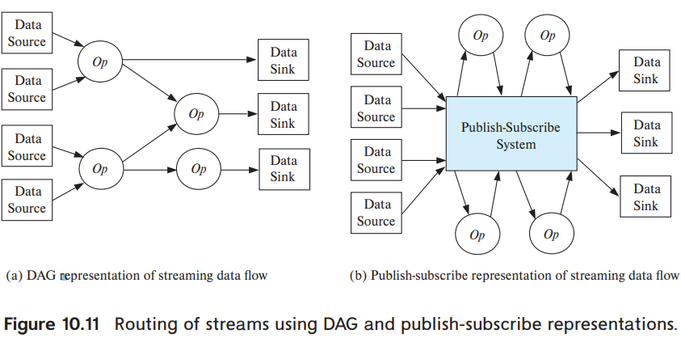

# 5. Streaming Data

1. Applications of Streaming Data
2. Querying Streaming Data
3. Algebraic Operations on Streams

---

- **streaming data** :  지속적인 데이터 흐름
- 많은 domain들이 application 에게 실시간으로 데이터를 가공(처리) 하기를 원함

## 1. Applications of Streaming Data

### streaming data를 사용하는 많은 domain들

- Stock market : trade (거래)
    - trade datra가 처리 system에 거래 흐름 (동향, stream)으로 들어감
    - stock market trader들은 trade data를 실시간으로 분석 후 거래 결정
    - 실시간에 준하는 속도 필요 (10 ms 이내)
- E-commerce : purchase (구매)
    - 거래 sequence가 stream을 이룸
    - 거래가 아닌 단순 click도 stream을 이룸
    - streaming data는 여러 방면에서 분석되어 사용됨
- Sensors : 주기적으로 data를 보내는 sensor들
    - sensor data는 stream을 이룸
    - vehicle, building, factory 등에서 사용됨
- Network data : network traffic에서 발생하는 데이터
    - network 문제를 탐지할 때 사용 (malware, Dos 등)
- Social media : message
    - e.g. Facebook, Twitter
    - continuous stream of messages
    - 각 메시지는 적절히 라우팅 되어야함
        - e.g. 친구에게, 모두에게

## 2. Querying Streaming Data

- **data-at-rest** : DB에 저장된 데이터
- streaming-data의 끝은 없음, unbounded
    - stream의 모든 데이터를 질의해도 최종 결과를 반환하지 않음
- stream의 **window** : 특정 범위 (시간, 숫자)에 해당하는 tuple을 담아둠
    - stream data에 질의 시 window를 사용

#### 쿼리 방법 (TODO. book)

1. Continuous query : relation data에 대한 삽입으로 간주
    - SQL 쿼리를 지속적으로 실행
    - 특정 DB의 insert 로그를 볼때 유용
    - 집계데이터를 보여주는 applicatoin에 비적합
2. Stream query languages : SQL을 확장해서 사용
    - relation data와 다르게 취급
    - window를 사용
    - e.g. 정시마다 tuple 생산
3. Algebraic operators : 사용자가 정의한 function을 허용
    - tuple이 input에서 operator에게 전달 -> operator 결과가 다른 operator에게 전달 (system, DB 등)
    - **가장 많이 사용되는 방법**
4. Pattern matching : pattern matching language를 정의해서 사용자에게 제공
    - system이 pattern에 맞는 tuple을 발견하면 그에 맞는 action을 함
    - **complex event processing (CEP)**
    - e.g. Oracle Event Processing, Microsoft StreamInsight, FlinkCEPl

#### lamda architecture

- streaming porcess 시스템은 일반적으로
    - memory에 데이터를 저장하고, 영구 저장을 보장하지 않음
    - delay를 최소화하고 빠르게 응답하는 것이 목적
- 빠르게 응답하고 싶고, 영구 저장을 보장하고 싶을 때
- streaming data를 복사해서 stream-proessing system에 전달,
- 또다른 복사본을 database storage에 전달
- 문제점
    - 쿼리가 2번 수행되어야함 (streaming system, database system)ㅣ
    - 저장된 데이터에 대한 streaming query가 적절치 않을 수 있음

### 1. Stream Extensions to SQL

- Tumbling window : 특정 시간 간격으로 window를 생성
    - e.g. 1시간마다 window 생성
    - window는 겹치지않고 인접하게 됨
    - window 사이즈 지정 가능 (e.g. 1시간, 1일, 1분 등)
- Hopping window : window를 n분마다 연산
- Sliding window : 각 tuple마다 특정 사이즈 window를 생성
    - SQL 표준에서 지원
- Session window : 여러 작업을 session으로 쪼갬
    - user, time-out interval, operation sequence를 지정
    - e.g. time-out : 5min, operation을 10AM -> 10:04 AM -> 11AM일 때,
        - 각 시간마다 다른 session 생성
    - duration이 종료되면 session window 닫음

#### window 예시

- relation _order(orderid, datetime, itemid, amount)_ 일 때
- Azure Stream Analytics 는 다음과 같이 tumbling window를 지원

```SQL
select item, System.Timestamp as window_end, sum(amount)
from order timestamp by datetime
group by itemid, tumblingwindow(hour, 1)
```

- 각 결과 tuple은 window의 마지막 timestamp를 가짐

### join

- stream과 realtion간의 join 허용, 결과는 stream
    - 결과 timestamp는 input stream의 timestamp와 동일
- stream간의 join은 문제 발생
    - join 조건에 맞는 stream이 훨씬 나중의 stream에 있을 수 있음
    - 따라서 tuple간의 시간차이에 제한을 두는 join 조건만 허용
        - e.g. tupel간의 timestamp 차이가 최대 1시간 이내

## 3. Algebraic Operations on Streams

- SQL은 streaming data에 적합하지 않음
- 사전에 정의된 algebraic operation들을 활용
    - e.g. selection, windowed aggregation
- incoming tuple이 operator에게 라우팅되어야함
    - operator는 consume후 consumer에게 전달
- fault-tolerant routing을 제공해야함
- _Apache Storm, Kafka_ 가 많이 사용됨

#### directed acyclic graph (DAG), publish-subscribe



- DAG : directed acyclic graph
    - operator를 node로 간주
    - node간의 edge는 tuple의 흐름을 나타냄
    - data-sink node : tuple을 저장소에 저장하거나 다른 곳에 전달 (streaming systme의 종착지)
    - Apache storm
        - _topology_ : 그래프 config 파일
        - _spout_ : stream의 source
        - _bolt_ : operator
- **publish-subscribe** system (**pub-sub** system)
    - topic으로 특정 data 발행 (publish)
    - subscriber는 topic을 구독 (subscribe)
    - 각 tuple은 topic을 tagging
    - tuple은 topic별로 저장됨
    - 장점 : operator를 쉽게 추가/제거 가능
    - Apache kafka는 pub-sub system
        - tuple을 특정 기간동안 보관 (subscriber가 없어도)
        - consumer가 faile이 일어나도 보관기간 안에서 재시도가 가능


