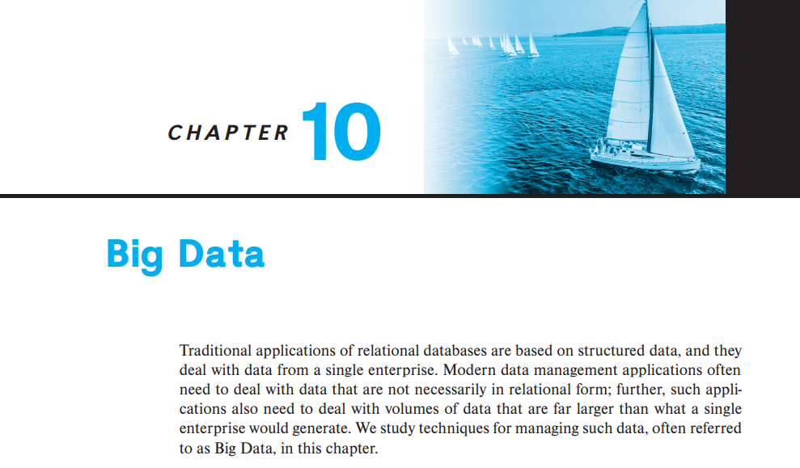

# CHAPTER 10. Big Data

- 전통적인 application의 관계형 DB는 structured data 기반
- 현대 application은 관계형 구조에 딱맞는 데이터만 다루지 않음
- 한 enterprise가 생산하는 데이터만을 다루지 않음
- 즉, BigData
- BigData를 다루는 방법

---

1. [Motivation](1_Motivation/README.md)
2. [Big Data Storage Systems](2_Big_Data_Storage_Systems/README.md)
3. [The MapReduce Paradigm](3_The_MapReduce_Paradigm/README.md)
4. [Beyond MapReduce: Algebraic Operations](4_Beyond_MapReduce_Algebraic_Operations/README.md)
5. Steaming Data
6. Graph DataBases
7. Summary
