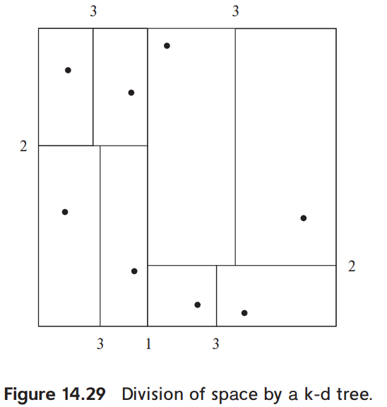

# 10. Indexing of Spatial and Temporal Data

1. Indexing of Spatial Data
2. Indexing Temporal Data

---

- B+-Tree index, hash index는 1차원 데이터에 적합
- Spatial data (2차원 이상), Temporal Data (시계열)는 다른 방식의 index 필요
    - tupl이 시간 간격이랑 연관된 경우 등

## 1. Indexing of Spatial Data (2차원 이상)

### Spatial Data?

- Spatial Data : 2차원 이상 공간에 대한 참조를 하는 데이터
- e.g. 레스토랑의 위/경도 쌍, 한 나라의 공간 범위 (위/경도 쌍으로 이루어진 다각형)

### B+-Tree index의 한계

- query 성능 낮음
- B+-Tree index : (위, 경도) 쌍의 복합 인덱스 새엉
- **range query** 에 비효율
    - e.g. 사용자 위, 경도의 500 미터 이내의 모든 레스토랑?
- **rectangular range query** : 위, 경도의 사각형 범위 내의 모든 레스토랑?
    - e.g. 한 나라의 공간 범위 내의 모든 레스토랑?
- **nearest neighbor** 에 비효율
    - e.g. 사용자 위, 경도에서 가장 가까운 레스토링?

### 1차원 데이터를 이진트리 (B+-Tree)로 표현

- 연속적으로 공간을 나누는 방식으로 동작
    1. 나눔
    2. 왼쪽은 왼쪽 서브트리, 오른쪽은 오른쪽 서브트리 접근
    3. 반복

### k-d tree

- 초기에 다차원 데이터를 indexing 하는 구조
- partitioning : 각 level이 공간을 둘로 나눔
    - level 이 높아지면서 공간을 둘로 나눔
- partitioning 1번마다 대략 반의 데이터 (point) 가 나뉘어짐
    - 각 node에 저장된 point 수가 최대 point 수보다 적어지면 partitioning 중단
- 위 표에서
    - leaf node 별 최대 point 수 : 1
    - 숫자는 k-d tree의 level을 나타냄
- Rectangular range queries, Nearest neighbor queries 에 효율적

#### 동작 : Rectangular range queries

- _x_ 차원이 50 ~ 80 and _y_ 차원이 40 ~ 70인 모든 point?
- 다음 탐색을 반복해서 수행

1. root에서 시작
2. _x_ 차원에서 분할되었고, point _xi_ 에서 paritioning 되었다고 가정
    - 왼쪽 서브트리 : _xi_ 보다 작은 _x_ 차원의 point
    - 오른쪽 서브트리 : _xi_ 보다 같거나 큰 _x_ 차원의 point
    - _x_ 가 50 ~ 80 에 속하는 범위를 가진 서브트리로 재귀 탐색
3. leaf node에 도달하면 검색 종료

#### k-d-B tree

- k-d tree 확장
- 각 내부 노드가 2개 이상의 child node를 가지도록 함
    - B-tree 가 binary tree 확장한 것처럼
    - tree의 height를 줄이기 위함
- 2차 저장소에 저장 시 k-d tree 보다 효율적
- 다른 대체 : quadtree
    - 각 node에서 2차원 공간을 4개로 나눔

### R-tree : 다각형 범위를 가진 데이터를 indexing 하는 구조

- k-d tree는 2차원까지만 효율적
- R-tree : B+-tree 같이 leaf node에 index된 객체를 저장하는 균형 트리
- **bounding box** : 각 노드는 범위와 연결되지 않고, bounding box로 연결됨
- leaf node : leaf node에 속하는 모든 객체를 포함하는 bounding box
    - index된 객체 저장
- 내부 노드 : 자식 노드의 bounding box를 포함하는 bounding box
    - 자식 노드의 포인터 저장
- 실선 : 사각형 집합 element
- 점선 : bounding box

## 2. Indexing Temporal Data (시계열)

