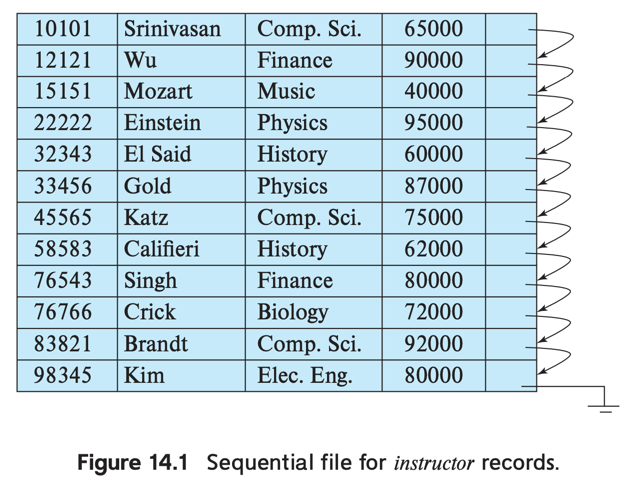
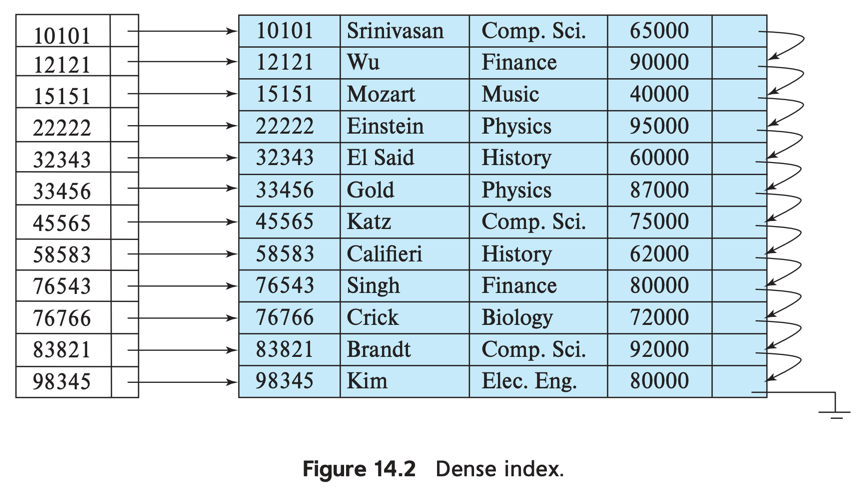
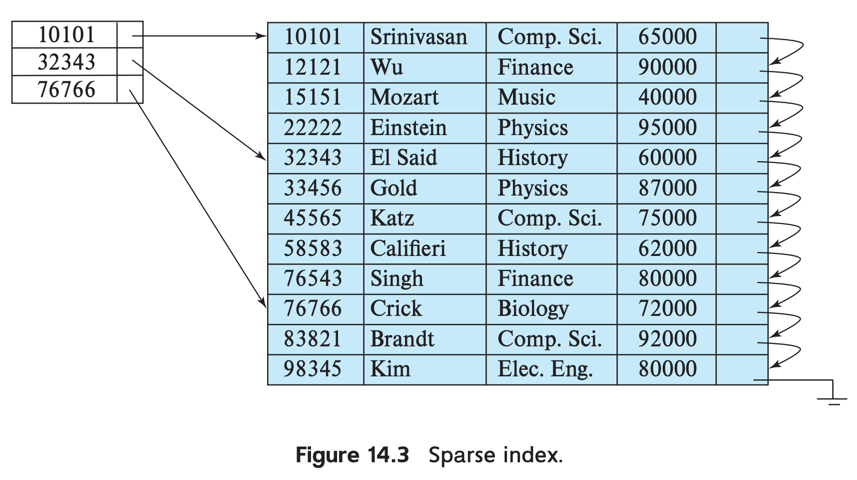
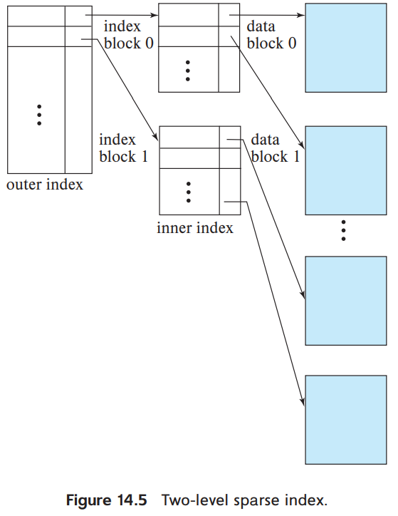

# 2. Ordered Indices

1. Dense and Sparse Indices
2. Multilevel Indexing
3. Index Update
4. Secondary Indices
5. Indices on Multiple Keys

--- 

- index에 search key를 정렬된 상태로 유지
- search key는 record와 대응
- file은 1개 이상의 index를 가질 수 있음

| 특징              | clustering index               | nonclustering index                 |
|-----------------|--------------------------------|-------------------------------------|
| file의 데이터 저장 순서 | search key와 같음                 | search key와 다름                      |
| 동의어             | primary index, clustered index | secondary index, nonclustered index |
| search key      | primary key일 수도 있음             | -                                   |

- **index-sequential file** : 모든 파일이 특정 search key에 의해 정렬됨
- 위 그림은 _instructor ID_ search key로 정렬되어있는 index-sequential file

## 1 Dense and Sparse Indices

- **index entry** (**index record**)는 search key와 pointer로 구성
- pointer : 연관된 1개 이상의 record를 가리킴
    - disk block의 식별자 + offset

- **Dense index** : search key와 1:1
    - search key + pointer (해당하는 첫번째 record를 가리킴)
    - dense clustering index : 모든 record에 대해 index entry가 존재
        - record 순서와 index 순서가 같음
    - dense nonclustering index : 동일한 search key를 가진 record에 대한 pointer list를 가짐
        - 하나의 search key에 대해 여러 개의 index entry가 존재
- **Sparse index** : 일부 search key에 대해 index entry가 존재
    - search key + pointer (해당하는 첫번째 record를 가리킴)
    - clustering index여야 함
    - 찾으려는 search key보다 작거나 같은 값을 가진 것 중 가장 큰 index entry를 찾아 탐색

- nonclustering index && search key != primary key
    - index entry의 pointer가 해당 조건의 첫번쨰 record를 가리킴
    - 해당 record 부터 search key와 다른 값이 나올때 까지 순차 탐색

### dense index vs sparse index

- dense index가 더 빠르지만, 더 많은 공간을 차지함
- sparse index의 insertion, deleteion overhead가 더 작음
- trade-off : access time, space overhead를 고려
    - 보통 blcok마다 sparse index를 가지도록 설계
    - disk의 block을 main memory로 가져오는 시간이 database reuqest의 대부분
    - sparse index를 사용하여, 원하는 record를 가진 block을 찾아 가져옴

## 2 Multilevel Indexing

  

- dense index는 원본 relation의 크기에 비례하여 커짐
    - e.g. 1,000,,000 tuples = 100 index entry (임의), 10,000 blocks
- index가 작을수록 search time은 줄어듦
    - index가 크면 disk에 저장됨
    - index가 크면 index block을 fetch 하는 추가 시간 필요
- Binary search는 비용이 큼 (random access 포함)
    - e.g. index가 _b_ blocks 을 차지할 때 _log2b_

### sparse outer index

- original index에 대한 sparse outer index 생성
    - original index = inner indexS
- 동작 예시
    1. outer index 에서 binary search 진행 (pointer가 inner index block을 가리킴)
    2. search key를 기준으로 같거나 작은 value 중 가장 큰 value를 가진 inner index block을 찾음
    3. value 찾음
- **multilevel indecies** : 2개 이상 level을 가진 index

## 3 Index Update

- 모든 index는 record가 생성/삭제 될 때 수정되어야 함
- update 될 떄
    - instructor realtion의 department가 변경되면, _dept_name_ index도 변경
- 명시적으로 update하지 않아도 됨

### 3.1 Insertion

- INSERT된 record에 나타난 search-key 를 사용해서 index 조회
    - e.g. _instructor_ 에 _ID_ 가 101인 record가 추가되면, _ID_ 가 101인 index entry를 탐색
- dense, sparse idnex에 따라 다름
- Dense indices
    - search-key 가 index에 없으면, index entry에 search key와 추가
    - search-key 가 index에 있으면,
        - index entry가 모든 record에 대한 pointer를 저장하는 경우, index entry에 새로운 record pointer 추가
        - search-key에 대한 첫번째 record pointer만 있으면, 적절한 위치(정렬)에 record를 삽입
- Sparse indices
    - 새로운 block을 생성하는 경우, 새 block의 첫번째 search key값을 index에 삽입
    - 해당 block의 가장 작은 search-key를 가지는 경우 해당 block에 대한 index entry 수정
    - 모두 아니면, index 변경 없음

### 3.2 Deletion

- 삭제할 record를 찾음
- Dense indices
    - search-key에 대한 record가 하나라면 index entry 제거
    - search-key의 record가 여러개라면
        - 모든 record에 대한 pointer를 저장 중이면, pointer에서 제거
        - search-key에 대한 첫번째 record pointer만 있으면, 삭제된 record를 가리키고 있으면 pointer 수정 (다음 record를 가리키도록)
- Sparse indices
    - search-key에 대한 index 가 없으면 index 변경 없음
    - search-key에 대한 index 가 있으면
        - 삭제된 record가 search-key에 대한 유일한 record이면, 삭제 후 index record 재정렬
        - 같은 search-key에 대한 다른 record가 존재하면, 해당 record를 가리키도록 수정

## 4 Secondary Indices

- Dense index, 모든 record에 대한 pointer를 가짐
- candidate key + secondary index = dense clustering index
- file 수정 시 **모든** index 수정 필요

### 모든 record에 대한 pointer를 가지는 이유

- not cadidate key + secondary index
    - **첫 record pointer만 가지는 거로 부족함** (file에 순차적으로 저장이 안되어있음)
- not candidate key + clustering index
    - search key value는 첫번째 row pointer만 가지면 됨 (다음 record는 순차적으로 탐색하면 됨)

### nonunique search key 구현

- 각 pointer가 file을 가리키는 pointer가 담긴 bucket을 가리킴
- 단점
    - index access가 느림 (level이 늘어남)
    - search key value에 대한 중복이 적을수록 공간 낭비가 늘어남

### 다른 index와 비교

- clustering index보다 query 성능이 우월
- 수정이 있을떄 발생하는 overhead 단점
- 수정, 쿼리 빈도에 따라 결정

## 5 Indices on Multiple Keys

- **composite search key** : 2개 이상의 필드로 구성된 search key
    - e.g. _takes_ 에서 (_course_id, semester, year_)로 조회
    - (a1, a2) < (b1, b2)라면,
        - (a1 < b1) or (a1 = b1)
        - and (a2 < b2)
