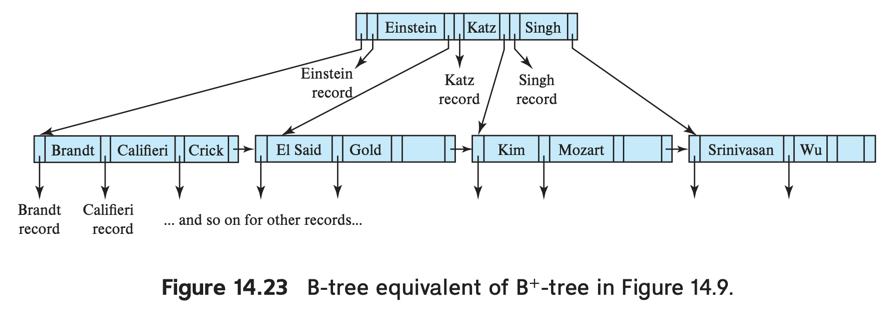
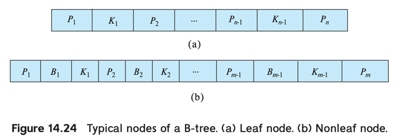

# 4. B+ Tree Index Extensions

1. B+-Tree File Organization
2. Secondary Indices and Record Relocation
3. Indexing Strings
4. Bulk Loading of B+-Trees Indices
5. B-Tree Index Files
6. Indexing on Flash Storage
7. Indexing in Main Memory

--- 

## 1. B+-Tree File Organization

- index-sequentioal file의 degradation 문제 : file이 커지면, index의 크기가 커져, overflow block 발생
- overflow block을 해결하기 위해, B+-tree를 사용
- **B+-Tree File Organization** : B+-tree index 말고, 실제 file 구조도 B+-tree 구조로 구성 가능
    - leaf node에 실제 rocord 저장 (record pointer 저장 X)
    - half full

### insertion, deletion

- B+-tree index와 동일
- key value _v_ record insert 시
    - _v_ 보다 같거나 작은 key value를 가진 leaf node 중 가장 큰 node의 block에 insert
    - 공간이 충분하면 insert, 아니면 split
- delete 시
    - record를 가진 block을 제거
    - block _B_가 half full이 안되면, redistribution

### 공간 효율성을 유지하는 방법

- record를 저장하는 것은 pointer, key에 비해 많은 공간을 차지
- insertion, deletion
    - node가 차있으면, 이웃과 redistribution
    - 이웃 node도 차있으면, split
    - node의 적재량을 2n/3 유지 (n = node의 최대 적재량)

### 대용량 데이터 저장 e.g. clobk, blob

- disk block보다 큰 데이터를 저장 가능 (거의 수 gigabyte)
- 더 작은 reocrd로 순서대로 쪼개어 B+-tree에 저장
- record number : 쪼개진 reocord에 순서대로 체번, key로 활용

## 2. Secondary Indices and Record Relocation

- leaf node의 분할은 수십~수백개의 I/O operation 발생 가능
- split 후 레코드를 가리키는 보조 index (= leaf node) 들이 update 되어야함
    - record의 value 변경이 아닌, record의 위치 변경으로 인해
- 해결 방법
    - 보조 index 에 pointer 대신, primary index search key value를 저장
        - e.g. _dept_name_ 보조 index에 _ID_ 의 key value 목록을 저장
    - split으로 인한 relocation 필요 없음 (pointer가 아니기 때문)
    - access 비용이 높아짐
        - 보조 index -> primary index -> record (primary index를 거쳐야함)

## 3. Indexing Strings

- 문자열 attribute에 B+-tree index 문제점
    - 크기 가변
    - 길이가 크면, 적은 fanout, 높은 height을 초래
- node마다 fanout이 다를 수 있음
- fanout을 증가시키는 방법 : prefix compression
    - 전체 serach key value를 저장하지 않고, prefix만 저장
    - prefix만으로 key value를 구분할 수 있어야함
    - e.g. _student_name_ 의 경우, "Minzi" 대신 "Minz" 저장, "Karina" 대신 "Kari" 저장

## 4. Bulk Loading of B+-Trees Indices

- main memory보다 큰 relation에 대한 index, nonclustered index
- leaf node는 db buffer에 없을 가능성이 큼
    - insertion 작업마다 block을 disk에서 읽어와야함
    - e.g. 1억개 record를 가지고, I/O 작업이 10ms 걸릴 떄, index 생성 시 최소 100만초 소요
- **bulk loading** of index : index에 대량의 entry를 한번에 insertion

### bulk loading을 효과적으로 하는 방법

1. 임시 파일 생성 : relation의 index entry 포함
2. search key 기준으로 sorting
    - sorting하는 이유
        - insertion 시, leaf node에 sequential하게 insert 가능
        - 각 leaf node 마다 1번의 I/O operation만 필요
        - e.g. index build 시 1,000,00 sec -> 1,000 sec 로 줄일 수 있음
3. 임시 파일을 읽어 index에 entry insertion

### bottom-up B+-tree construction : leaf level에서 부터 index를 생성

- 비어있는 B+-tree에 insertion 작업에 효과적
- 임시 파일을 읽어, 정렬한 뒤 block 사이즈에 맞게 block에 저장

### 실제 DBMS에서의 bulk loading

- bottom-up 구조, entry 정렬을 위한 기술이 구현되어 있음
- 몇 DB는 큰 숫자의 tuple이 insertion 될 때,
    - realtion의 index를 drop 하고, insert 뒤 다시 생성

## 5. B-Tree Index Files

|                        |               B+-tree               |                            B-tree                            |
|:----------------------:|:-----------------------------------:|:------------------------------------------------------------:|
| search key value 저장 위치 |      leaf node, unleaf node 중복      |                       전체 tree에 걸쳐 한번만                        |
|     전체 tree node 수     |              상대적으로 많음               |                           상대적으로 적음                           |
|         access         |          root -> leaf node          | 특정 Serach key value에 한해서만 성능이 우수  leaf node에 도달 전 완료가 가능 |
|  deletion, insertion   | 상대적으로 간단        leaf node에서만 삭제 |                           상대적으로 복잡                           |
|       insertion        |              상대적으로 간단               |                           상대적으로 복잡                           |
|         실제 구현          |  대부분의 DBMS에서 B-tree는 이 B+-tree를 의미  |                           거의 사용 안함                           |

- B+-tree index의 변형
- search key가 unique라면, 전체 tree에 걸쳐 한번만 저장
- search key의 pointer를 강제로 가져야함
    - pointer는 실제 record나 search key와 관련된 bucket을 가리킴
- 많은 DB에서 B-tree는 B+-tree를 의미
    - 정의는 서로 다르나, 실제 DB 구현에서는 B-tree는 B+-tree를 의미 (동의어)

### tree 구조

- leaf node는 B+-tree와 동일
    - _n -1_ 개의 serach key value
- unleaf node
    - _Pi_ : B+-tree의 _i_ 번째 leaf node를 가리키는 pointer
    - _Bi_ : bucket, file-record pointer
    - _m -1_ 개의 serach key value

### access

- access 성능은 탐색하려는 search key value의 위치에 따라 달라짐
- leaf node 도달하지 않아도 완료 가능
- 특정 Serach key value에 한해서만 성능이 우수
    - 나머지는 B+-tree보다 느림

### deletion, insertion

- Deletion : B+-tree보다 복잡
    - B+-tree는 leaf node에서만 Deletion이 일어남
    - subtree로 부터 대체할 적절한 entry를 찾아야함
        - _Ki_ 가 삭제되면, _Pi+1_ 의 subtree에서 가장 작은 serach key value를 찾아 _Ki_ 로 대체
        - leaf node에 underfull 발생 시 추가 조치 필요
- Insertion : B+-tree보다 복잡

## 6. Indexing on Flash Storage

- flash storage (e.g. SSD) 비용이 저렴해지고 있음
- 표준 B+-tree는 SSD에도 적용 가능 (magnetic disk보다 성능 우수)

### lookup

- SSD는 더 빠른 random I/O operation 제공
    - SSD는 page 구조
    - 20 ~ 100 μs 의 random pate read (magnetic disk는 5 ~ 10 ms)

### write

- magnetic disk 보다 복잡
- 모든 update에 전체 flash-storage page의 copy + write가 필요
    - 20 ~ 100 ms

### 최적화

- node size 는 magnetic disk 보다 작아야함
    - flash page 가 disk block보다 작기 떄문
- bulk loading 은 효율적
- bottom-up B+-tree construction 은 효율적
    - page wirte 수를 줄임
- page rewrite 수를 줄이는 방법
    - 방법 1 : buffer를 추가하여 update 시 buffer에 기록 후 lazy하게 write
        - 다른 update 작업들과 함께 반영되어 전체 page rewirte 수를 줄임
    - 방법 2 : tree를 여러개 생성, merge

## 7. Indexing in Main Memory

- main memory 는 더 커지고 비용이 저렴해짐
- B+-tree를 in-memory data로 구현 가능

### 최적화

- 공간 효율을 높여야함
- 상대적으로 height이 높을 수 있음 (disk 기반 B+-tree에 비해)

### cache memory

- _cache-line_ 을 통해 cache memory에서 main memory로 전송 (일반적으로 64 bytes)
- CPU에 cache 되어있다면 1 ~ 2 ns 소요
- caching 안되어있으면 50 ~ 100 ns 소요 (cache miss)
- _cache-line_ 에 딱 맞는 node를 제공하면 성능 우수
    - node가 크면, lookup 시 여러 _cache-line_ 에 걸쳐 이진 탐색 수행, cache miss 발생 가능성 높음

### in-memory지만, 메모리보다 큰 데이터

- 큰 node 는 disk-based access
- node 내부 데이터를 하나의 큰 key 배열로 다루지 않고,
    - 작은 node로 구조화 (node 데이터 크기를 _cache-line_ 에 맞춤)
- node 내 데이터를 선형, 이진 탐색하지 않고, 최소한의 cache miss들을 감수하며 tree를 탐색 