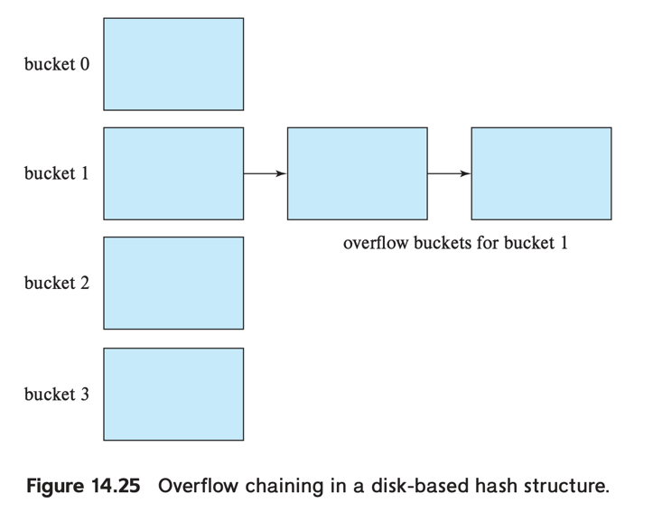

# 5. Hash Indices

### Hashing

- main memory에 index를 만드는데 사용되는 기법
- join 연산을 위해 임시로 생성되는 index에 많이 사용됨
- record를 file에 구성할 때에도 사용됨 (hash file 구성은 거의사용 안됨)
- in-memory hash indices, disk-based hash indices로 구분됨

### bucket

- 1개 이상의 record를 저장할 수 있는 storage 단위
- in-memory hash index에서 bucket은 disk block의 linked list로 구현됨
- hash file oraganization에서는 record pointer 대신 bucket에 실제 record 저장

### 구조

- _K_ : serach-key value 집합
- _B_ : 모든 bucket 주소 집합
- _h_ : hash function
    - _h_ : _K_ -> _B_
- in-memory hash index에서는 _B_ 는 단순 pointer 배열
    - _i_ 번째 bucket은 offset _i_ 에 저장
    - 각 pointer는 bucket linked list의 head를 가리킴

### Insertion

- _Ki_ 를 insert 할 떄,
    - _h(Ki)_ 를 계산해서 record의 bucket을 결정
    - offset _i_ 에 index entry를 저장

### Overflow chaining (closed addressing, closed hashing)

- 2개 이상의 record를 하나의 bucket에 저장하는 쓰이는 방법
- 다른 hashing 방법으로 open addressing이 있으나 잘 쓰이지 ㅇ낳음
    - deleteion 성능이 좋지 않음

### lookup

- search key에 대한 동등한 query 성능 지원
- _Ki_ 를 찾기 위해 _h(Ki)_ 를 계산하고, _B_ 에서 bucket을 찾음
    - e.g. _K5_, _K7_ 의 hash value가 같을 때
        - _h(K5) = h(K7) = 3_
        - loolup _K5_ 을 하면, bucket에 _K5_, _K7_ 가 저장되어 있음
        - 그 중에서 search-key value가 _K5_ 인 record를 찾아야 함
- range query 지원 안함

### Deletion

- _Ki_ 를 delete 할 때,
    - _h(Ki)_ 를 계산해서 record의 bucket을 결정
    - bucket에서 해당 record를 찾아서 삭제

## Disk-based hash index

### insertion

- hashing을 사용해 bucket을 결정
    - bucket에 공간이 있으면, bucket에 record wjwkd
    - bucket에 공간이 부족하면, **bucket overflow** 발생

### bucket overflow

- bucket _b_ 에 반드시 insert 되어야한다면, **overflow bucket** 을 제공해서 여기에 isnert
    - overflow bucket은 linked list로 연결
    - lookup 시 _k_ 의 bucket을 찾고, overflow bucket을 순차적으로 탐색
- record 수보다 bucket 수가 모자랄 경우
- 한 bucket이 다른 bucket 보다 많은 record를 할당 받을 경우
- **skew** : bucket이 고르게 분포되지 않을 경우
    - 2개 이상의 record가 같은 search key를 가질 경우
    - hash 결과가 균일하게 분포하지 못할 경우

#### 해결방안

- bucket 수를 _(nr/fr) * (1+d)_ 으로 설정
    - _nr_ : record 수
    - _fr_ : bucket 당 record 수
    - _d_ : fundge facotr, 일반적으로 0.2
    - _d_ 가 0.2일 때 bucket의 20 % 가 empty

---

### static hashing

- index 생성 시 bucket 수를 고정
- 문제점 : 저장될 record 규모를 미리 파악해야함
    - isnertion이 들어올 수록 bucket 대비 record가 많아지게됨
    - bucket 하나에 record가 많아지거나 overflow bucket이 많아짐 (성능저하)

#### 해결방안

- bucket 수를 증가시키기위해 index를 재구성
- e.g. bucket의 2배만큼 record가 쌓여있으면 index를 재구성
- 문제점 : index 재구성 시간이 relation 크기에 비례
- **dynamic hashing** : bucket 수를 동적으로 증가시키는 방법
    - e.g. _linear hashing, extendible hashing_