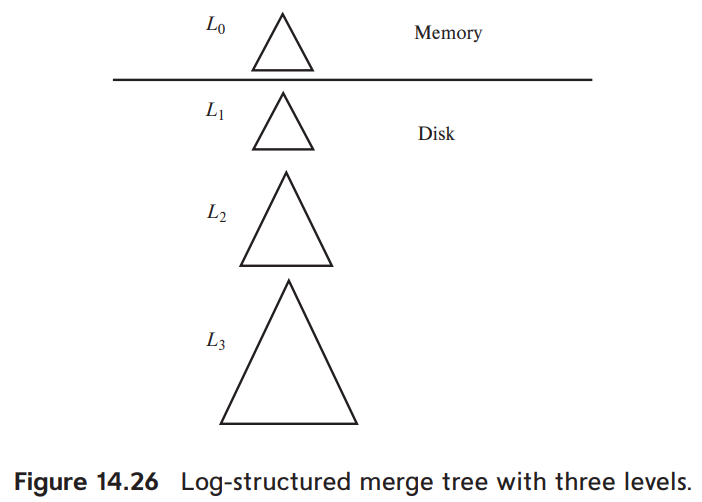
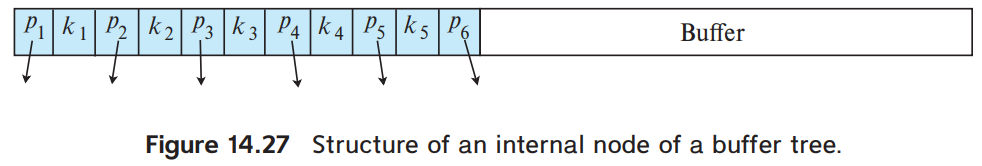

# 8.Write-Optimized Index Structures

1. LSM Trees
2. Buffer Tree

---

### 거대한 B+-Tree의 쓰기 성능은 떨어짐

- B+-Tree는 read-optimized index structure
    - random wirte 성능 떨어짐
- leaf level의 저장 공간이 클 때, index 순서와 무관한 쓰기가 일어나면,
    - 각 write/insert 마다 다른 leaf node에 접근
    - buffer size보다 leaf node 가 크면,
        - random read operation 발생
- 높은 wirte/insert 비율의 경우, **log-structured merge tree** (LSM Tree)

## 1. LSM Trees

### 구조

- 하나의 LSM Tree는 _n_ 개의 B+-Tree로 구성
- _L0_ : in-memory B+-Tree (시작점)
- _L1, L2, ..., Lk_ : on-disk B+-Tree
    - _k_ : LSM Tree의 레벨

### Insertion

- insert 시 제일 먼저 in-memory B+-Tree에 insert
- in-memory treee가 차면 data를 disk tree로 이동
    - _L1_ 비었으면, _L1_ 초기화, 전체 _L0_ 복사
    - _L1_ 안비었으면, leaf level 탐색해서 맞는 부분에 merge
        - bottom-up 방식으로 merge
        - 새롭게 생성된 _L1_ 은 기존의 _L1_ 을 대체
    - 이동이 완료되면, _L0_ 을 비움
- 기존 _L1_ 을 수정하는 대신, 새로운 트리로 복사해서 생성하는 이유
    - 새로운 트리의 leaf node는 순차적으로 저장되어있어 다음 병합 시 random I/O 발생 안함
    - leaf가 가득 찰 시 페이지 단위의 분할로 인해 부분만 채워지는 경우를 방지

### stepped-merge index : cost를 줄이기 위한 변형 index

1. multiple level
    - _Li+1_ 의 tree의 사이즈는 최대 _Li_ 의 _k_ 배
    - 각 record는 각 레벨에서 _k_ 배 쓰여질 수 있음
2. _L0_ 을 제외한 레벨마다 최대 _b_ 개의 트리를 가지게 함
    - _L0_ 가 disk에 기록될 때, _L1_ 의 트리가 이미 존재해도, _L1_ 의 트리를 새로 생성
    - _Li_ 의 트리가 _b_ 개면, 새로운 _Li+1_ 로 병합됨

- level 마다 1개의 tree를 가지는 것보다 insert 비용이 저렴
- query 비용은 올라감 : level 별 tree가 많아짐
    - _Bloom filters_ 로 query 비용을 줄일 수 있음

#### Google's Bigtable, Apache HBase

- LSM Tree의 변형을 사용
- 분산 파일 시스템에 구축 (기존 file을 수정하지 않고, append)
- 외에도 Apache AsterixDB, Apache Cassandra, MongoDB 등이 LSM Teee 지원
    - 대부분 각 level마다 multiple tree를 가지는 식으로 구현
    - MySQL, SQLite4, LevelDB 도 지원

### Deletion

- **deletion entry**를 insert함
    - deletion entry : 삭제될 index entry를 가리킴

### Lookup

- 모든 tree를 retrieve하고, 결과를 key 순서대로 merge

1. lookup
    - deletion entry가 있으면 거기엔 deletion entry, original entry 둘다 찾아짐
    - original entry은 정제해서 result에 포함시키지 않음
2. merge
    - deletion entry와 매치되는 entry 모두 제거
    - 매치 기준 : deletion entry의 search key가 동일한 entry

### Update

- delete와 비슷하게 동작, update entry를 insert
- lookup 시 entry 중 가장 최신 value를 가진 entry를 찾아서 반환
- merge 중 최신 entry를 제외한 나머지 entry를 제거

### LSD tree와 SSD

- LSD tree는 magnetick disk의 write 성능을 높이기 위한 것
- Flash 기반의 SSD는 random I/O 에 대한 overhead가 적음
- SSD는 in-place update 말고, 전체 page를 다시 씀
    - LSM을 사용하여 write 수를 줄이는 것이 부차적인 성능 향상을 줌

## 2. Buffer Tree

- LSM 의 대안
- B+-Tree의 내부 node마다 buffer를 연결

### Insertion

- leaf를 탐색하지 않고, root의 buffer에 insert
- root buffer가 가득 차면, 각 index record를 child node로 push down
    - child node에 push down
    - child node가 internal node이면 child node buffer에 insert
    - buffer가 가득차면 다시 push down
    - child node가 leaf node이면 leaf node 에 insert
        - insert 결과 leaf node에 overfull 발생 시 split
- buffer의 모든 record의 serach key는 push down 전 정렬

### Lookup

- B+-Tree의 lookup과 동일
- record를 가진 leaf node를 search key 기준으로 탐색
- 추가 작업
    - internal node 탐색 시에 search key와 매치되는 record가 있는지 검사
    - range lookup도 마찬가지

### Deletion, Update

- LSM tree와 비슷하나
    - deletion entry, update entry를 insert하는 대신
    - 일반적인 B+-Tree의 deletion, update를 수행

### 이점, LSM tree와 비교

- Buffer tree는 I/O Operation에 대한 LSM 대비 더 나은 최악 복잡도를 제공
    - read 더 빠름
    - write 는 LSM이 더 빠름
- magnetick disk에서 read, SSD에서 write
    - Buffer tree가 더 빠름
- write 수를 줄임

#### Generalized Search Tree (GiST)

- PostgreSQL
- Buffer tree를 이용하여 구현
- 사용자가 정의한 code에 의해 search, update, split을 구현
- R-tree, spatial treee 구현 시 사용
