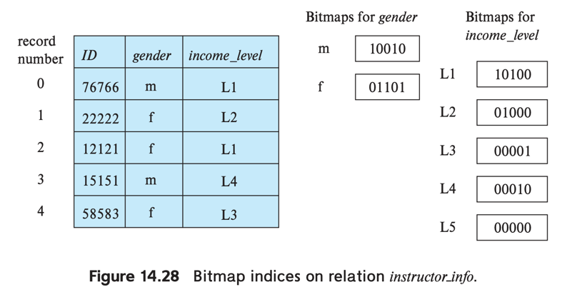

# 9. Bitmap Indices

### Bitmap Index?

- single key 기반의 index로, multiple key query에 특화
- record 별로 number를 순차적으로 할당
- **bitmap** : bit로 이루어진 배열
- **bitmap index** : bitmap을 이용한 index
    - relation _r_ 의 attribute _A_ 에 대한 bitmap index가 있을 때,
    - index에는 _A_ 가 가지는 모든 value로 이루어진 bitmap을 생성
- value v<sub>j</sub>에 대한 i번째 bit가 1이면, i번째 record의 attribute _A_ 값이 v<sub>j</sub>임을 의미
    - 모든 다른 bit는 0
    - e.g. attribute _gender_ bitmap index의 _male_ 에 대한 3번째 bit가 1이면,
        - record 3의 _gender = male_

### 동작



- _instructor_info_ relation
    - attribute _gender_ 는 _f_ or _m_
    - attribute _income_level_
        - _L1_ : 0 - 9999
        - _L2_ : 10000 - 19999
        - _L3_ : 20000 - 29999
        - _L4_ : 30000 - 74999
        - _L5_ : 75000 - 무한대

### 이점 : multiple key query

- multiple key로 selection 수행 할 떄
- _income_level_, _gender_ 에 각각 bitmap index가 있을 때

```sql
select *
from instructor_info
where gender = 'f'
  and income_level = 'L2';
```

- _gender_ 가 _f_ 인 bitmap과 _income_level_ 이 _L2_ 인 bitmap을 fetch
    - 두 bitmap을 **intersection** 연산 (논리곱)
    - 두 bitmap에서 같은 자릿수에서 둘다 1인 bitmap을 연산