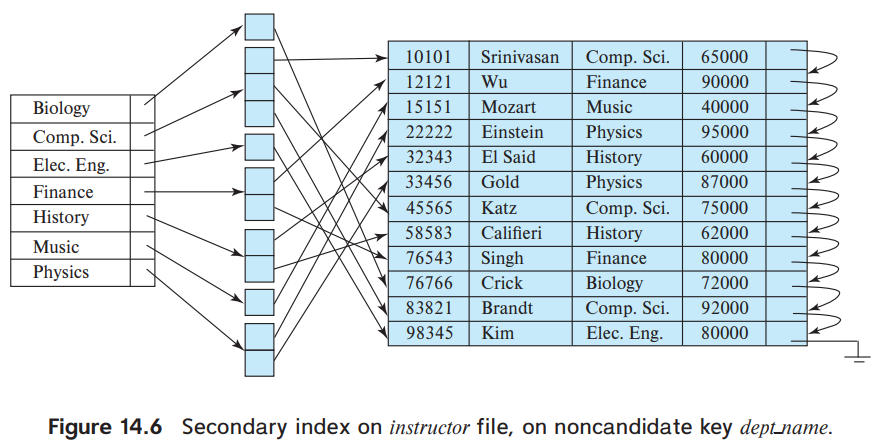
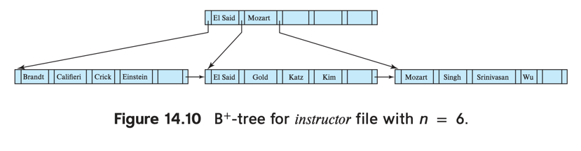
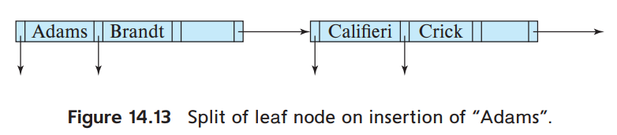
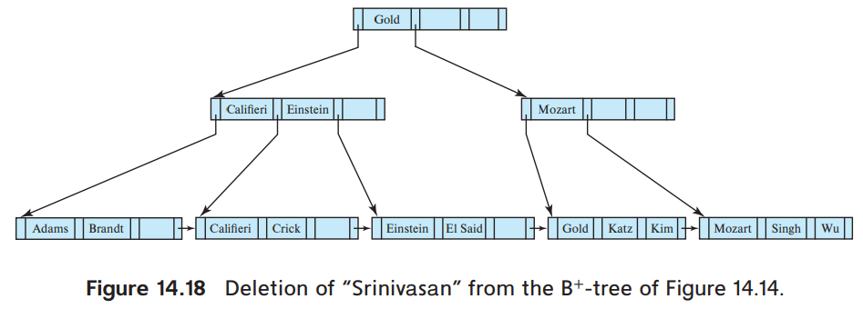
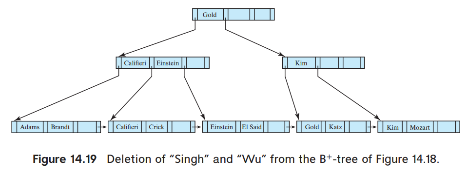

# CHPATGER 14. INDEXING

1. Basic Concepts
2. Ordered Indices
3. B+ Tree Index Files
4. B+ Tree Index Extensions
5. Hash Indices
6. Multiple-Key Access
7. Creation of Indices
8. Write-Optimized Index Structures
9. Bitmap Indices
10. Indexing of Spatial and Temporal Data
11. Summary

---

#### Index의 필요성

- 전체 record에서 일부만 질의하는 경우가 대부분
    - e.g. _전체 교수 중 물리학과 교수만 질의, 전체 학생 중 학번이 2010인 학생만 질의_
- 일부만 질의하는데 모든 record를 검색하는 것은 비효율적
- 질의 대상을 direct로 접근할 수 있도록 하는 자료구조

## 1. Basic Concepts

#### Index = 책의 색인

| 특징     | Database index | Book index   |
|--------|----------------|--------------|
| 목적     | record를 찾기 위함  | topic을 찾기 위함 |
| 형태     | ordered        | ordered      |
| 데이터 크기 | record의 일부     | 전체 책 내용의 일부  |

#### e.g. _student_ 를 _ID_ 로 조회 시 index를 사용하는 경우

1. index 조회
2. index를 통해 disk block을 찾음
3. disk block을 fetch

#### 주의점

- index 자체가 매우 커지면 안됨
- index를 정렬해두면 탐색 시간이 줄어도, 전체 탐색시간이 여전히 길 수 있음
- add, remove 작업에 정렬된 index를 유지하기 위한 추가 작업이 필요함

#### index의 종류

- ordered indices : 이미 정렬된 상태로 index를 유지
- Hash indices : value를 bucket 범위에 균등하게 분포, _hash function_ 을 기반으로 함
- Database applicaiton마다 적합한 index가 다름

#### index 평가 기준

- **Access types** : access를 효율적으로 지원하기 위함
    - access : 특정 value나 range를 가진 record를 찾는 것
- **Access time** : access 시간을 위한 질의 기술
- **Insertion time** : insert하는데 걸리는 시간
    - insert 공간을 찾음 + index 구조를 유지하기 위한 추가 작업
- **Deletion time** : delete하는데 걸리는 시간
    - delete 대상을 찾음 + index 구조를 유지하기 위한 추가 작업
- **Space overhead** : index 구조를 위한 추가 공간

#### search key

- file의 record를 찾는데 사용되는 속성
    - e.g. _Student_ file에서 탐색 시, _ID_, _name_ 등이 search key가 될 수 있음
- _primary key_, _candidate key_ , _superkey_ 와 다름
- **nonunique search key** : search key value에 대해 2개 이상의 record가 존재할 경우
    - e.g. _Student_ file에서 _name_ 은 nonunique search key

## 2. Ordered Indices

- index에 search key를 정렬된 상태로 유지
- search key는 record와 대응
- file은 1개 이상의 index를 가질 수 있음


| 특징              | clustering index               | nonclustering index                 |
|-----------------|--------------------------------|-------------------------------------|
| file의 데이터 저장 순서 | search key와 같음                 | search key와 다름                      |
| 동의어             | primary index, clustered index | secondary index, nonclustered index |
| search key      | primary key일 수도 있음             | -                                   |


- **index-sequential file** : 모든 파일이 특정 search key에 의해 정렬됨
- 위 그림은 _instructor ID_ search key로 정렬되어있는 index-sequential file

### 2.1 Dense and Sparse Indices

- **index entry** (**index record**)는 search key와 pointer로 구성
- pointer : 연관된 1개 이상의 record를 가리킴
    - disk block의 식별자 + offset


- **Dense index** : search key와 1:1
    - search key + pointer (해당하는 첫번째 record를 가리킴)
    - dense clustering index : 모든 record에 대해 index entry가 존재
        - record 순서와 index 순서가 같음
    - dense nonclustering index : 동일한 search key를 가진 record에 대한 pointer list를 가짐
        - 하나의 search key에 대해 여러 개의 index entry가 존재
- **Sparse index** : 일부 search key에 대해 index entry가 존재
    - search key + pointer (해당하는 첫번째 record를 가리킴)
    - clustering index여야 함
    - 찾으려는 search key보다 작거나 같은 값을 가진 것 중 가장 큰 index entry를 찾아 탐색


- nonclustering index && search key != primary key
    - index entry의 pointer가 해당 조건의 첫번쨰 record를 가리킴
    - 해당 record 부터 search key와 다른 값이 나올때 까지 순차 탐색

#### dense index vs sparse index

- dense index가 더 빠르지만, 더 많은 공간을 차지함
- sparse index의 insertion, deleteion overhead가 더 작음
- trade-off : access time, space overhead를 고려
    - 보통 blcok마다 sparse index를 가지도록 설계
    - disk의 block을 main memory로 가져오는 시간이 database reuqest의 대부분
    - sparse index를 사용하여, 원하는 record를 가진 block을 찾아 가져옴

### 2.2 Multilevel Indexing

  

- dense index는 원본 relation의 크기에 비례하여 커짐
    - e.g. 1,000,,000 tuples = 100 index entry (임의), 10,000 blocks
- index가 작을수록 search time은 줄어듦
    - index가 크면 disk에 저장됨
    - index가 크면 index block을 fetch 하는 추가 시간 필요
- Binary search는 비용이 큼 (random access 포함)
    - e.g. index가 _b_ blocks 을 차지할 때 _log<sub>2</sub>b_

#### sparse outer index

- original index에 대한 sparse outer index 생성
    - original index = inner indexS
- 동작 예시
    1. outer index 에서 binary search 진행 (pointer가 inner index block을 가리킴)
    2. search key를 기준으로 같거나 작은 value 중 가장 큰 value를 가진 inner index block을 찾음
    3. value 찾음
- **multilevel indecies** : 2개 이상 level을 가진 index

### 2.3 Index Update

- 모든 index는 record가 생성/삭제 될 때 수정되어야 함
- update 될 떄
    - instructor realtion의 department가 변경되면, _dept_name_ index도 변경
- 명시적으로 update하지 않아도 됨

#### 2.3.1 Insertion

- INSERT된 record에 나타난 search-key 를 사용해서 index 조회
    - e.g. _instructor_ 에 _ID_ 가 101인 record가 추가되면, _ID_ 가 101인 index entry를 탐색
- dense, sparse idnex에 따라 다름
- Dense indices
    - search-key 가 index에 없으면, index entry에 search key와 추가
    - search-key 가 index에 있으면,
        - index entry가 모든 record에 대한 pointer를 저장하는 경우, index entry에 새로운 record pointer 추가
        - search-key에 대한 첫번째 record pointer만 있으면, 적절한 위치(정렬)에 record를 삽입
- Sparse indices
    - 새로운 block을 생성하는 경우, 새 block의 첫번째 search key값을 index에 삽입
    - 해당 block의 가장 작은 search-key를 가지는 경우 해당 block에 대한 index entry 수정
    - 모두 아니면, index 변경 없음

#### 2.3.2 Deletion

- 삭제할 record를 찾음
- Dense indices
    - search-key에 대한 record가 하나라면 index entry 제거
    - search-key의 record가 여러개라면
        - 모든 record에 대한 pointer를 저장 중이면, pointer에서 제거
        - search-key에 대한 첫번째 record pointer만 있으면, 삭제된 record를 가리키고 있으면 pointer 수정 (다음 record를 가리키도록)
- Sparse indices
    - search-key에 대한 index 가 없으면 index 변경 없음
    - search-key에 대한 index 가 있으면
        - 삭제된 record가 search-key에 대한 유일한 record이면, 삭제 후 index record 재정렬
        - 같은 search-key에 대한 다른 record가 존재하면, 해당 record를 가리키도록 수정

### 2.4 Secondary Indices



- Dense index, 모든 record에 대한 pointer를 가짐
- candidate key + secondary index = dense clustering index
- file 수정 시 **모든** index 수정 필요

#### 모든 record에 대한 pointer를 가지는 이유

- not cadidate key + secondary index
    - **첫 record pointer만 가지는 거로 부족함** (file에 순차적으로 저장이 안되어있음)
- not candidate key + clustering index
    - search key value는 첫번째 row pointer만 가지면 됨 (다음 record는 순차적으로 탐색하면 됨)

#### nonunique search key 구현

- 각 pointer가 file을 가리키는 pointer가 담긴 bucket을 가리킴
- 단점
    - index access가 느림 (level이 늘어남)
    - search key value에 대한 중복이 적을수록 공간 낭비가 늘어남

#### 다른 index와 비교

- clustering index보다 query 성능이 우월
- 수정이 있을떄 발생하는 overhead 단점
- 수정, 쿼리 빈도에 따라 결정

### 2.5 Indices on Multiple Keys

- **composite search key** : 2개 이상의 필드로 구성된 search key
    - e.g. _takes_ 에서 (_course_id, semester, year_)로 조회
    - (a<sub>1</sub>, a<sub>2</sub>) < (b<sub>1</sub>, b<sub>2</sub>)라면,
        - (a<sub>1</sub> < b<sub>1</sub>) or (a<sub>1</sub> = b<sub>1</sub>)
        - and (a<sub>2</sub> < b<sub>2</sub>)

## 3. B+ Tree Index Files

- Ordered idnex는 file이 커지면 성능 저하
    - 순차적으로 scan
    - file 재구성으로 해결할 수 있지만, 재구성 빈도가 많아지면 전체 성능 저하
- **B+-tree** index는 삽입/삭제에도 효율성을 유지하는 가장 널리 사용되는 인덱스
- **balanced tree** (이진트리)
    - root에서 leaf node로 가는 모든 경로의 길이가 같음
    - lookup, insertion, deletion 성능 보장
- File 수정 시 성능/공간 overhead가 존재하지만, file 재구성 비용을 피할 수 있어 효율적

### 3.1 Structure of B+ Tree


- multilevel index
- 중복 search-key 없음
- _n_ = node의 최대 pointer 수
- n-1 search key : _K<sub>1</sub>, K<sub>2</sub>, ..., K<sub>n-1</sub>_
    - search-key는 정렬되어있음, _K<sub>i</sub> < K<sub>i+1</sub>,_  _(i < j)_
- n pointer : _P<sub>1</sub>, P<sub>2</sub>, ..., P<sub>n</sub>_
    - 다음 search key node의 pointer


- **leaf node** : pointer _P<sub>i</sub>_ 는 search key _K<sub>i</sub>_ 의 record를 가리킴
    - n개의 leaf noder가 있고, 마지막 P<sub>n</sub> record를 가리키지 않음
    - 각 leaf는 _(n-1)/2_ ~ _n-1_ 개의 record를 가질 수 있음
        - e.g. _n=4_ 이면, 2 ~ 3개의 record를 가질 수 있음
        - _L<sub>i</sub>_, _L<sub>j</sub>_ 가 leaf node라면 _(i<j)_, _L<sub>i</sub>_ 의 모든 search key는 _L<sub>j</sub>_ 의 모든
          search key보다 작음
    - Dense index로 사용 시 leaf node는 모든 record를 가짐
- **nonleaf node** (internal nodes) : 모든 pointer가 tree node를 가리킴
    - _n_ pointer는 반드시 _n/2_ ~ _n_ 개의 pointer를 가짐
    - _fanout_ : nonleaf node의 pointer 개수
    - _P<sub>i</sub>_ 가 가리키는 subtree의 모든 search key는 _K<sub>i</sub>_ 보다 작고, _K<sub>i-1</sub>_ 보다 같거나 큼
    - _P<sub>1</sub>_ 가 가리키는 subtree의 모든 search key는 _K<sub>1</sub>_ 보다 작음
- **root node** : 2 ~ _n/2_  개의 pointer를 가짐


- _n=4_ 인 B+ tree
    - _n_ : leaf node의 pointer 수



#### nonunique search key

- 일반적으로 serach key는 중복 가능
    - 방법 1 : leaf node의 search key에 대해 중복 허용
        - insertion, deletion overhead 증가 (트리 수정 필요)
    - 방법 2 : leaf node의 pointer가 record가 아닌 record list를 가리킴
        - pointer list가 크면, access time 증가
- 대부분의 Database 구현 방식은?
    - search key attribute _a<sub>i</sub>_ 이 relation _r_ 에 대해 nonunique할 때, (_A<sub>p</sub>_ 는 _r_ 의 primary key)
    - unique composite search key (_a<sub>i</sub>_, _A<sub>p</sub>_) 구성
    - e.g. user relation의 _name_ 필드 대신, (_name_, _user_id_)를 사용 (user_id는 primary key)
    - 명시적이지 않아도, 대부분의 DB는 내부적으로 추가 attribute를 사용해서 중복을 피함

### 3.2 Queries on B+-Trees

````
/* v is the search key value (unique search key) */
function find(v)
/* Assumes no duplicate keys, and returns pointer to the record with
* search key value v if such a record exists, and null otherwise */
    Set C = root node
    while (C is not a leaf node) begin
      Let i = smallest number such that v ≤ C.Ki
      if there is no such number i then begin
          Let Pm = last non-null pointer in the node
          Set C = C.Pm
      end
      else if (v = C.Ki) then Set C = C.Pi+1
      else Set C = C.Pi /* v < C.Ki */
end
/* C is a leaf node */
if for some i, Ki = v
    then return Pi
    else return null ; /* No record with key value v exists*/
````

1. root node에서 시작, _v_ 를 가진 leaf node를 찾을 떄까지 2번 반복
2. _v_ 보다 크거나 같은 가장 작은 _K<sub>i</sub>_ 를 찾음
    - 존재하면
        - _v_ 가 _K<sub>i</sub>_ 와 같으면, _P<sub>i+1</sub>_ 을 가리키는 subtree로 이동
        - _v_ 가 _K<sub>i</sub>_ 보다 작으면, _P<sub>i</sub>_ 을 가리키는 subtree로 이동
    - 없으면, 마지막 _P<sub>m</sub>_ 을 가리키는 subtree로 이동 (m은 가장 마지막 nonnull pointer)
3. 찾은 leafnode에서 _K<sub>i</sub>_ 와 _v_ 가 같으면, _P<sub>i</sub>_ 을 반환
    - 같지 않으면, _null_ 반환

##### range queries

- _salary_ 속성이 _[50000, 100000]_ 범위에 있는 record를 찾는 경우
- _find(lb, ub)_

````
function findRange(lb, ub)
/* Returns all records with search key value V such that lb ≤ V ≤ ub. */
    Set resultSet = {};
    Set C = root node
    while (C is not a leaf node) begin
        Let i = smallest number such that lb ≤ C.Ki
        if there is no such number i then begin
            Let Pm = last non-null pointer in the node
            Set C = C.Pm
        end
        else if (lb = C.Ki) then Set C = C.Pi+1
        else Set C = C.Pi /* lb < C.Ki */
    end
    /* C is a leaf node */
    Let i be the least value such that Ki ≥ lb
    if there is no such i
        then Set i = 1 + number of keys in C; /* To force move to next leaf */
    Set done = false;
    while (not done) begin
        Let n = number of keys in C.
        if ( i ≤ n and C.Ki ≤ ub) then begin
            Add C.Pi to resultSet
            Set i = i + 1
        end
        else if (i ≤ n and C.Ki > ub)
            then Set done = true;
        else if (i > n and C.Pn+1 is not null)
            then Set C = C.Pn+1, and i = 1 /* Move to next leaf */
        else Set done = true; /* No more leaves to the right */
    end
    return resultSet;
````

1. _find(lb)_ 와 동일하게 _lb_ 를 가진 leaf node를 찾음
2. _lb_ <= _K<sub>i</sub>_ <= _ub_ 인 모든 pointer를 수집
    - _K<sub>i</sub>_ > _ub_ 이면, stop

#### cost (n = 200 일 때)

| 구분         | size     |
|------------|----------|
| node       | 4KB      |
| search-key | 12 bytes |
| pointer    | 8 bytes  |

- _N_ 개의 record가 있을 때 최대 log<sub>(n/2)</sub>(N)
- 더 보수적으로 search-key를 32bytes, _n_ = 100, log<sub>50</sub>(1,000,000) = 4
    - 최대 4개의 node에 access해서 record를 찾음

#### in-memory tree (e.g. binary search tree)와 다른점

|                               | B+ tree                                     | in-memory tree (e.g. binary search tree)                    |
|-------------------------------|---------------------------------------------|-------------------------------------------------------------|
| node 크기                       | disk block 정도의 사이즈, 많은 pointer              | 사이즈가 작고, 최대 2개의 pointer                                     |
| tree 높이                       | 폭이 크고 height 작음                             | 폭이 작고 height 큼                                              |
| 탐색속도 (_N_ = 1,000,000 record) | log<sub>50</sub>(1,000,000) = 4 node access | log<sub>2</sub>(1,000,000) = 20 node access (balanced tree) |

#### 추가 cost

- leaf node를 찾은 후 random I/O operaion이 필요함
    - record를 fetch하기 위함
- range queries
    - _lb_ 와 _ub_ 사이의 record를 찾기 위해, _lb_ 와 _ub_ 사이의 모든 leaf node에 access (최대 _M(n/2)_ + 1 node)
    - 2차 index의 경우 다른 block에 있음, 최악 _M_ random I/O operation이 필요함
    - clustered indicies의 경우, 연속된 block에 있어 비용이 낮아짐

#### nonunique key

- search key에 중복이 있을 경우, 내부적으로 추가 attribute를 사용해서 중복을 피함
    - e.g. _name_ 대신 (_name_, _user_id_)를 사용
    - _a<sub>i</sub>_ 대신 (_a<sub>i</sub>_, _A<sub>p</sub>_)를 사용
- `findRange(lb, ub)` 의 경우, _lb = (v, -∞)_, _ub = (v, +∞)_ 로 사용
    - _-∞_ 은 _A<sub>p</sub>_ 가 가능한 가장 작은 값, _+∞_ 는 _A<sub>p</sub>_ 가 가능한 가장 큰 값

### 3.3 Updates on B+-Trees

- update = delete & insert
- update 시 delete, insert를 수행하므로, delete, isnert만 고민
- **split** : insertion 결과가 node 최대 크기를 넘어서면 split
- **coalesce** : node가 너무 작을 때
- **Insertion** : `find()`와 동일하게 작동
    1. search key를 가진 leaf node 찾음
    2. insert entry (search key 순서 유지)
- **Deletion**
    1. 삭제되어야할 search key를 가진 leaf node 찾음
    2. search-key에 entry가 1개 이상이면, record를 찾을때까지 반복
        - leaf node에서 entry 제거
    3. leaf node 왼쪽으로 이동


#### 3.3.1 Insertion

- 삽입이 발생해야하는 leaf node _l_ 을 결정해야함
- 삽입이 split을 발생시키면, 재귀적으로 tree 부모를 탐색해가며 split이 일어나지 않을때까지 반복




- _instructor_ relation에 _name_ 이 _Adams_ 인 record를 추가하는 경우
    1. "Brandt", "Califieri", "Crick" leafnode 찾음
    2. node가 가득차서 split
- node에 공간이 있으면, insert
- 최악의 경우 root까지 이르는 모든 node를 나누고, tree의 height이 1 증가


- nonleaf node를 split할 경우 (e.g. "Lamport"를 insert 시)
    1. 새로운 right hand side node 생성 ("Kim", "Lamport")
    2. parent node 생성 ("Kim", n1), n1은 새로운 right hand side node를 가리킴
        - parent node가 비어있으면 생성하지 않고, 연결
- pointer는 각자 child node를 가리킴
- search-key
    - "Kim"은 pointer와 함께 이동
    - "Califieri", "Einstein"은 그대로 남음
    - "Gold"는 자신의 parent node에 추가

````
procedure insert_in_leaf (node L, value K, pointer P)
    if (K < L.K1)
        then insert P, K into L just before L.P1
        else begin
        Let Ki be the highest value in L that is less than or equal to K
        Insert P, K into L just after L.Ki
    end
procedure insert_in_parent(node N, value K′, node N′)
    if (N is the root of the tree)
        then begin
            Create a new node R containing N, K′, N′ /* N and N′ are pointers */
            Make R the root of the tree
            return
        end
    Let P = parent (N)
    if (P has less than n pointers)
        then insert (K′, N′) in P just after N
        else begin /* Split P */
            Copy P to a block of memory T that can hold P and (K′, N′)
            Insert (K′, N′) into T just after N
            Erase all entries from P; Create node P′
            Copy T.P1 …T.P⌈(n+1)∕2⌉ into P
            Let K′′ = T.K⌈(n+1)∕2⌉
            Copy T.P⌈(n+1)∕2⌉+1 …T.Pn+1 into P′
            insert in parent(P, K′′, P′)
        end
````

- _insert_in_leaf_
    - _L_ : leaf node, _K_ : search key, _P_ : pointer
    - _parent(N)_ : node _N_ 의 parent node를 찾음
- _insert_in_parent_
    - _N_ : _N_, _N′_ 를 포함하는 node, _K′_ : _N′_ 의 search key, _N′_ : 새로운 right hand side node
- _T_ : 임시 메모리 영역
    - split된 node를 저장하기 위함

#### 3.3.2 Deletion

````
procedure delete(value K, pointer P)
    find the leaf node L that contains (K, P)
    delete entry(L, K, P)
    
procedure delete entry(node N, value K, pointer P)
    delete (K, P) from N
    if (N is the root and N has only one remaining child)
    then make the child of N the new root of the tree and delete N
    else if (N has too few values/pointers) then begin
        Let N′ be the previous or next child of parent(N)
        Let K′ be the value between pointers N and N′ in parent(N)
        if (entries in N and N′ can fit in a single node)
            then begin /* Coalesce nodes */
                if (N is a predecessor of N′) then swap variables(N, N′)
                if (N is not a leaf)
                    then append K′ and all pointers and values in N to N′
                    else append all (Ki, Pi) pairs in N to N′; set N′.Pn = N.Pn
                delete entry(parent(N), K′, N); delete node N
            end
        else begin /* Redistribution: borrow an entry from N′ */
            if (N′ is a predecessor of N) then begin
                if (N is a nonleaf node) then begin
                    let m be such that N′.Pm is the last pointer in N′
                    remove (N′.Km−1, N′.Pm) from N′
                    insert (N′.Pm, K′) as the first pointer and value in N,
                        by shifting other pointers and values right
                    replace K′ in parent(N) by N′.Km−1
                end
                else begin
                    let m be such that (N′.Pm, N′.Km) is the last pointer/value
                        pair in N′
                    remove (N′.Pm, N′.Km) from N′
                    insert (N′.Pm, N′.Km) as the first pointer and value in N,
                        by shifting other pointers and values right
                    replace K′ in parent(N) by N′.Km
                end
            end
            else … symmetric to the then case …
        end
    end
````




- "Srinivasan" 을 제거하는 경우
- lookup 알고리즘으로 "Srinivasan" 을 가진 leaf node를 찾음
    - 위에서 "Srinivasan" 을 제거하면, leaf node에 "Wu" 만 남음
    - 각 node를 재 분배하여 node의 반 이상이 차있도록 유지시켜야함
    - "Wu" leaf node 는 다른 형제 node와 합쳐져야함
    - node가 삭제되면, node를 가리키는 parent의 pointer도 제거해야함
- 제거대상 : ("Srinivasan", _n3_), _n3_ 는 "Srinivasan" 이 있는 leafnode를 가리키는 pointer
    - entry를 제거하면, node에는 가장 왼쪽 pointer만 남음
    - parent node는 **underfull**
- sibling node “Califieri”, “Einstein”, and “Gold
    - 가능하다면 합침
    - 위에선 가능하지 않음 (size 넘침)
- **redistribute** (재분배) : 각 node가 n/2 개의 child pointer를 갖도록
    - "Gold"를 가리키는 pointer를 오른쪽 sibling으로 이동
    - 오른쪽 sibling은 이동해온 pointer, 기존 pointer만 존재 (search key value는 없음)
    - "Gold" searchkey를 올리고, root node의 "Mozart" search key를 내림




- "Singh", "Wu"를 제거하는 경우
    - 2가지를 다 제거하면 leaf node에 underfull 발생
    - search-key value "Kim" 을 올리고 parent node의 "Mozart" 를 내림


- "Gold"를 제거하는 경우
    - underfull leaf 발생, sibling과 merge 가능
    - parent node underfull 발생, sibling과 merge 가능
    - root node search-key value "Gold"가 내려옴
    - root node에 pointer 하나 남음 (root node는 최소 2개의 children)
    - root node 제거 (tree depth 1 감소)
- nonleaf node에도 "Gold"가 여전히 존재

### 3.4 Complexity of B+-Tree Updates

- log<sub>(n/2)</sub>(N) : _n_ 은 node의 최대 pointer 수, _N_ 은 indexing 된 record 수
- deletion procedure 최악 복잡도 log<sub>(n/2)</sub>(N) (unique search key)
- 성능이 treee 높이에 비례
- 실제로는 최악보다 성능이 좋은 I/O Operation을 보임
    - 매우 큰 relation이어도, 대부분의 nonleaf node가 메모리 버퍼에 있을 가능성이 높음
    - 따라서, 일반적인 조회는 1~2 개의 I/O Operation으로 수행됨
    - update의 경우 split 발생 확률이 적음, 평균적으로 1개의 I/O Operation으로 수행됨
- underfull
    - node가 기본적으로 반 이상 차있는 것을 보장
    - 대부분의 node가 2/3 이상 차있음

### 3.5 Nonunique Search Keys

- unique하지 않은 attribute에 대해서 unique attribute를 붙여서 composite search key를 만듦
    - **uniquifier attribute** :  record-id, primary key, unique 속성을 가진 필드 사용

#### B+ tree에서 중복 search-key를 그대로 사용하는 방법

- search key를 각각 tree에 한번만 저장, pointer bucket(or list)을 유지
    - 공간 효율 : search key를 한번만 저장
    - 구현 복잡 : 동적인 bucket size를 유지하기 위한 구현 코드 필요
    - 공간 차지
        - bucket이 leaf node에 위치할 경우, leaf node보다 bucket size가 더 커질 수 있음
        - bucket이 별도 block에 있을 경우, I/O operation 필요 (fetch)
- record마다 search key를 저장
    - insert 작업 시에, leaf node가 차면 split 가능
    - split handling 필요, 구현 복잡
    - 공간 차지 : search key를 record마다 저장해야함
- 단점
    - unique search key에 비해 deletion 성능이 떨어짐 (lookup, insertion 복잡도는 같음)
    - 특정 search-key value가 여러번 중복이고, 그 중 한 record를 삭제해야할 때
    - unique search key는 nonunique 보다 효율적
        - composite search key를 사용, root node에서 한번의 lookup으로 leaf node 찾음
    - deletion 성능 때문에 대부분의 DB는 자동으로 attribute를 추가해 unique search key를 만듦

## 4. B+ Tree Index Extensions

## 5. Hash Indices

## 6. Multiple-Key Access

## 7. Creation of Indices

## 8. Write-Optimized Index Structures

## 9. Bitmap Indices

## 10. Indexing of Spatial and Temporal Data

## 11. Summary
