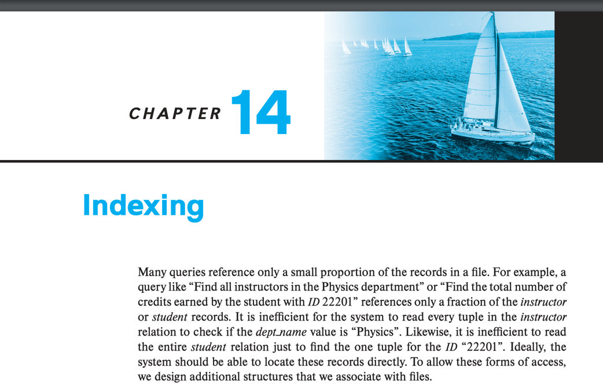

# CHPATGER 14. INDEXING

#### Index의 필요성

- 전체 record에서 일부만 질의하는 경우가 대부분
    - e.g. _전체 교수 중 물리학과 교수만 질의, 전체 학생 중 학번이 2010인 학생만 질의_
- 일부만 질의하는데 모든 record를 검색하는 것은 비효율적
- 질의 대상을 direct로 접근할 수 있도록 하는 자료구조

---

1. [Basic Concepts](1_Basic_Concepts/README.md)
2. [Ordered Indices](2_Ordered_Indices/README.md)
3. [B+ Tree Index Files](3_B+_Tree_Index_Files/README.md)
4. [B+ Tree Index Extensions](4_B+_Tree_Index_Extensions/README.md)
5. [Hash Indices](5_Hash_Indices/README.md)
6. [Multiple-Key Access](6_Multiple-Key_Access/README.md)
7. [Creation of Indices](7_Creation_of_Indices/README.md)
8. Write-Optimized Index Structures
9. Bitmap Indices
10. Indexing of Spatial and Temporal Data
11. Summary
