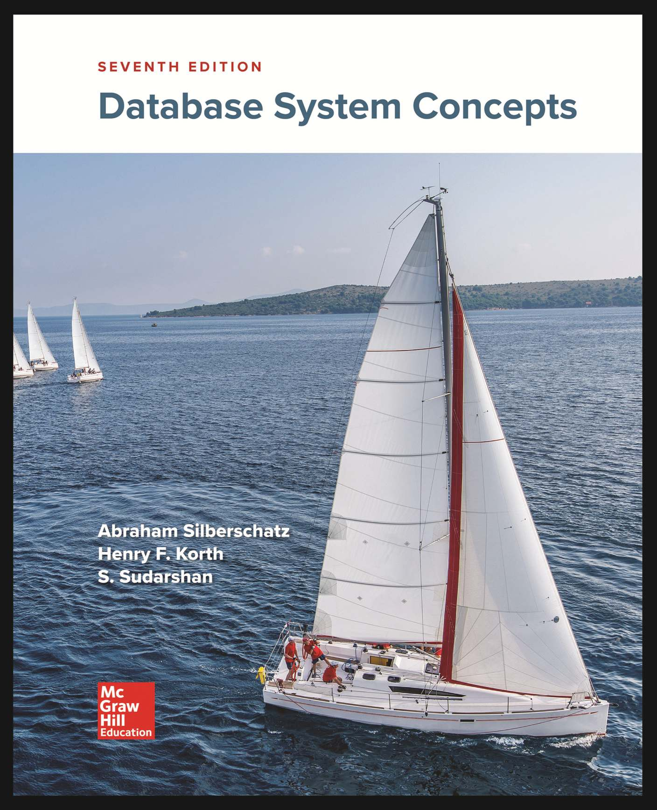

# database system concepts

- [Chapter 1 Introduction](Chapter_1_Introduction/README.md)

1. PART ONE RELATIONAL LANGUAGES
    - Chapter 2 Introduction to the Relational Model
    - Chapter 3 Introduction to SQL
    - Chapter 4 Intermediate SQL
    - Chapter 5 Advanced SQL
2. PART TWO DATABASE DESIGN
    - Chapter 6 Database Design and the E-R Model
    - Chapter 7 Relational Database Design
3. PART THREE APPLICATION DESIGN AND DEVELOPMENT
    - Chapter 8 Complex Data Types
    - Chapter 9 Application Development
4. PART FOUR BIG DATA ANALYTICS
    - Chapter 10 Big Data
    - Chapter 11 Data Analytics
5. PART FIVE STORAGE MANAGEMENT AND INDEXING
    - Chapter 12 Pysical Storage Systems
    - Chapter 13 Data Storage Structures
    - [Chapter 14 Indexing](Chapter_14_Indexing/README.md)
6. PART SIX QUERY PROCESSING AND OPTIMIZATION
    - Chapter 15 Query Processing
    - Chapter 16 Query Optimization
7. PART SEVEN TRANSACTION MANAGEMENT
    - Chapter 17 Transactions
    - Chapter 18 Concurrency Control
    - Chapter 19 Recovery System
8. PART EIGHT PARALLEL AND DISTRIBUTED DATABASES
    - Chapter 20 Database-System Architectures
    - Chapter 21 Parallel and Distributed Storage
    - Chapter 22 Parallel and Distributed Query Processing
    - Chapter 23 Parallel and Distributed Transaction Management
9. PART NINE ADVANCED TOPICS
    - Chapter 24 Advanced Indexing Techniques
    - Chapter 25 Advanced Application Development
    - Chapter 26 Blockchain Databases
