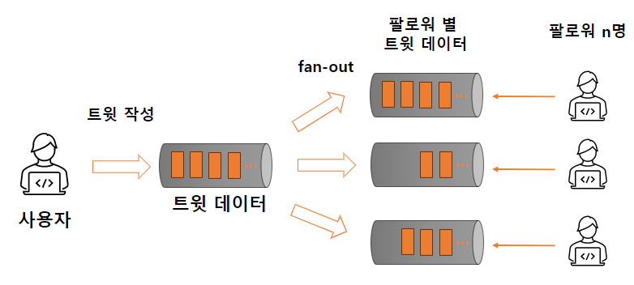

# 1. 신뢰할 수 있고 확장 가능하며 유지보수하기 쉬운 애플리케이션

- 과거 애플리케이션
    - 계산 중심 <sup>compute-intensive</sup>
    - CPU 성능 중요
- 오늘날 **데이터 중심 애플리케이션**
    - 데이터 중심 <sup>data-intensive</sup>
    - 데이터의 양, 복잡도, 변화 속도가 성능에 영향

### 데이터 중심 어플리케이션의 구성 요소

- 데이터베이스 : 애플리케이션에서 나중에 데이터를 찾을 수 있게 저장
- 캐시 : 읽기 속도를 높이기 위해 값비싼 수행 결과 기억
- 검색 색인 <sup>search index</sup> : 사용자가 필터링하여 문서를 찾기 위해 만든 추가적인 데이터 구조
- 스트림 처리 <sup>stream processing</sup> : 비동기 처리를 위해 다른 프로세스나 다른 기계로 데이터 전송
- 일괄 처리 <sup>batch processing</sup> : 주기적으로 누적된 데이터를 분석, 처리

## 데이터 시스템에 대한 생각

### '데이터 시스템' 이라는 포괄적인 용어의 필요성

- 데이터 도구는 다양한 use case에 최적화 되어 더이상 전통 적인 분류에 딱 들어맞지 않음
    - Redis 메시지 큐는 데이터 스토어, Apache Kafka 메시지 큐는 지속성 <sup>durability</sup> 보장
- 애플리케이션의 데이터 도구에 대한 광범위한 요구사항
    - 단일 도구로는 더이상 데이터 처리, 저장을 만족시킬 수 없음

### 개발자는 데이터 시스템 설계자이기도 하다

서비스 인터페이스나 API 는 클라이언트가 모르게 내부 구현을 숨긴다.  
내부에는 인메모리 캐시, 메시지큐, 전문 색인, 기본 데이터베이스 등이 구성된 아키텍처를 구현한다.

### 소프트웨어 시스템에서 중요하게 생각하는 세가지 관심사

- 신뢰성 <sup>reliability</sup>
    - 시스템이 오류 없이 올바르게 동작하는지
- 확장성 <sup>scalability</sup>
    - 시스템의 부하나 데이터가 증가할 때 어떻게 대처하는지
- 유지보수성 <sup>maintainability</sup>
    - 시스템을 쉽게 생산적으로 변경하고 확장할 수 있는지

## 신뢰성

#### 신뢰성이란, 무엇가 잘못되더라도 지속적으로 올바르게 동작하는 것

- 애플리케이션은 상요자가 기대한 기능을 수행
- 시스템은 사용자가 범한 시룻나 예상지 못한 소프트웨어 사용법을 허용
- 시스템 성능은 예상된 부하와 데이터 양에서 필수적인 사용사례를 충분히 만족
- 시스템은 허가되지 않은 접근과 오남용 방지

결함 <sup>fault, 잘못될 수 있는 일</sup>을 예측하고 대처할 수 잇는 시스템을 결함성 <sup>fault-tolerant</sup> 또는 탄력성 <sup>resilient</sup> 을 지녔다고
한다.  
내결함성은 결함으로 인해 장애가 발생하지 않게금 하는 것이다.

> 넷플릭스의 Chaos Monkey  
> 고의적으로 결함을 유도함으로써 내결함성 시스템을 지속적으로 훈련하고, 테스트해서   
> 결함이 자연적으로 발생했을 때 올바르게 처리하도록 하는 것

### 하드웨어 결함

- 하드디스크 고장, 램 결함, 전원 공급 장치 고장, 네트워크 장비 고장 등
- 시스템 장애율을 줄이기 위한 방법 : 하드웨어에 중복 <sup>redundancy</sup>을 둠
    - e.g. 디스크 RAID 구성
    - 시스템 재부팅이 필요한 경우 전체 시스템 중단 없이 한 노드식 패치 가능 <sup>rolling upgrade</sup>

### 소프트웨어 오류

- 시스템 내 체게적 오류 <sup>systematic error</sup>
- 예상이 어렵고 노드간 상관관계로 인해 오류를 더 많이 유발
    - 소프트웨어 버그
    - 공유 자원 <sup>CPU, 메모리, 디스크, 네트워크 대역폭</sup> 을 과도 점유하는 일부 프로세스
    - 연쇄 장애 <sup>cascading failure</sup> : 오류가 전파되어 시스템 전체가 망가지는 것

#### 소프트웨어 오류 방지방법

- 주위 깊게 생각하가
- 테스트
- 프로세스 격리 <sup>process isolation</sup>
- 모니터링 분석 등

### 인적 오류

사람은 시스템 설계자이자 운영자이다.  
그러나 운영자의 설정오류가 하드웨어 결함보다 오류를 많이 일으킨다.

#### 인적오류 방지방법

- 오류 가능성을 최소화하는 시스템 설계
- 사람이 가장 많이 실수하는 부분과 실수로 인해 장애가 발생하는 부분의 분리
    - 비 프로덕션 샌드박스<sup>sandbox</sup> 환경
- 단위 테스트부터 통합테스트, 수동 테스트까지 모든 수준에서 철저하게 테스트, 자동테스트를 통한 corner case 발견
- 인적 오류를 빠르고쉽게 복구할 수 있게 하기
    - 설정 내역을 빠르게 roll back, 새로운 코드를 서서히 roll out, 계산이 잘못된 경우 데이터 재계산 도구 제공
- 성능 지표와 오류율 같은 상세하고 명확한 모니터링 대책
- 조작 교육과 실습

### 신뢰성을 얼마나 중요할까?

**중요하지 않은** 애플리케이션도 사용자에 대한 책임이 있다.  
가족 사진 수천장을 저장해둔 애플리케이션의 사용자인 부모를 생각해보자. 오류가 생기면 부모가 시스템의 신뢰도를 어떻게 느낄까?

## 확장성

- 시스템이 현재 안정적으로 동작한다고 미래에도 안정적이라는 보장은 없다
- 성능저하를 유발하는 흔한 이유는 **부하**의 증가
- "시스템이 특정 방식으로 커지면 이에 대처하기 위한 선택은 무엇인가?"
- "추가 부하를 다루기 위해 계산 자원을 어떻게 투입할까?"

### 부하 기술하기

시스템의 현재 부하를 간결하게 기술해야한다. 그래야 부하 성장 질문을 논의할 수 있다.  
부하는 부하 매개변수 <sup>load parameter</sup> 로 기술한다.

#### 부하 매개변수의 예

- 웹 서버 TPS
- 데이터베이스 읽기/쓰기 비율
- active user
- 캐시 적중률 등

### 부하 매개변수를 활용한 트위터의 예시

트위터의 부하 매개변수 : 사용자별 팔로워 분포도

트위터의 주요동작 2가지

- tweet 작성 : 사용자가 팔로워들에게 새로운 메시지 게시
- 홈 타임라인 : 팔로워들이 사용자의 트윗 읽기

트위터의 확장성 문제 : fan-out <sup>팔로워들에게 트윗을 전달하는 작업</sup>

- 쓰기 비율이 읽기 비율보다 적음
- 쓰기 작업시 읽기 작업보다 많은 일을 해야 적합

#### 트위터의 주요동작 구현

##### 옵션

1. RDBMS 이용
    ```sql
    -- 홈 타임라인 요청
    SELECT tweets.*, users.*
    FROM tweets
             JOIN users
                  ON tweets.sender_id = users.user_id
             JOIN follows ON follows.followee_id = users.user_id
    WHERE follows.follower_id = < userid >
    ```
2. 사용자별 홈타임라인 캐시 유지 : **fan-out**
    - 사용자가 트윗을 작성하면 팔로워들의 홈타임라인 캐시에 트윗 삽입
    - fan-out이 크다? -> 사용자의 트윗 작성 <sup>출력</sup>이 많은 팔로워들의 홈타임라인 <sup>입력</sup>에 보여야 함  
    

2가 적합해 보이지만 유명인들은 쓰기 작업시 일이 너무많아짐. 팔로워가 1억명이라면??

#### 트위터의 선택

- 1과 2를 적절히 섞음 <sup>hybrid</sup>
    - 부하 매개변수 <sup>사용자별 팔로워 분포도</sup>를 사용
- 2를 기본으로 사용하되 유명인의 경우 fan-out에 따른 부하를 고려하여 1을 채택

### 성능 기술하기


#### 성능 수치의 필요성 

시스템 부하를 기술하면 부하가 증가했을 때 어떤 일이 일어나는지 다음과 같이 조사할 수 있다.  

- 부하 매개변수를 증가시키고 세스템 자원 <sup>CPU, 메모리, 네트워크 등</sup>은 변경하지않으면 성능에 어떤 영향이 생길까?
- 부하 매개변수 증가 시 성능이 유지되길 원한다면 자원을 얼마나 투입해야할까?


### 부하 대응 접근 방식

## 유지보수성

### 운영성 : 운영의 편리함 만들기
### 단순성 : 복잡도 관리
### 발전성 : 변화를 쉽게 만들기

## 정리

## 참고문헌
