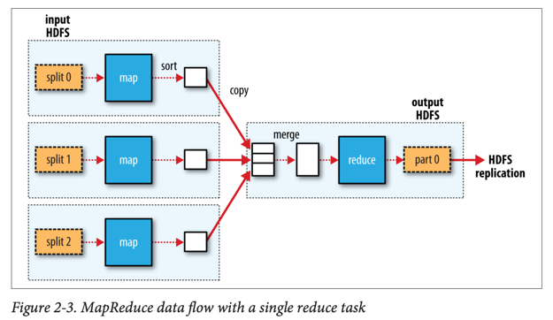
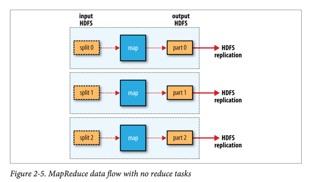

# MapReduce

# MapReduce 핵심 요약

## MapReduce란?

- 대용량 데이터 처리를 위한 **프로그래밍 모델**
- 간단하면서도 유용한 프로그램 표현이 가능
- **병렬 처리**가 기본으로 내장되어 있어 대규모 데이터 분석 가능

## MapReduce 동작 원리

### 기본 구조

- **Map 단계**: 입력 데이터를 key-value 쌍으로 변환
- **Reduce 단계**: 동일한 key를 가진 값들을 집계/처리
- 두 단계 사이에 **Shuffle**: 같은 key를 가진 데이터를 같은 reducer로 전송

### 예제: 연도별 최고 기온 찾기


1. **Map 함수**
    - 날씨 데이터에서 연도와 기온 추출
    - (1950, 0), (1950, 22), (1949, 111) 등 출력

2. **Shuffle**
    - 동일 연도끼리 그룹화
    - (1949, [111, 78]), (1950, [0, 22, -11])

3. **Reduce 함수**
    - 각 연도별 최대값 계산
    - (1949, 111), (1950, 22) 출력

## Java MapReduce 구현

### 필수 구성요소

- **Mapper 클래스**: map() 메소드 구현
- **Reducer 클래스**: reduce() 메소드 구현
- **Job 설정**: 입출력 경로, Mapper/Reducer 클래스 지정

```java
import java.io.IOException;

import org.apache.hadoop.io.IntWritable;
import org.apache.hadoop.io.LongWritable;
import org.apache.hadoop.io.Text;
import org.apache.hadoop.mapreduce.Mapper;

public class MaxTemperatureMapper extends Mapper<LongWritable, Text, Text, IntWritable> {

    private static final int MISSING = 9999;

    @Override
    public void map(LongWritable key, Text value, Context context) throws IOException, InterruptedException {

        String line = value.toString();
        String year = line.substring(15, 19);
        int airTemperature;
        if (line.charAt(87) == '+') { // parseInt doesn't like leading plus signs
            airTemperature = Integer.parseInt(line.substring(88, 92));
        } else {
            airTemperature = Integer.parseInt(line.substring(87, 92));
        }
        String quality = line.substring(92, 93);
        if (airTemperature != MISSING && quality.matches("[01459]")) {
            context.write(new Text(year), new IntWritable(airTemperature));
        }
    }
}
```

```java
import java.io.IOException;

import org.apache.hadoop.io.IntWritable;
import org.apache.hadoop.io.Text;
import org.apache.hadoop.mapreduce.Reducer;

public class MaxTemperatureReducer extends Reducer<Text, IntWritable, Text, IntWritable> {

    @Override
    public void reduce(Text key, Iterable<IntWritable> values, Context context) throws
        IOException,
        InterruptedException {

        int maxValue = Integer.MIN_VALUE;
        for (IntWritable value : values) {
            maxValue = Math.max(maxValue, value.get());
        }
        context.write(key, new IntWritable(maxValue));
    }
}
```

```java
import org.apache.hadoop.fs.Path;
import org.apache.hadoop.io.IntWritable;
import org.apache.hadoop.io.Text;
import org.apache.hadoop.mapreduce.Job;
import org.apache.hadoop.mapreduce.lib.input.FileInputFormat;
import org.apache.hadoop.mapreduce.lib.output.FileOutputFormat;

public class MaxTemperature {

    public static void main(String[] args) throws Exception {
        if (args.length != 2) {
            System.err.println("Usage: MaxTemperature <input path> <output path>");
            System.exit(-1);
        }

        Job job = new Job();
        job.setJarByClass(MaxTemperature.class);
        job.setJobName("Max temperature");
        FileInputFormat.addInputPath(job, new Path(args[0]));
        FileOutputFormat.setOutputPath(job, new Path(args[1]));

        job.setMapperClass(MaxTemperatureMapper.class);
        job.setReducerClass(MaxTemperatureReducer.class);
        job.setOutputKeyClass(Text.class);
        job.setOutputValueClass(IntWritable.class);

        System.exit(job.waitForCompletion(true) ? 0 : 1);
    }
}
```


### 주요 데이터 타입

- `LongWritable`: Java Long 대응
- `Text`: Java String 대응
- `IntWritable`: Java Integer 대응

## 확장 처리 (Scaling Out)


### 데이터 분할과 처리

- **Input Split**: 입력 데이터를 고정 크기 조각으로 분할
- 각 Split마다 하나의 Map Task 생성
- 최적 Split 크기 = HDFS 블록 크기 (기본 128MB)

### 데이터 지역성 (Data Locality)

1. **Data-local**: 데이터가 있는 노드에서 직접 처리
2. **Rack-local**: 같은 랙 내 다른 노드에서 처리
3. **Off-rack**: 다른 랙의 노드에서 처리 (네트워크 비용 발생)

### 처리 흐름






- Map Task → 로컬 디스크에 중간 결과 저장
- Reduce Task → 모든 Map 출력을 네트워크로 수집
- 최종 출력 → HDFS에 저장 (복제본 생성)

## Combiner 함수

### 개념

- Map 출력에서 Reduce 입력 사이의 **중간 집계**
- 네트워크 전송량 감소로 성능 향상
- 최적화 기능이므로 호출 횟수 보장 없음

### 조건

- **결합법칙과 교환법칙**을 만족해야 함
- `max(0, 20, 10, 25, 15) = max(max(0, 20, 10), max(25, 15)) = max(20, 25) = 25`
- 평균값 계산 등에는 사용 불가

## Hadoop Streaming

### 개념

- Java 외 다른 언어로 MapReduce 프로그램 작성 가능
- **표준 입출력**을 통한 데이터 교환
- Tab으로 구분된 key-value 형태

### 특징

- **Ruby, Python** 등 다양한 언어 지원
- Unix 파이프라인으로 로컬 테스트 가능
- `-files` 옵션으로 스크립트 파일을 클러스터에 배포

### 실행 방법

```bash
hadoop jar $HADOOP_HOME/share/hadoop/tools/lib/hadoop-streaming-*.jar \
  -input input/data \
  -output output \
  -mapper map_script.py \
  -reducer reduce_script.py \
  -combiner reduce_script.py
```

## 핵심 개념 정리

### MapReduce vs 전통적 처리

- **병렬 처리**: 자동으로 여러 노드에서 병렬 실행
- **장애 처리**: Task 실패 시 자동으로 다른 노드에서 재실행
- **확장성**: 데이터와 하드웨어 크기에 선형적으로 확장

### 데이터 처리 패러다임

- **Write Once, Read Many**: 한 번 쓰고 여러 번 읽는 패턴에 최적화
- **Batch Processing**: 실시간이 아닌 배치 처리에 특화
- **Schema-on-Read**: 읽을 때 데이터 구조 해석
