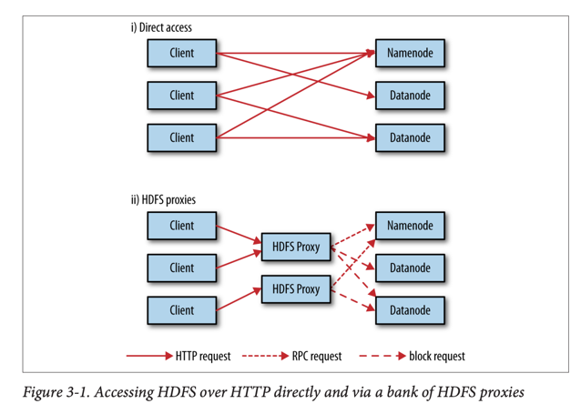
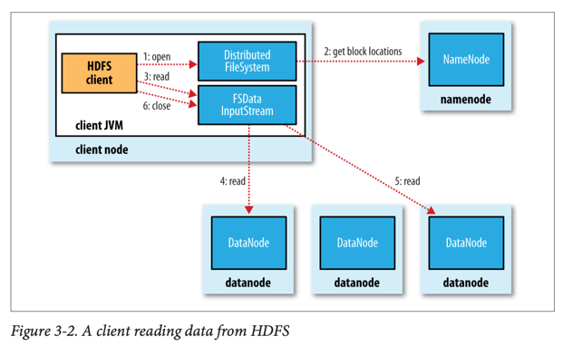
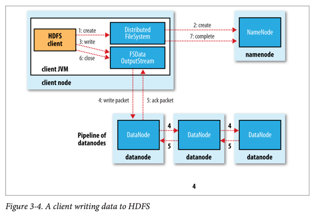
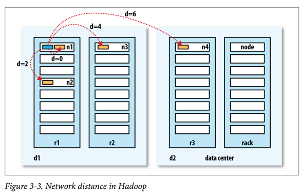
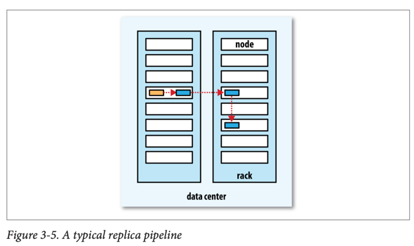

# The Hadoop Distributed File System

## HDFS 설계 원칙

### 설계 목표

- **매우 큰 파일**: 수백 메가바이트~테라바이트급 파일 처리
- **스트리밍 데이터 접근**: Write-once, read-many-times 패턴에 최적화
- **범용 하드웨어**: 고가의 전용 하드웨어가 아닌 일반 하드웨어에서 동작

### HDFS에 적합하지 않은 경우

- **낮은 지연시간** (Low-latency) 접근이 필요한 경우
- **많은 작은 파일**: 네임노드 메모리 제약으로 수십억 개 파일 처리 어려움
- **다중 작성자**: 하나의 파일에 여러 작성자가 동시 접근 불가
- **임의 위치 수정**: 파일 끝이 아닌 임의 위치 수정 불가

## HDFS 핵심 개념

### 블록 (Block)

- **기본 크기**: 128MB (기존 디스크 블록의 512바이트보다 훨씬 큼)
- **큰 블록의 이유**: 탐색 시간 최소화로 전송 시간 최적화
- **블록 단위 처리**: 파일이 블록 단위로 분할되어 독립적으로 저장
- **복제**: 각 블록은 기본 3개의 복제본으로 분산 저장

### 네임노드 (NameNode)와 데이터노드 (DataNode)

- **네임노드**: 마스터 역할, 파일시스템 네임스페이스와 메타데이터 관리
    - 네임스페이스 이미지 (namespace image)와 편집 로그 (edit log) 유지
    - 블록 위치 정보는 메모리에서만 관리
- **데이터노드**: 워커 역할, 실제 블록 데이터 저장 및 검색
    - 클라이언트나 네임노드 요청에 따라 블록 저장/검색
    - 주기적으로 네임노드에 블록 리포트 전송

### 보조 네임노드 (Secondary NameNode)

- 네임노드가 **아님** (이름과 달리)
- 주기적으로 네임스페이스 이미지와 편집 로그 병합
- 편집 로그가 너무 커지는 것 방지

## HDFS 고급 기능

### 블록 캐싱 (Block Caching)

- 자주 접근하는 파일 블록을 데이터노드 메모리에 캐싱
- 캐시 지시문 (cache directive)과 캐시 풀 (cache pool)로 관리
- 조인에서 사용하는 작은 룩업 테이블 등에 유용

### HDFS 연합 (HDFS Federation)

- 여러 네임노드가 파일시스템 네임스페이스 분할 관리
- 각 네임노드는 네임스페이스 볼륨 (namespace volume) 관리
- 블록 풀 (block pool)을 통해 데이터노드는 모든 네임노드에 등록

### HDFS 고가용성 (High Availability)

- **액티브-스탠바이** 구성으로 단일 장애점 (SPOF) 해결
- **공유 저장소**: NFS 파일러 또는 쿼럼 저널 매니저 (QJM) 사용
- **자동 장애조치**: 장애 발생 시 수십 초 내 스탠바이로 전환
- **펜싱 (Fencing)**: 이전 액티브 노드의 동작 차단으로 데이터 무결성 보장

## 명령줄 인터페이스

### 기본 파일시스템 작업

```bash
# 파일 복사
hadoop fs -copyFromLocal localfile hdfsfile
hadoop fs -copyToLocal hdfsfile localfile

# 디렉터리 생성 및 목록 조회
hadoop fs -mkdir books
hadoop fs -ls .

# 파일 권한 확인
hadoop fs -ls -l filename
```

### 파일 권한 모델

- **POSIX 유사**: 읽기(r), 쓰기(w), 실행(x) 권한
- **소유자/그룹/기타** 권한 구분
- 기본적으로 보안 비활성화 상태에서도 권한 검사 수행

## Hadoop 파일시스템

### 다양한 파일시스템 지원

| 파일시스템     | URI 스킴  | 설명                 |
|-----------|---------|--------------------|
| 로컬 파일시스템  | file    | 로컬 디스크의 파일시스템      |
| HDFS      | hdfs    | Hadoop 분산 파일시스템    |
| WebHDFS   | webhdfs | HTTP를 통한 HDFS 접근   |
| Amazon S3 | s3a     | S3 기반 파일시스템        |
| Azure     | wasb    | Microsoft Azure 기반 |

### 인터페이스



- **HTTP**: WebHDFS 프로토콜을 통한 REST API 제공
- **C 라이브러리**: libhdfs를 통한 C 언어 접근
- **NFS**: NFSv3 게이트웨이를 통한 POSIX 접근
- **FUSE**: 사용자 공간 파일시스템으로 마운트

## Java API 사용

### FileSystem 클래스 주요 메소드

```java
// FileSystem 인스턴스 획득
FileSystem fs = FileSystem.get(URI.create(uri), conf);

// 파일 읽기
FSDataInputStream in = fs.open(new Path(filename));

// 파일 쓰기
FSDataOutputStream out = fs.create(new Path(filename));

// 파일 상태 조회
FileStatus status = fs.getFileStatus(new Path(filename));

// 파일 목록 조회
FileStatus[] statuses = fs.listStatus(new Path(dirname));
```

### 고급 기능

- **FSDataInputStream**: 임의 위치 탐색 (seek) 지원
- **PathFilter**: 파일 필터링을 위한 인터페이스
- **Glob 패턴**: 와일드카드를 사용한 파일 매칭

## 데이터 흐름 (Data Flow)

### 파일 읽기 과정



1. **클라이언트**: FileSystem.open() 호출
2. **네임노드 접촉**: 블록 위치 정보 요청
3. **데이터노드 연결**: 가장 가까운 데이터노드에서 블록 읽기
4. **스트리밍**: 블록 순서대로 연속 읽기
5. **오류 처리**: 손상된 블록 발견 시 다른 복제본에서 읽기

### 파일 쓰기 과정



1. **파일 생성**: 네임노드에 새 파일 생성 요청
2. **데이터 패킷화**: 데이터를 패킷으로 분할하여 데이터 큐에 저장
3. **파이프라인 구성**: 복제 팩터에 따라 데이터노드 파이프라인 구성
4. **패킷 전송**: 첫 번째 데이터노드로 패킷 전송 후 다음 노드로 전달
5. **확인 응답**: 모든 데이터노드에서 확인 응답 받을 때까지 대기

### 네트워크 토폴로지





- **트리 구조**: 데이터센터 → 랙 → 노드 계층
- **거리 계산**: 공통 조상까지의 거리 합으로 측정
- **복제본 배치 전략**:
    - 1번째: 클라이언트와 같은 노드
    - 2번째: 다른 랙의 임의 노드
    - 3번째: 2번째와 같은 랙의 다른 노드

### 일관성 모델 (Coherency Model)

- **파일 생성**: 즉시 네임스페이스에 표시
- **쓰기 가시성**: 블록 단위로만 다른 리더에게 보임
- **hflush()**: 데이터노드 메모리까지 플러시 보장
- **hsync()**: 디스크까지 동기화 보장 (fsync와 유사)

## 병렬 복사 도구

### distcp 사용법

```bash
# 기본 복사
hadoop distcp file1 file2
hadoop distcp dir1 dir2

# 업데이트 및 삭제 옵션
hadoop distcp -update -delete -p hdfs://namenode1/foo hdfs://namenode2/foo

# 맵 태스크 수 지정
hadoop distcp -m 100 source dest
```

### 클러스터 균형 유지

- **밸런서 도구**: 블록 분산을 균등하게 조정
- **적절한 맵 수**: 노드당 20개 맵을 기본으로 사용
- **불균형 방지**: distcp 사용 시 충분한 병렬성 확보
